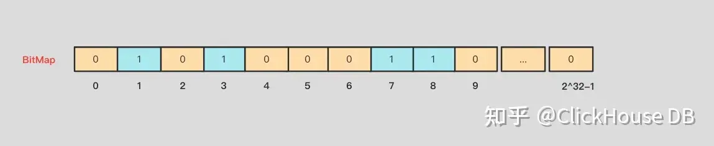

## 一、Clickhouse圈选实践

### 背景

> ​	做任何营销活动第一步通常需要找寻目标人群和用户特征。人群的筛选通常离不开用户画像。用户画像就是根据用户特征、业务场景和用户行为等信息，构建一个标签化的用户模型。
>
> ​	比如消费者用户画像分为属性和行为标签两类。这两类标签，一个是固定的，一个是可变的。
>
> ​	固定的属性标签基本就是买家的性别，年龄段，会员等级，消费水平，购买力等。而可变的行为标签基本包括买家的浏览，加购物车，购买等行为。
>
> 如何快速的对千万级的标签数据进行用户画像？


​	双11到了，假设需要发放 1000 万张优惠券，那我们首先需要根据标签筛选出符合条件的人群，人数大约为 1000 万左右，然后对选择的人群进行画像分析，看是否符合预期的特征。如果人群符合特征，系统将一键生成进行营销的人群包（userid 列表），自动化发布和营销。

​	通常的方案：

​	创建一张 userid 为主键的画像大宽表，表的其他字段为画像的特征字段，将圈选的人群与画像表进行 in 操作，然后 group by 操作。

**这种设计带来两个比较严重的问题：**

- 当增加或者删除特征字段时，画像表的表结构需要修改；
- 当圈选的人群数量比较大时，涉及到大记录集的 group by 运算，性能差。


### 什么是bitmap？

​	假如有几十亿个unsigned int类型的数据，要求去重或者计算总共有多少不重复的数据？最简单的办法就是直接利用一个HashMap，进行去重。但是这里面有个内存使用量的问题，几十亿个元素，即使不考虑HashMap本身实现所用到的数据结果，单单key本身，假如每个unsigned int占用4个字节，简单算一下的话，这里都需要几十GB的内存占用，因此，这里就引出了BitMap。

​	BitMap的思想非常简单，就是用一个bit表示一个二元的状态，比如有或者没有，存在或者不存在，用bit本身的位置信息，对应不同的数据。比如针对上面的问题，我们可以开辟一个2^32 bit的内存空间，每一个bit存储一个unsigned int类型的数据，有就是1，没有就是0，总共需要存储unsigned int类型的最大范围个数据，也就是2^32 个数据，这个2^32其实就是所谓的基数。如下图所示：



​	假如存在数字8，那就把对应的第8位的值赋为1。上图插入的数据为1、3、7、8。接着依次把所有的数据遍历然后更新这个BitMap。这样我们就可以得到最终结果。

### 案例分析：使用CK的bitmap圈选

将一个特征值下的 userid 集合做为 Bitmap 对象存储到一条记录中。

用户圈选的人群 Bitmap 对象与画像表的 Bitmap 对象进行与（AND）操作，返回圈选人群的画像信息。

1、参考SQL

```sql
-- 星座标签表
CREATE TABLE learn.user_start_sign
(
    `user_id` UInt32,
    `constellation` UInt32
)
ENGINE = MergeTree
PRIMARY KEY user_id;

CREATE TABLE learn.user_level
(
    `user_id` UInt32,
    `level` UInt32
)
ENGINE = MergeTree
PRIMARY KEY user_id;

CREATE TABLE learn.user_color
(
    `user_id` UInt32,
    `color` UInt32
)
ENGINE = MergeTree
PRIMARY KEY user_id;

-- bitmap存储表：
CREATE TABLE learn.ch_label_string
(
 labelname String,   --标签名称
 labelvalue String,  --标签值
 uv AggregateFunction( groupBitmap, UInt64 )  --userid集合
)
ENGINE = AggregatingMergeTree()
PARTITION BY labelname
ORDER BY (labelname, labelvalue)
SETTINGS index_granularity = 128;

insert into learn.user_start_sign values
(1,1),(2,2),(3,2),(4,1);

insert into ch_label_string(labelname,labelvalue,uv)
select '星座',constellation,groupBitmapState(toUInt64(user_id)) as bm from my_resource.lable_one group by constellation;
```

星座

1   1
2   2
3   2
4   1

等级

1   1
2   3
3   3
4   1

颜色

1   4
2   5
3   6
4   6

生成bitmap后的表数据

| labelname | labelvalue | uv    |
| --------- | ---------- | ----- |
| 等级      | 1          | {1,4} |
| 等级      | 3          | {2,3} |
| 颜色      | 4          | {1}   |
| 颜色      | 5          | {2}   |
| 颜色      | 6          | {3,4} |
| 星座      | 1          | {1,4} |
| 星座      | 2          | {2,3} |

查询星座是1，等级是1，颜色是6的用户id，按照如下查询:

```sql
with(
select groupBitmapOrState(uv) from ch_label_string where labelname='星座' and labelvalue='1'
) as g1,
(
select groupBitmapOrState(uv) from ch_label_string where labelname='等级' and labelvalue='1'
) as g2,
(
select groupBitmapOrState(uv) from ch_label_string where labelname='颜色' and labelvalue='6'
) as g3
select bitmapToArray(bitmapAnd(bitmapAnd(g1,g2),g3))
```

其中，groupBitmapMergeState 函数对通过 WHERE 筛除得到的任意个数的 bitmap (users) 进行 AND 操作，而 bitmapAnd 只能对两个 bitmap 进行 AND 操作。


bitmap函数介绍：

**arrayJoin**宽表转Bitmap表需要行转列，要用arrayJoin把多列数组炸成行。

**bitmapAnd** 求两个Bitmap值的交集

**bitmapOr**求两个Bitmap值的并集

**bitmapXor**求两个Bitmap值的差集(异或)

**bitmapToArray**把Bitmap转换成数值数组

**bitmapToArray**把Bitmap转换成数值数组

**bitmapCardinality**返回一个bitmap数据的个数


### CK BitMap圈选优势

- **在执行“预估人数”计算时，优势特别明显：**每个 shard 仅需要返回符合条件的人数，在查询节点做 sum 操作，然后将 sum 结果返回给客户端。充分挖掘了 ClickHouse 分布式并行计算的能力。

- 标签数据可以并行构建，加快标签数据生产速度；
- HDFS 文件并发导入 ClickHouse，加快标签数据的就绪速度；
- 查询请求平均响应时长在 2 秒以下，复杂查询在 5 秒以下；
- 支持标签数据准实时更新；
- 标签表达式和查询 SQL 对用户来说比较友好，提升系统的易维护性；
- 相对于 ElasticSearch 的配置，可以节约一半硬件资源。


参考：

https://blog.csdn.net/u013516966/article/details/124938171

https://zhuanlan.zhihu.com/p/480345952

