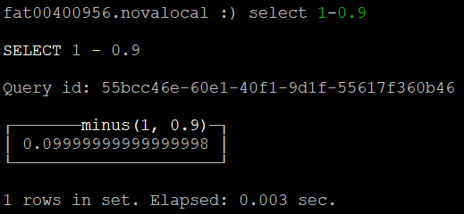
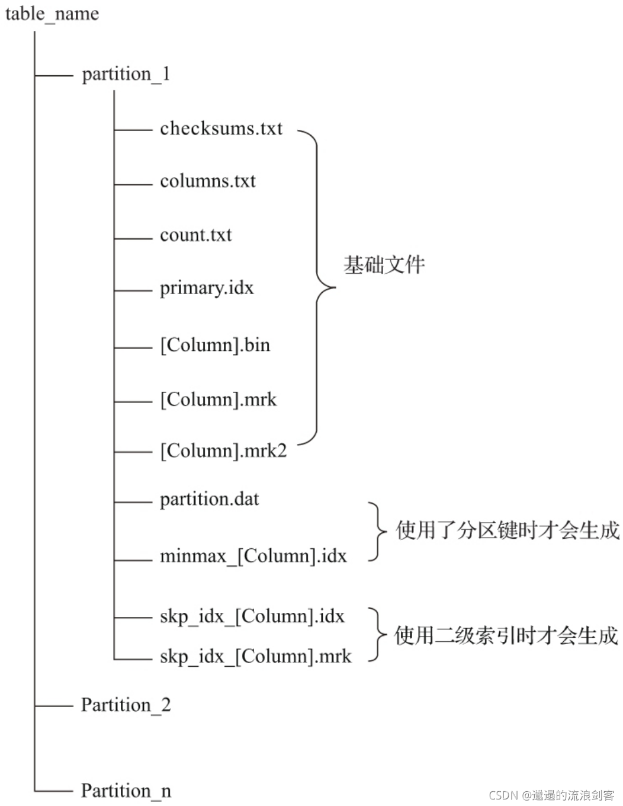
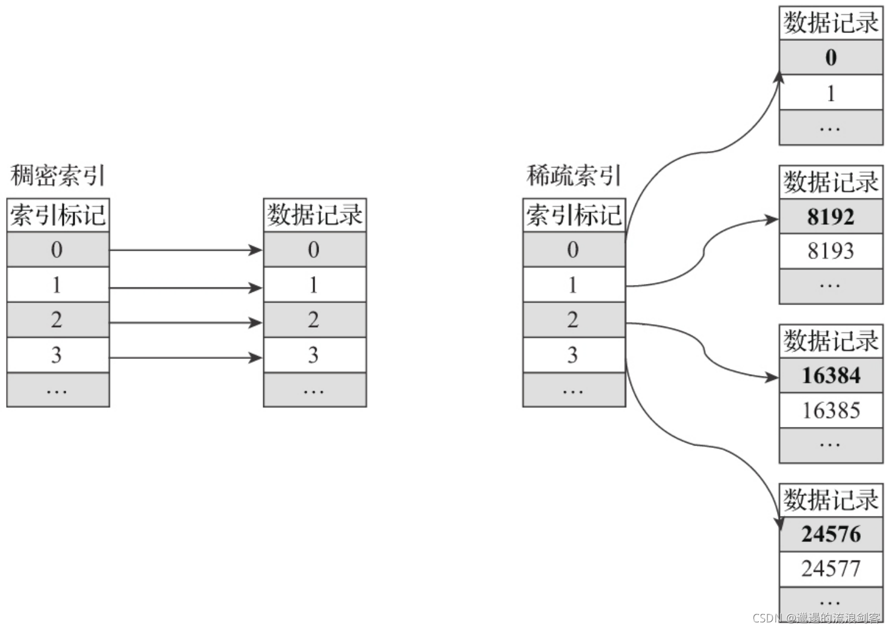
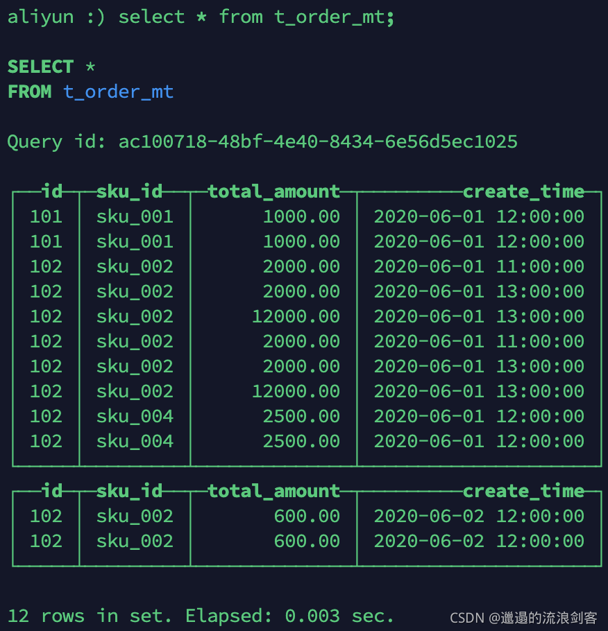
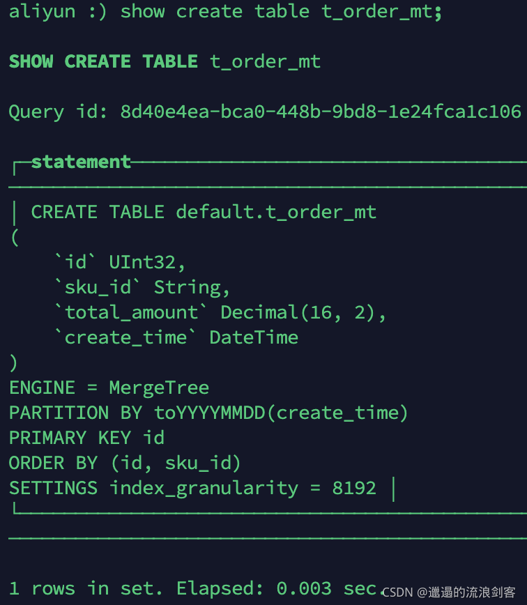
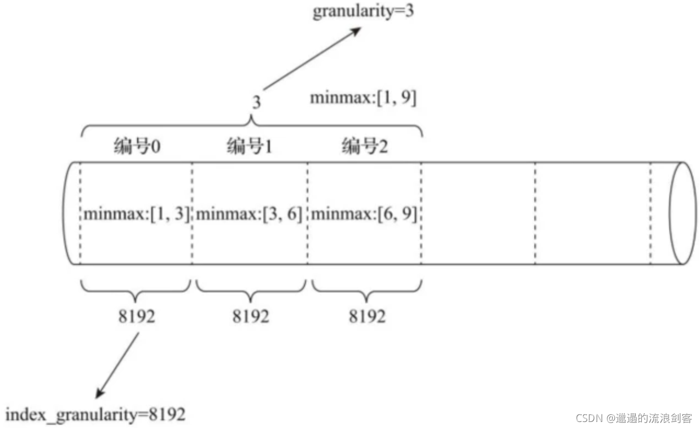
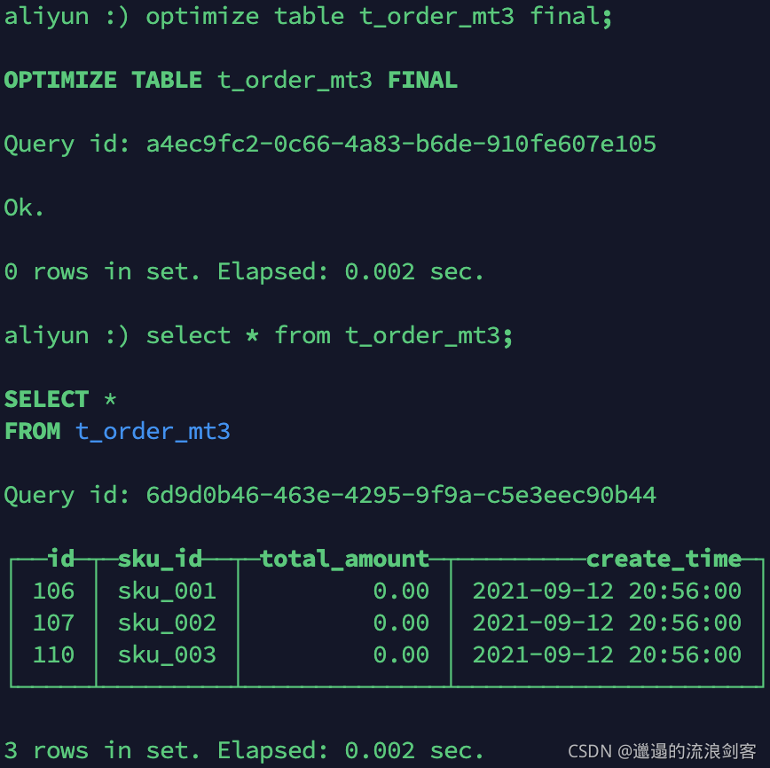

# ClickHouse基础篇

> 参考：[ClikkHouse笔记](https://daiqiaohong.gitee.io/blog/%E5%A4%A7%E6%95%B0%E6%8D%AE%E6%8A%80%E6%9C%AF%E4%B9%8BClickHouse/)

## 数据类型

### 整型

固定长度的整型，包括有符号整型或无符号整型。

整型范围（-2n-1~2n-1-1）：

Int8 - [-128 : 127]

Int16 - [-32768 : 32767]

Int32 - [-2147483648 : 2147483647]

Int64 - [-9223372036854775808 : 9223372036854775807]

无符号整型范围（0~2n-1）：

UInt8 - [0 : 255]

UInt16 - [0 : 65535]

UInt32 - [0 : 4294967295]

UInt64 - [0 : 18446744073709551615]


### 浮点型

Float32 - float

Float64 – double



> 注意：浮点型在进行计算时可能会引起四舍五入的误差。


## 表引擎

### 表引擎的使用

表引擎是 ClickHouse 的一大特色。可以说，表引擎决定了如何存储表的数据。包括：

- 数据的存储方式和位置，写到哪里以及从哪里读取数据。

- 支持哪些查询以及如何支持。
- 并发数据访问。
- 索引的使用（如果存在）。
- 是否可以执行多线程请求。
- 数据复制参数。

> 表引擎的使用方式就是必须显式在创建表时定义该表使用的引擎，以及引擎使用的相关参数。
>
> 特别注意：引擎的名称大小写敏感

### TinyLog

以列文件的形式保存在磁盘上，不支持索引，没有并发控制。一般保存少量数据的小表，生产环境上作用有限。

```sql
CREATE TABLE t_tinylog
(
    `id` String,
    `name` String
)
ENGINE = TinyLog;
```

### Memory

内存引擎，数据以未压缩的原始形式直接保存在内存当中，服务器重启数据就会消失。读写操作不会相互阻塞，不支持索引。简单查询下有非常非常高的性能表现（超过 10G/s）。

### MergeTree

ClickHouse 中最强大的表引擎当属 MergeTree（合并树）引擎及该系列（*MergeTree）中的其他引擎，支持**索引和分区**，地位可以相当于 innodb 之于 Mysql。

**1、建表语句**

```sql
CREATE TABLE t_order_mt
(
    `id` UInt32,
    `sku_id` String,
    `total_amount` Decimal(16, 2),
    `create_time` Datetime
)
ENGINE = MergeTree
PARTITION BY toYYYYMMDD(create_time)
PRIMARY KEY id
ORDER BY (id, sku_id);
```

2、插入数据

```sql
INSERT INTO t_order_mt VALUES
(101,'sku_001',1000.00,'2020-06-01 12:00:00') ,
(102,'sku_002',2000.00,'2020-06-01 11:00:00'),
(102,'sku_004',2500.00,'2020-06-01 12:00:00'),
(102,'sku_002',2000.00,'2020-06-01 13:00:00'),
(102,'sku_002',12000.00,'2020-06-01 13:00:00'),
(102,'sku_002',600.00,'2020-06-02 12:00:00');
```

MergeTree 其实还有很多参数(绝大多数用默认值即可)，但是这三个参数是更加重要的，也涉及了关于 MergeTree 的很多概念。




1. 主键可重复
2. 根据日期分区，2020-06-01、2020-06-02共两个分区
3. 分区内根据id和sku_id排序


#### partition by 分区(可选)

1、作用

分区的目的主要是降低扫描的范围，优化查询速度。

2、如果不填

只会使用一个分区。

3、分区目录

MergeTree 是以列文件+索引文件+表定义文件组成的，但是如果设定了分区那么这些文件就会保存到不同的分区目录中。

分区目录文件命名规则：PartitionId_MinBlockNum_MaxBlockNum_Level（分区值_最小分区_最大分区块编号_合并层级）

- PartitionId：
  - 数据分区 ID 生成规则
  - 数据分区规则由分区 ID 决定，分区ID由 PARTITION BY 分区键决定。根据分区键字段类型，ID生成规则可以分为：
    - 未定义分区键：没有定义 PARTITION BY ，默认生成一个目录名为 all 的数据分区，所有数据均存放在 all 目录下。
    - 整型分区键：分区键为整型，那么直接用该整型值的字符串形式作为分区ID。
    - 日期类分区键：分区键为日期类型，或者可以转化成日期类型。
    - 其他类型分区键：String、Float 类型等，通过128位的 Hash 算法取其 Hash 值作为分区ID。
  - MinBlockNum：最小分区块编号，自增类型，从1开始向上递增。每产生一个新的目录分区就向上递增一个数字。
  - MaxBlockNum：最大分区块编号，新创建的分区 MinBlockNum 等于 MaxBlockNum 的编号。
  - Level：合并的层级，被合并的次数。合并次数越多，层级值越大。

4、并行

​	分区后，面对涉及跨分区的查询统计，ClickHouse 会以分区为单位并行处理。

5、数据写入与合并

​	任何一个批次的数据写入都会产生一个临时分区，不会纳入任何一个已有的分区。写入后的某个时刻（大概 10-15 分钟后），ClickHouse 会自动执行合并操作（等不及也可以手动通过 optimize 执行），把临时分区的数据，合并到已有分区中。

```sql
OPTIMIZE TABLE xxxx FINAL;
# 只针对某一个分区做合并操作
OPTIMIZE TABLE xxxx PARTITION 'yyyy' FINAL;
```

**案例**：

执行插入操作:

```sql
insert into t_order_mt values
(101,'sku_001',1000.00,'2020-06-01 12:00:00') ,
(102,'sku_002',2000.00,'2020-06-01 11:00:00'),
(102,'sku_004',2500.00,'2020-06-01 12:00:00'),
(102,'sku_002',2000.00,'2020-06-01 13:00:00'),
(102,'sku_002',12000.00,'2020-06-01 13:00:00'),
(102,'sku_002',600.00,'2020-06-02 12:00:00');
```

查看数据并没有纳入任何分区



手动optimize之后: `optimize table t_order_mt final;`

再次查询



#### primary key主键（可选）

​	ClickHouse中的主键，和其他数据库不太一样，**它只提供了数据的一级索引，但是却不是唯一约束。**这就意味着是可以存在相同primary key的数据

​	主键的设定主要依据是查询语句中的where条件，根据条件通过对主键进行某种形式的**二分查找**，能够定位到对应的index granularity，避免了全表扫描。

​	index granularity：直接翻译的话就是索引粒度，指在**稀疏索引**中两个相邻索引对应数据的间隔。**ClickHouse中的MergeTree默认是8192**。官方不建议修改这个值，除非该列存在大量重复值，比如在一个分区中几万行才有一个不同数据。



**稀疏索引**：

​	稀疏索引的好处就是可以**用很少的索引数据，定位更多的数据**，代价就是只能定位到索引粒度的第一行，然后再进行进行一点扫描。

#### order by（必须）

​	order by设定了**分区内**的数据按照哪些字段顺序进行有序保存。

​	order by是MergeTree中唯一一个必填项，甚至比primary key还重要，因为当用户不设置主键的情况，很多处理会依照order by的字段进行处理。

​	要求：**主键必须是order by字段的前缀字段**，比如order by字段是(id,sku_id)，那么主键必须是id或者(id,sku_id)

#### 二级索引

目前在ClickHouse的官网上二级索引的功能在v20.1.2.4之前是被标注为实验性的，在这个版本之后默认是开启的。

**老版本使用二级索引前需要增加设置**

是否允许使用实验性的二级索引（v20.1.2.4开始，这个参数已被删除，默认开启）

`set allow_experimental_data_skipping_indices=1;`

```sql
create table t_order_mt2(
    id UInt32,
    sku_id String,
    total_amount Decimal(16,2),
    create_time Datetime,
    INDEX a total_amount TYPE minmax GRANULARITY 5
) engine =MergeTree
partition by toYYYYMMDD(create_time)
primary key (id)
order by (id, sku_id);
```

**创建测试表**

```sql
create table t_order_mt2(
    id UInt32,
    sku_id String,
    total_amount Decimal(16,2),
    create_time Datetime,
    INDEX a total_amount TYPE minmax GRANULARITY 5
) engine =MergeTree
partition by toYYYYMMDD(create_time)
primary key (id)
order by (id, sku_id);
```

GRANULARITY N是设定二级索引对于一级索引粒度的粒度。

​	minmax索引的聚合信息是在一个index_granularity区间内数据的最小和最大值。以下图为例，假设index_granularity=8192且granularity=3，则数据会按照index_granularity划分为n等份，MergeTree从第0段分区开始，依次获取聚合信息。当获取到第3个分区时（granularity=3），则汇总并会生成第一行minmax索引（前3段minmax汇总后取值为[1, 9]）


> 参考：https://juejin.cn/post/7172870780529672223

#### 数据TTL

MergeTree提供了可以管理数据**表**或者**列**的生命周期的功能。

**1）列级TTL**

插入数据（请根据实际时间修改数据）

```sql
insert into t_order_mt3 values
(106,'sku_001',1000.00,'2023-09-13 09:35:00'),
(107,'sku_002',2000.00,'2023-09-13 09:36:00'),
(110,'sku_003',600.00,'2023-09-13 09:37:00');
```

TTL的列必须是日志类型且不能为主键

手动合并，查看效果：到期后，指定的字段数据归0。



**2）表级TTL**

下面的这条语句是数据会在create_time之后10秒丢失

`alter table t_order_mt3 MODIFY TTL create_time + INTERVAL 10 SECOND;`

涉及判断的字段必须是Date或者Datetime类型，推荐使用分区的日期字段

能够使用的时间周期：

- SECOND
- MINUTE
- HOUR
- DAY
- WEEK
- MONTH
- QUARTER
- YEAR

### ReplacingMergeTree

ReplacingMergeTree是MergeTree的一个变种，它存储特性完全继承MergeTree，只是多了一个**去重**的功能。

**1）去重时机**

数据的去重只会在合并的过程中出现。合并会在未知的时间在后台进行，所以你无法预先作出计划。有一些数据可能仍未被处理。

**2）去重范围**

**如果表经过了分区，去重只会在分区内部进行去重，不能执行跨分区的去重**

所以ReplacingMergeTree能力有限，ReplacingMergeTree适用于在后台清除重复的数据以节省空间，但是它不保证没有重复的数据出现。

**3）案例**

```sql
create table t_order_rmt(
    id UInt32,
    sku_id String,
    total_amount Decimal(16,2) ,
    create_time Datetime 
) engine =ReplacingMergeTree(create_time)
partition by toYYYYMMDD(create_time)
primary key (id)
order by (id, sku_id);
```

**`ReplacingMergeTree()`填入的参数为版本字段，重复数据保留版本字段值最大的。如果不填版本字段，默认按照插入顺序保留最后一条**

插入数据：

```sql
insert into t_order_rmt values
(101,'sku_001',1000.00,'2020-06-01 12:00:00') ,
(102,'sku_002',2000.00,'2020-06-01 11:00:00'),
(102,'sku_004',2500.00,'2020-06-01 12:00:00'),
(102,'sku_002',2000.00,'2020-06-01 13:00:00'),
(102,'sku_002',12000.00,'2020-06-01 13:00:00'),
(102,'sku_002',600.00,'2020-06-02 12:00:00');
```

执行查询操作：


**4）结论**

1. 实际上是使用order by字段作为唯一键进行去重 (id, sku_id)
2. 去重不能跨分区
3. 只有同一批插入（新版本）或合并分区时才会进行去重。`optimize **table** t_order_rmt **final**;`可以执行去重。
4. 认定重复的数据保留，版本字段值最大的
5. 如果版本字段相同则按插入顺序保留最后一笔


### SummingMergeTree

对于不查询明细，只关心以维度进行汇总聚合结果的场景。如果只使用普通的MergeTree的话，无论是存储空间的开销，还是查询时临时聚合的开销都比较大。

ClickHouse为了这种场景，提供了一种能够预聚合的引擎SummingMergeTree。

1、案例

```sql
create table t_order_smt(
	id UInt32,
	sku_id String,
	total_amount Decimal(16,2) ,
	create_time Datetime 
) engine =SummingMergeTree(total_amount)
partition by toYYYYMMDD(create_time)
primary key (id)
order by (id,sku_id );

insert into t_order_smt values
(101,'sku_001',1000.00,'2020-06-01 12:00:00'),
(102,'sku_002',2000.00,'2020-06-01 11:00:00'),
(102,'sku_004',2500.00,'2020-06-01 12:00:00'),
(102,'sku_002',2000.00,'2020-06-01 13:00:00'),
(102,'sku_002',12000.00,'2020-06-01 13:00:00'),
(102,'sku_002',600.00,'2020-06-02 12:00:00');

SELECT * from t_order_smt;
```

执行查询操作：


2、结论

- 以SummingMergeTree()中指定的列作为汇总数据列.
- 可以填写多列,必须数字列，如果不填，以所有非维度列（除了order by的列之外）且为数字列的字段为汇总数据列。
- 不在一个分区的数据不会被聚合
- 只有在同一批次插入（新版本）或分片合并时才会进行聚合

3、开发建议

设计聚合表的话，唯一键值、流水号可以去掉，所有字段全部是维度、度量或者时间戳。

4、问题

能不能直接执行以下 SQL 得到汇总值：

`SELECT total_amount FROM XXX WHERE province_name = '' AND create_date = 'xxx'`


不行，**可能会包含一些还没来得及聚合的临时明细**。


如果要是获取汇总值，还是需要使用 sum 进行聚合，这样效率会有一定的提高，但本身 ClickHouse 是列式存储的，效率提升有限，不会特别明显。

`SELECT SUM(total_amount) FROM XXX WHERE province_name = '' AND create_date = 'xxx'`

## 副本

副本的目的主要是保障数据的高可用性，即使一台 ClickHouse 节点宕机，那么也可以从其他服务器获得相同的数据。

### 副本写入流程


## 分片集群

​	副本虽然能够提高数据的可用性，降低丢失风险，但是每台服务器实际上必须容纳全量数据，对数据的**横向扩容**没有解决。

​	要解决数据水平切分的问题，需要引入分片的概念。**通过分片把一份完整的数据进行切分，不同的分片分布到不同的节点上，再通过 Distributed 表引擎把数据拼接起来一同使用**。

​	Distributed 表引擎本身不存储数据，有点类似于 MyCat 之于 MySql，成为一种中间件，通过分布式逻辑表来写入、分发、路由来操作多台节点不同分片的分布式数据。


>  注意：ClickHouse 的集群是表级别的，实际企业中，大部分做了高可用，但是没有用分片，避免降低查询性能以及操作集群的复杂性。(实际上数据量大肯定用了分片)。
>


```sql
1.

创建distributed replicate表

CREATE TABLE `t2`(`dir` String, `file` String, `path` String,d Date )ENGINE = ReplicatedMergeTree('/clickhouse/test/tables/t2/01','cluster-01') PARTITION BY (d) ORDER BY (d, path) SETTINGS index_granularity=8192;
CREATE TABLE t2all AS t2 ENGINE = Distributed(test, default, t2, rand())
CREATE TABLE `t2`(`dir` String, `file` String, `path` String,d Date )ENGINE = ReplicatedMergeTree('/clickhouse/test/tables/t2/02','cluster-02') PARTITION BY (d) ORDER BY (d, path) SETTINGS index_granularity=8192;
CREATE TABLE `t2`(`dir` String, `file` String, `path` String,d Date )ENGINE = ReplicatedMergeTree('/clickhouse/test/tables/t2/01','cluster-03') PARTITION BY (d) ORDER BY (d, path) SETTINGS index_granularity=8192;
CREATE TABLE `t2`(`dir` String, `file` String, `path` String,d Date )ENGINE = ReplicatedMergeTree('/clickhouse/test/tables/t2/02','cluster-04') PARTITION BY (d) ORDER BY (d, path) SETTINGS index_granularity=8192;
 

 

通过这种方式可以进行drop parttion和truncate table

alter table t2 drop PARTITION '2018-10-19'  清空一个表的分区

truncate table t2;   清空一张表

drop 和 truncate 不能再distributed 引擎上执行

 

2.

ReplicatedMergeTree 引擎必须设置primary key，primary key可以是多列。如果primarykey 一样，则会覆盖之前的数据

MergeTree 引擎必须设置primary key，primary key可以是多列。如果primarykey 一样，不会覆盖之前的数据

 

3.

alter table t2 delete where d='2018-10-19'  删除数据

ReplicatedMergeTree 引擎如果插入了已经删除的数据      还是无法显示出来

MergeTree  引擎如果插入了已经删除的数据                      是可以显示出来的

 

4.

CREATE TABLE `t2`(`dir` String, `file` String, `path` String,d Date )ENGINE = ReplicatedMergeTree('/clickhouse/test/tables/t2/02','cluster-04'，d, (d, path), 8192）;

这种方式创建表，不支持alter table t2 drop PARTITION '2018-10-19' 

 

5.创建非分区表

CREATE TABLE default.t6 ( dir Nullable(String),  file String,  path String) ENGINE = ReplicatedMergeTree('/clickhouse/test/tables/t6/02', 'cluster-04') ORDER BY tuple() SETTINGS index_granularity = 8192

可以直接插入null，并且所有列的数据一样才会覆盖

insert into t6 values(null,'112','11');

 

6.创建分区表

CREATE TABLE default.t4 ( dir Nullable(String),  file String,  path String,  d Date) ENGINE = ReplicatedMergeTree('/clickhouse/test/tables/t4/02', 'cluster-04') PARTITION BY d ORDER BY d SETTINGS index_granularity = 8192 

可以直接插入null，并且所有列的数据一样才会覆盖

insert into t6 values(null,'112','11','2018-10-19');
```

