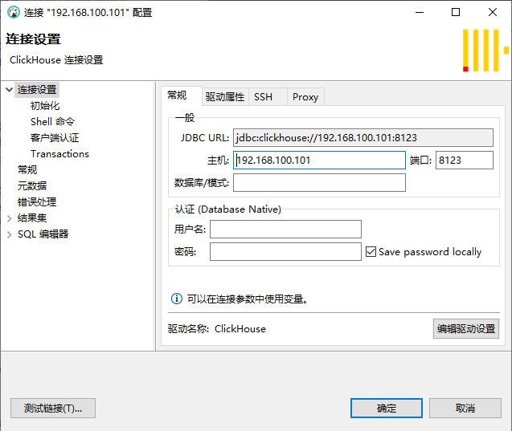
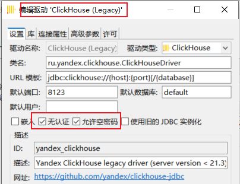
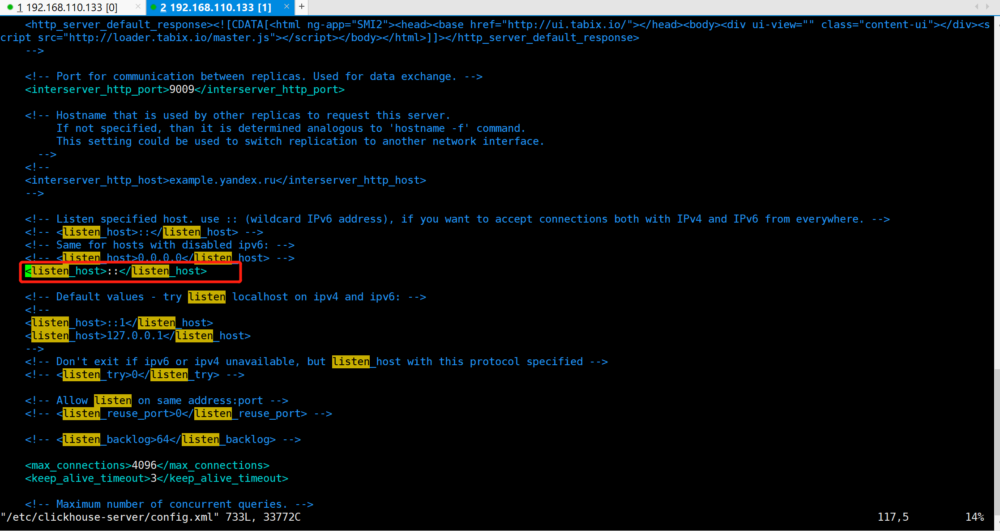

# Clickhouse安装部署

## 单机版本安装

### 安装包下载并安装

安装包下载地址：https://repo.yandex.ru/clickhouse/rpm/stable/x86_64/r

```bash
rpm -ivh clickhouse-common-static-22.2.2.1-2.x86_64.rpm
rpm -ivh clickhouse-server-22.2.2.1-2.noarch.rpm
rpm -ivh clickhouse-client-22.2.2.1-2.noarch.rpm
```

### Clickhouse操作

1、启动

`service clickhouse-server start`

2、启动client

`clickhouse-client`


## Debeaver连接Clickhouse






1、关闭密码登录要求

 cd /etc/clickhouse-server/users.d/

 mv default-password.xml default-password.xml.bak


2、允许外部连接CK




`vim /etc/clickhouse-server/config.xml`

新增一行，默认是注释的，让本地服务可以远程连接远程部署的Clickhouse服务，如上图所示：


解决问题参考：

https://cloud.tencent.com/developer/article/1795092


## clickhouse卸载

**检查有哪些clickhouse依赖包：**

`sudo yum list installed | grep clickhouse`


**移除依赖包：**

```bash
sudo yum remove -y clickhouse-common-static
sudo yum remove -y clickhouse-common-static-dbg
```


3、**卸载完再确认一下是否卸载干净**

```
sudo yum list installed | grep clickhouse 
```

4、**删除相关配置文件** 

```bash
sudo rm -rf /var/lib/clickhouse

sudo rm -rf /etc/clickhouse-*

sudo rm -rf /var/log/clickhouse-server
```


## ClickHouse初体检

1、clickhouse一些简单的操作

```sql
CREATE database learn;

use learn;

create table if not exists learn.tb_test
(
    id Int64,
    datetime DateTime,
    content Nullable(String),
    value Nullable(Float64),
    date Date
)
engine = MergeTree                  --使用mergeTree引擎，ch主要引擎
partition by toYYYYMM(datetime)     --按照datetime这个字段的月进行分区
order by id                         --按照id进行排序
TTL datetime + INTERVAL 3 DAY ;     --三天过期

-- 修改
ALTER TABLE learn.tb_test
MODIFY TTL datetime + INTERVAL 1 DAY;

select * from learn.tb_test order by id;

alter table tb_test drop partition '202005';

insert into learn.tb_test values (6, '2020-02-29 12:38:37', 'abcde', 12.553, '2020-04-25');

insert into learn.tb_test values (5, '2020-02-29 12:38:37', 'abcde', 12.553, '2020-04-25');

--修改数据，不推荐使用
alter table tb_test update content = 'hello click' where id=52;

--删除数据，不推荐使用
alter table tb_test delete WHERE id=56;
```

2、趣味玩法

1.求和引擎SummingMergeTree
这种引擎可以自动聚合非主键数字列，可以用于事件统计

```sql
--自动求和聚合表
CREATE TABLE IF NOT EXISTS learn.tb_stat
(
    regionId String,    --门店id
    groupId String,     --统计组id
    in int,             --进客流
    out int,            --出客流
    statDate DateTime   --统计时间
)
ENGINE = SummingMergeTree
partition by (toYYYYMM(statDate), regionId)
ORDER BY (toStartOfHour(statDate), regionId, groupId);

insert into tb_stat values ('1232364', '111',  32, 2,  '2020-03-25 12:56:00');
insert into tb_stat values ('1232364', '111',  34, 44, '2020-03-25 12:21:00');
insert into tb_stat values ('1232364', '111',  54, 12, '2020-03-25 12:20:00');
insert into tb_stat values ('1232364', '222',  45, 11, '2020-03-25 12:13:00');
insert into tb_stat values ('1232364', '222',  32, 33, '2020-03-25 12:44:00');
insert into tb_stat values ('1232364', '222',  12, 23, '2020-03-25 12:22:00');
insert into tb_stat values ('1232364', '333',  54, 54, '2020-03-25 12:11:00');
insert into tb_stat values ('1232364', '333',  22, 74, '2020-03-25 12:55:00');
insert into tb_stat values ('1232364', '333',  12, 15, '2020-03-25 12:34:00');


select toStartOfHour(statDate), regionId, groupId, sum(in), sum(out)
from tb_stat group by toStartOfHour(statDate), regionId, groupId;
```


数据插入后，大概过1分钟，在此查询该表可以发现，只剩下3调数据：

```
select * from tb_stat;

1232364 111 480 232 2020-03-25 04:56:00
1232364 222 356 268 2020-03-25 04:13:00
1232364 333 352 572 2020-03-25 04:11:00
```

