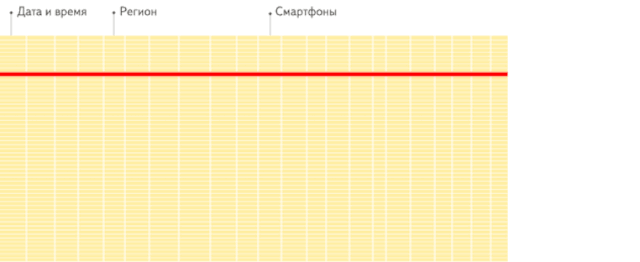

> 特别鸣谢！
>
> 参考文档：[为什么ClickHouse为什么这么快？](https://www.modb.pro/db/37700)

# 交互式分析之 ClickHouse

**交互式分析简介**

​		交互式分析，也称 OLAP（Online Analytical Processing），它赋予用户对海量数据进行多维度、交互式的统计分析能力，以充分利用数据的价值进行量化运营、辅助决策等，帮助用户提高生产效率。

​		交互式分析主要应用于统计报表、即席查询（Ad Hoc）等领域，前者查询模式较固定，后者即兴进行探索分析。

​		代表场景例如：移动互联网中 PV、UV、活跃度等典型实时报表；互联网内容领域中人群洞察、关联分析等即席查询。

