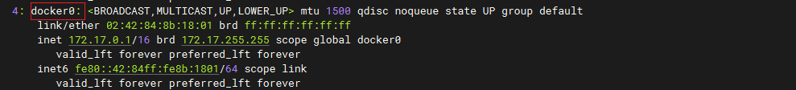
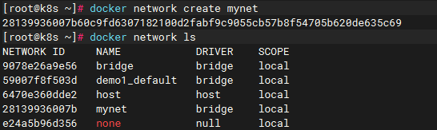
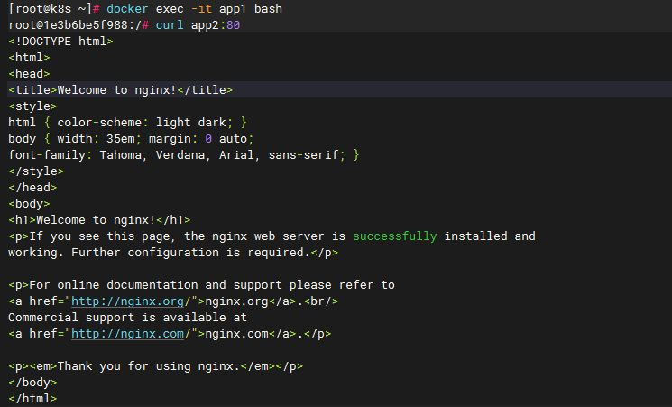
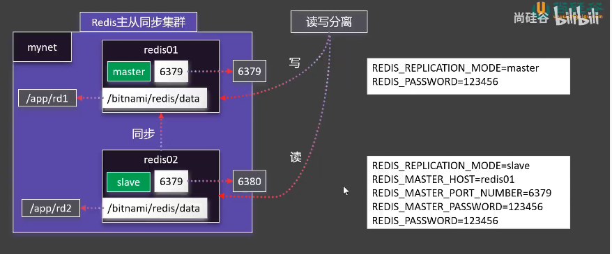

# Docker快速入门

## Docker安装


## Docker常用命令

### 常用命令

```bash
#查看运行中的容器
docker ps
#查看所有容器
docker ps -a
#搜索镜像
docker search nginx
#下载镜像
docker pull nginx
#下载指定版本镜像
docker pull nginx:1.26.0
#查看所有镜像
docker images
#删除指定id的镜像
docker rmi e784f4560448


#运行一个新容器
docker run nginx
#停止容器
docker stop keen_blackwell
#启动容器
docker start 592
#重启容器
docker restart 592
#查看容器资源占用情况
docker stats 592
#查看容器日志
docker logs 592
#删除指定容器
docker rm 592
#强制删除指定容器
docker rm -f 592
# 后台启动容器
docker run -d --name mynginx nginx
# 后台启动并暴露端口
docker run -d --name mynginx -p 80:80 nginx
# 进入容器内部
docker exec -it mynginx /bin/bash

# 提交容器变化打成一个新的镜像
docker commit -m "update index.html" mynginx mynginx:v1.0
# 保存镜像为指定文件
docker save -o mynginx.tar mynginx:v1.0
# 删除多个镜像
docker rmi bde7d154a67f 94543a6c1aef e784f4560448
# 加载镜像
docker load -i mynginx.tar 


# 登录 docker hub
docker login
# 重新给镜像打标签
docker tag mynginx:v1.0 leifengyang/mynginx:v1.0
# 推送镜像
docker push leifengyang/mynginx:v1.0

```

【小技巧】

1、查询所有的容器ID

```sh
[root@k8s ~]# docker ps -aq
7e0e5571d82f
08d218e7098d
0d5d690c20e4
f3c093d390d6
```

2、删除所有的容器

```
docker rm -f ${docker ps -aq}
```


## 存储

两种方式，注意区分：

- 目录挂载： `-v /app/nghtml:/usr/share/nginx/html`
- 卷映射：`-v ngconf:/etc/nginx`

```
docker run -d -p 99:80 \
-v /app/nghtml:/usr/share/nginx/html \
-v ngconf:/etc/nginx \
--name app03 \
nginx
```


卷实际就是一个存储。

卷映射的统一位置：/var/lib/docker/volumes/<volume-name>


【理解】

- 用目录挂载，提前要在宿主机里面把对应的映射文件创建好
- 用卷映射，不用提前创建，docker会自动创建一个卷，在`卷映射的统一位置：/var/lib/docker/volumes/<volume-name>`这个位置。默认初始化使用docker里面的文件。

## 网络

### 网络基础

docker安装后，默认配置一个docker0的网卡

```sh
# 查看所有的IP/网卡
ip a
```



创建自定义网络，实现主机名作为稳定域名访问。

docker 为每个容器分配唯一ip，使用容器IP+容器端口可以互相访问。

```sh
# 查看docker创建细节
docker inspect nginx
```


docker0默认不支持主机域名。


1、创建网络

```sh
# 创建网络
docker network create mynet

# 查看网络
docker network ls
```



2、使用网络

```sh
docker run -d -p 88:80 --name app1 --network mynet nginx

docker run -d -p 99:80 --name app2 --network mynet nginx
```

3、验证

```
docker exec -it app1 bash

curl app2:80
```



用了网络之后，各个容器可以通过**容器名/ID + 端口号**进行访问。

### Redis主从同步集群




安装代码

```sh
#自定义网络
docker network create mynet
#主节点
docker run -d -p 6379:6379 \
-v /app/rd1:/bitnami/redis/data \
-e REDIS_REPLICATION_MODE=master \
-e REDIS_PASSWORD=123456 \
--network mynet --name redis01 \
bitnami/redis

#从节点
docker run -d -p 6380:6379 \
-v /app/rd2:/bitnami/redis/data \
-e REDIS_REPLICATION_MODE=slave \
-e REDIS_MASTER_HOST=redis01 \
-e REDIS_MASTER_PORT_NUMBER=6379 \
-e REDIS_MASTER_PASSWORD=123456 \
-e REDIS_PASSWORD=123456 \
--network mynet --name redis02 \
bitnami/redis
```


【注意】

1、提前建好 rd1和rd2，并赋读写权限(777)

