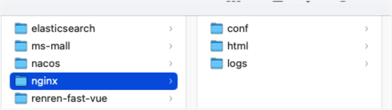
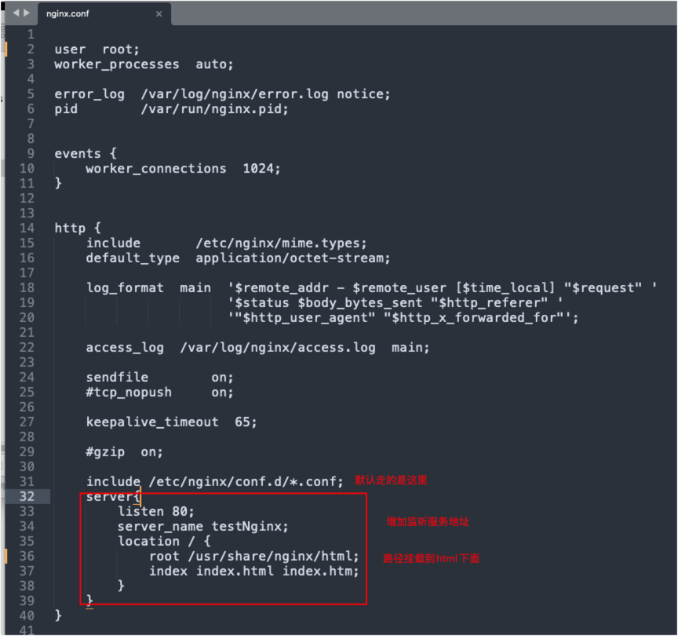

# Docker部署nginx

> https://blog.csdn.net/sinat_28927441/article/details/130968502

## 准备工作

1、拉去镜像

```bash
docker pull nginx:1.10
```

2、启动nginx服务

```bash
docker run -d -p 80:80 --name nginx nginx:1.10
```

3、拷贝容器中的配置文件到本地目录

```bash
docker container cp nginx:/etc/nginx .
```

4、然后重新命名拷贝进来的文件夹nginx 为 conf，在创建html、logs文件夹



5、删除nginx 容器

## 二、部署

1、创建新的nginx服务，挂载本地目录和容器中的目录

```bash
docker run -d \
-p 80:80 \
--name nginx \
-v /自己的本地路径/nginx/html:/usr/share/nginx/html \
-v /自己的本地路径/nginx/logs:/var/log/nginx \
-v /自己的本地路径/nginx/conf:/etc/nginx \
nginx
```

2、查看镜像服务是否启动 

`docker ps`

3、测试访问 localhost

403 被拒绝

4、配置conf

403 被拒绝，因为在nginx.conf 配置文件中默认分发到的是 default.conf文件，并增加server配置信息

nginx.conf 路径就是上面自己配置的conf文件夹下面

server 配置信息:

```json
server{
        listen 80;
        server_name testNginx;
        location / {
            root /usr/share/nginx/html;
            index index.html index.htm;
        }
    }
```



但是在 /usr/share/nginx/html 文件夹 下面缺少index.html文件，对应的本地目录也是html/下面

简单：

创建html文件—index.html，放到html目录下面

```bash
Hello Nginx!
```


6、[重启nginx](https://so.csdn.net/so/search?q=重启nginx&spm=1001.2101.3001.7020)镜像服务

docker restart

再次测试访问，就能访问到index.html 文件了

