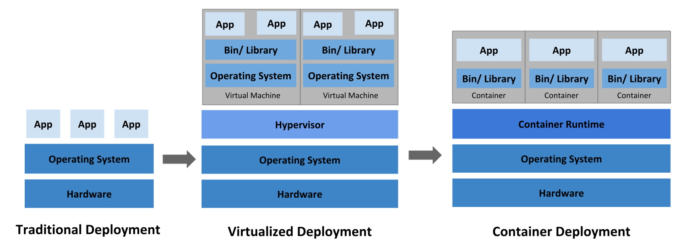
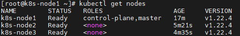

# K8S介绍与部署

> 参考：[k8s教程](https://k8s.easydoc.net)

##  Kubernetes（K8S）简介

### Kubernetes (K8S) 是什么

它是一个为 **容器化** 应用提供集群部署和管理的开源工具，由 Google 开发。
**Kubernetes** 这个名字源于希腊语，意为“舵手”或“飞行员”。k8s 这个缩写是因为 k 和 s 之间有八个字符的关系。 Google 在 2014 年开源了 Kubernetes 项目。


**主要特性：**

- 高可用，不宕机，自动灾难恢复
- 灰度更新，不影响业务正常运转
- 一键回滚到历史版本
- 方便的伸缩扩展（应用伸缩，机器加减）、提供负载均衡
- 有一个完善的生态

### 不同的应用部署方案



##### 传统部署方式：

应用直接在物理机上部署，机器资源分配不好控制，出现Bug时，可能机器的大部分资源被某个应用占用，导致其他应用无法正常运行，无法做到应用隔离。

##### 虚拟机部署

在单个物理机上运行多个虚拟机，每个虚拟机都是完整独立的系统，性能损耗大。

##### 容器部署

所有容器共享主机的系统，轻量级的虚拟机，性能损耗小，资源隔离，CPU和内存可按需分配

### 什么时候需要 Kubernetes

当你的应用只是跑在一台机器，直接一个 docker + docker-compose 就够了，方便轻松；
当你的应用需要跑在 3，4 台机器上，你依旧可以每台机器单独配置运行环境 + 负载均衡器；
当你应用访问数不断增加，机器逐渐增加到十几台、上百台、上千台时，每次加机器、软件更新、版本回滚，都会变得非常麻烦、痛不欲生，再也不能好好的摸鱼了，人生浪费在那些没技术含量的重复性工作上。

这时候，Kubernetes 就可以一展身手了，让你轻松管理百万千万台机器的集群。“谈笑间，樯橹灰飞烟灭”，享受着一手掌控所有，年薪百万指日可待。

Kubernetes 可以为你提供集中式的管理集群机器和应用，加机器、版本升级、版本回滚，那都是一个命令就搞定的事，不停机的灰度更新，确保高可用、高性能、高扩展。


### Kubernetes 集群架构


##### master

主节点，控制平台，不需要很高性能，不跑任务，通常一个就行了，也可以开多个主节点来提高集群可用度。

##### worker

工作节点，可以是虚拟机或物理计算机，任务都在这里跑，机器性能需要好点；通常都有很多个，可以不断加机器扩大集群；每个工作节点由主节点管理

##### 重要概念 Pod

豆荚，K8S 调度、管理的最小单位，一个 Pod 可以包含一个或多个容器，每个 Pod 有自己的虚拟IP。一个工作节点可以有多个 pod，主节点会考量负载自动调度 pod 到哪个节点运行。


##### Kubernetes 组件

`kube-apiserver` API 服务器，公开了 Kubernetes API
`etcd` 键值数据库，可以作为保存 Kubernetes 所有集群数据的后台数据库
`kube-scheduler` 调度 Pod 到哪个节点运行
`kube-controller` 集群控制器
`cloud-controller` 与云服务商交互


## 裸机安装


### 开始安装

1、设置主机名

```sh
# 每个节点分别设置对应主机名
hostnamectl --static set-hostname k8s-node1
hostnamectl --static set-hostname k8s-node2
hostnamectl --static set-hostname k8s-node3
```

2、设置hosts

```SH
# 所有节点都修改 hosts
vim /etc/hosts

192.168.56.102 k8s-node1
192.168.56.103 k8s-node2
192.168.56.104 k8s-node3
```

3、关闭selinux

```sh
# 所有节点关闭 SELinux
setenforce 0
sed -i --follow-symlinks 's/SELINUX=enforcing/SELINUX=disabled/g' /etc/sysconfig/selinux
```


4、关闭防火墙

```sh
# 所有节点确保防火墙关闭
systemctl stop firewalld
systemctl disable firewalld
```

5、安装yum工具类

```sh
yum install yum-utils
```

6、添加安装源（所有节点）

```sh
# 添加 k8s 安装源
## step1: 镜像源
cat <<EOF > kubernetes.repo
[kubernetes]
name=Kubernetes
baseurl=https://mirrors.aliyun.com/kubernetes/yum/repos/kubernetes-el7-x86_64
enabled=1
gpgcheck=0
repo_gpgcheck=0
gpgkey=https://mirrors.aliyun.com/kubernetes/yum/doc/yum-key.gpg https://mirrors.aliyun.com/kubernetes/yum/doc/rpm-package-key.gpg
EOF

## setp2: 切换
mv kubernetes.repo /etc/yum.repos.d/

# 添加 Docker 安装源
yum-config-manager --add-repo http://mirrors.aliyun.com/docker-ce/linux/centos/docker-ce.repo
```

7、安装所需组件

```sh
yum install -y kubelet-1.22.4 kubectl-1.22.4 kubeadm-1.22.4 docker-ce
```

8、启动 kubelet、docker，并设置开机启动（所有节点）

```sh
systemctl enable kubelet
systemctl start kubelet
systemctl enable docker
systemctl start docker
```

9、修改 docker 配置（所有节点）

```sh
# kubernetes 官方推荐 docker 等使用 systemd 作为 cgroupdriver，否则 kubelet 启动不了
cat <<EOF > daemon.json
{
  "exec-opts": ["native.cgroupdriver=systemd"],
  "registry-mirrors": ["https://ud6340vz.mirror.aliyuncs.com"]
}
EOF

mv daemon.json /etc/docker/

# 重启生效
systemctl daemon-reload
systemctl restart docker
```

10、用 [kubeadm](https://kubernetes.io/docs/reference/setup-tools/kubeadm/) 初始化集群（仅在主节点跑）

> 操作前必须执行两项操作：
>
> (1) 虚拟机的核数设置为2
>
> (2) 关闭swap (工作节点也要执行)
>
> swapoff  -a
> sed -ri 's/.*swap.*/#&/' /etc/fstab

具体操作如下

```sh
# 初始化集群控制台 Control plane
# 失败了可以用 kubeadm reset 重置
kubeadm init --image-repository=registry.aliyuncs.com/google_containers

# 记得把 kubeadm join xxx 保存起来
# 忘记了重新获取：kubeadm token create --print-join-command

# 复制授权文件，以便 kubectl 可以有权限访问集群
# 如果你其他节点需要访问集群，需要从主节点复制这个文件过去其他节点
mkdir -p $HOME/.kube
cp -i /etc/kubernetes/admin.conf $HOME/.kube/config
chown $(id -u):$(id -g) $HOME/.kube/config

# 在其他机器上创建 ~/.kube/config 文件也能通过 kubectl 访问到集群

```

11、把工作节点加入集群（只在工作节点跑）

```sh
kubeadm join 172.16.32.10:6443 --token xxx --discovery-token-ca-cert-hash xxx
```

12、安装网络插件，否则 node 是 NotReady 状态（主节点跑）

```sh
# 很有可能国内网络访问不到这个资源，你可以网上找找国内的源安装 flannel
kubectl apply -f https://raw.githubusercontent.com/coreos/flannel/master/Documentation/kube-flannel.yml

# 如果上面的插件安装失败，可以选用 Weave，下面的命令二选一就可以了。
kubectl apply -f https://github.com/weaveworks/weave/releases/download/v2.8.1/weave-daemonset-k8s.yaml
kubectl apply -f http://static.corecore.cn/weave.v2.8.1.yaml

# 更多其他网路插件查看下面介绍，自行网上找 yaml 安装
https://blog.csdn.net/ChaITSimpleLove/article/details/117809007
```

> 请注意，flannel 插件很多学员都安装不上（因为网络问题），这样会导致后面名字访问服务用不了，
> 大家可以改用 weave 或者使用香港服务器或者寻找国内的源安装

13、查看节点，要在主节点查看（其他节点有安装 kubectl 也可以查看）


```sh
kubectl get nodes
```



