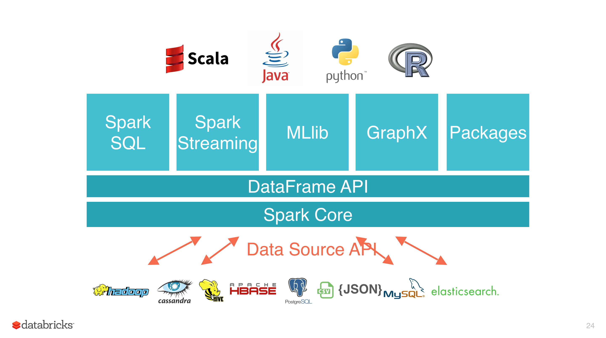
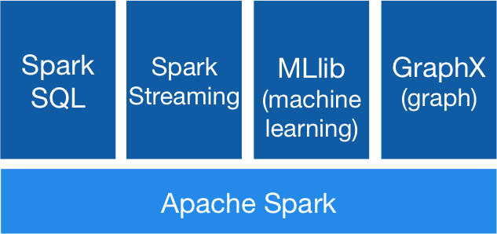

> 【鸣谢】
>
> 参考文档：[Spark简介](https://github.com/heibaiying/BigData-Notes/blob/master/notes/Spark简介.md)
>
> https://www.cnblogs.com/tgzhu/p/5818374.html

# 一、Spark简介

## 1.1 简介

Spark 于 2009 年诞生于加州大学伯克利分校 AMPLab，2013 年被捐赠给 Apache 软件基金会，2014 年 2 月成为 Apache 的顶级项目。相对于 MapReduce 的批处理计算，Spark 可以带来上百倍的性能提升，因此它成为继 MapReduce 之后，最为广泛使用的分布式计算框架。

## 1.2 特点

Apache Spark 具有以下特点：

- 使用先进的 DAG 调度程序，查询优化器和物理执行引擎，以实现性能上的保证；
- 多语言支持，目前支持的有 Java，Scala，Python 和 R；
- 提供了 80 多个高级 API，可以轻松地构建应用程序；
- 支持批处理，流处理和复杂的业务分析；
- 丰富的类库支持：包括 SQL，MLlib，GraphX 和 Spark Streaming 等库，并且可以将它们无缝地进行组合；
- 丰富的部署模式：支持本地模式和自带的集群模式，也支持在 Hadoop，Mesos，Kubernetes 上运行；
- 多数据源支持：支持访问 HDFS，Alluxio，Cassandra，HBase，Hive 以及数百个其他数据源中的数据。



## 1.3 集群架构

| Term（术语）     | Meaning（含义）                                              |
| ---------------- | :----------------------------------------------------------- |
| Application      | Appliction都是指用户编写的Spark应用程序，其中包括一个Driver功能的代码和分布在集群中多个节点上运行的Executor代码。 |
| Driver program   | Spark中的Driver即运行上述Application的main函数并创建SparkContext，创建SparkContext的目的是为了准备Spark应用程序的运行环境，在Spark中有SparkContext负责与ClusterManager通信，*进行资源申请、任务的分配和监控*等，当Executor部分运行完毕后，Driver同时负责将SparkContext关闭，通常用SparkContext代表Driver |
| Cluster manager  | 集群资源管理器，指的是在集群上获取资源的外部服务。目前有三种类型 |
| Worker node      | Standalon : spark原生的资源管理，由Master负责资源的分配 Apache Mesos:与hadoop MR兼容性良好的一种资源调度框架 Hadoop Yarn: 主要是指Yarn中的ResourceManager执行计算任务的工作节点 |
| Executor         | 位于工作节点上的应用进程，负责执行计算任务并且将输出数据保存到内存或者磁盘中 |
| Task             | 被送到某个Executor上的工作单元，但hadoopMR中的MapTask和ReduceTask概念一样，是运行Application的基本单位，多个Task组成一个Stage，而Task的调度和管理等是由TaskScheduler负责。 |
| **Job**          | 包含多个Task组成的并行计算，往往由Spark Action触发生成， 一个Application中往往会产生多个Job |
| **Stage**        | 每个Job会被拆分成多组Task， 作为一个TaskSet， 其名称为Stage，Stage的划分和调度是有DAGScheduler来负责的，Stage有非最终的Stage（Shuffle Map Stage）和最终的Stage（Result Stage）两种，Stage的边界就是发生shuffle的地方 |
| **DAGScheduler** | 根据Job构建基于Stage的DAG（Directed Acyclic Graph有向无环图)，并提交Stage给TASkScheduler。 其划分Stage的依据是RDD之间的依赖的关系找出开销最小的调度方法。 |


**执行过程**：

1. 用户程序创建 SparkContext 后，它会连接到集群资源管理器，集群资源管理器会为用户程序分配计算资源，并启动 Executor；
2. Driver 将计算程序划分为不同的执行阶段和多个 Task，之后将 Task 发送给 Executor；
3. Executor 负责执行 Task，并将执行状态汇报给 Driver，同时也会将当前节点资源的使用情况汇报给集群资源管理器。

## 1.4 核心组件

Spark 基于 Spark Core 扩展了四个核心组件，分别用于满足不同领域的计算需求。




## 1.5 Hadoop or Spark

Hadoop的MR框架和Spark框架都是数据处理框架，那么我们在使用时如何选择呢？

- Hadoop MapReduce由于其设计初衷并不是为了满足循环迭代式数据流处理，因此在多并行运行的数据可复用场景（如：机器学习、图挖掘算法、交互式数据挖掘算法）中存在诸多计算效率等问题。所以Spark应运而生，Spark就是在传统的MapReduce 计算框架的基础上，利用其计算过程的优化，从而大大加快了数据分析、挖掘的运行和读写速度，并将计算单元缩小到更适合并行计算和重复使用的RDD计算模型。
- 机器学习中ALS、凸优化梯度下降等。这些都需要基于数据集或者数据集的衍生数据反复查询反复操作。MR这种模式不太合适，即使多MR串行处理，性能和时间也是一个问题。数据的共享依赖于磁盘。另外一种是交互式数据挖掘，MR显然不擅长。而Spark所基于的scala语言恰恰擅长函数的处理。
- Spark是一个分布式数据快速分析项目。它的核心技术是弹性分布式数据集（Resilient Distributed Datasets），提供了比MapReduce丰富的模型，可以快速在内存中对数据集进行多次迭代，来支持复杂的数据挖掘算法和图形计算算法。
- **Spark和Hadoop的根本差异是多个作业之间的数据通信问题 : Spark多个作业之间数据通信是基于内存，而Hadoop是基于磁盘**。
- Spark Task的启动时间快。Spark采用fork线程的方式，而Hadoop采用创建新的进程的方式。
- Spark只有在shuffle的时候将数据写入磁盘，而Hadoop中多个MR作业之间的数据交互都要依赖于磁盘交互.
- Spark的缓存机制比HDFS的缓存机制高效。

​		

​		经过上面的比较，我们可以看出在绝大多数的数据计算场景中，Spark确实会比MapReduce更有优势。但是Spark是基于内存的，所以在实际的生产环境中，由于内存的限制，可能会由于内存资源不够导致Job执行失败，此时，MapReduce其实是一个更好的选择，所以Spark并不能完全替代MR。


# 二、Spark快速上手

## 2.1 创建Maven项目

增加Scala插件

​		Spark 由 Scala 语言开发的，所以本课件接下来的开发所使用的语言也为 Scala，咱们当 前使用的 Spark 版本为 3.0.0，默认采用的 Scala 编译版本为 2.12，所以后续开发时。我们依 然采用这个版本。开发前请保证 IDEA 开发工具中含有 Scala 开发插件

### 2.1.2 增加pom依赖

```xml
<?xml version="1.0" encoding="UTF-8"?>
<project xmlns="http://maven.apache.org/POM/4.0.0"
         xmlns:xsi="http://www.w3.org/2001/XMLSchema-instance"
         xsi:schemaLocation="http://maven.apache.org/POM/4.0.0 http://maven.apache.org/xsd/maven-4.0.0.xsd">
    <modelVersion>4.0.0</modelVersion>

    <groupId>com.pitaya</groupId>
    <artifactId>learn-spark</artifactId>
    <packaging>pom</packaging>
    <version>1.0-SNAPSHOT</version>
    <modules>
        <module>spark-core</module>
    </modules>

    <properties>
        <maven.compiler.source>8</maven.compiler.source>
        <maven.compiler.target>8</maven.compiler.target>
        <scala.binary.version>2.12</scala.binary.version>
        <scala.version>2.12.18</scala.version>
    </properties>

    <dependencies>
        <dependency>
            <groupId>org.apache.spark</groupId>
            <artifactId>spark-core_2.12</artifactId>
            <version>3.0.1</version>
        </dependency>
        <!-- Scala Library, provided by Flink as well. -->
        <dependency>
            <groupId>org.scala-lang</groupId>
            <artifactId>scala-library</artifactId>
            <version>${scala.version}</version>
            <!--			<scope>provided</scope>-->
        </dependency>
    </dependencies>

    <build>
        <plugins>
            <plugin>
                <groupId>net.alchim31.maven</groupId>
                <artifactId>scala-maven-plugin</artifactId>
                <version>3.2.2</version>
                <executions>
                    <execution>
                        <!-- 声明绑定到maven的compile阶段 -->
                        <goals>
                            <goal>compile</goal>
                            <goal>testCompile</goal>
                        </goals>
                    </execution>
                </executions>
            </plugin>
        </plugins>
    </build>
</project>
```

【注意】pom文件中的依赖和插件必须要加上。

### 2.1.3 Scala环境搭建

参考：https://blog.csdn.net/u010416101/article/details/127505064

### 2.1.4 WordCount参考代码

```scala
package com.pitaya.wc

import org.apache.spark.rdd.RDD
import org.apache.spark.{SparkConf, SparkContext}

object WordCount {
  def main(args: Array[String]): Unit = {
    // 创建 Spark 运行配置对象
    val sparkConf = new SparkConf().setMaster("local[*]").setAppName("WordCount")
    // 创建 Spark 上下文环境对象（连接对象）
    val sc : SparkContext = new SparkContext(sparkConf)
    // 读取文件数据
    val fileRDD: RDD[String] = sc.textFile("input/word.txt")
    // 将文件中的数据进行分词
    val wordRDD: RDD[String] = fileRDD.flatMap( _.split(" ") )
    // 转换数据结构 word => (word, 1)
    val word2OneRDD: RDD[(String, Int)] = wordRDD.map((_,1))
    // 将转换结构后的数据按照相同的单词进行分组聚合
    val word2CountRDD: RDD[(String, Int)] = word2OneRDD.reduceByKey(_+_)
    // 将数据聚合结果采集到内存中
    val word2Count: Array[(String, Int)] = word2CountRDD.collect()
    // 打印结果
    word2Count.foreach(println)
    //关闭 Spark 连接
    sc.stop()
  }
}

```


