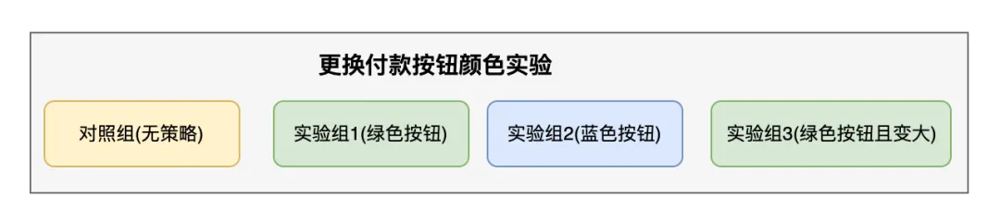

# 算法AB实验平台进化历程和挑战｜得物技术

> [算法AB实验平台进化历程和挑战｜得物技术](https://mp.weixin.qq.com/s/-x9FoPVfH05IGx-7KM3iMA)

## 一、AB平台简介

AB实验平台这几年在互联网公司得到了越来越广泛的应用，采用AB实验来评估产品和技术迭代效果也成为主流的业务新功能效果评估方式，数据驱动的文化在这几年得到了不少公司的广泛的认同，通过数据和指标来说明产品效果也得到了越来越多的公司的认可和应用。

AB实验在其中就是一种很常见的**产品效果数据评估工具**，在各大公司的产品迭代过程中也得到了越来越广泛的应用。

## 二、1.0 时代 从无到有

在AB实验刚开始的时候，需要解决的问题很简单：

**通过某种用户流量分组方式，将不同的用户划分到不同的流量组，在不同的流量组通过控制变量的方式应用不同的产品策略，随后观察两个组的产品效果差别。**

这种非常朴素的实验思路就是最基本的AB实验的分流，需要注意的是在过程中需要保证控制变量和稳定的流量比例。

### 一个基本AB实验实例

一个基本的AB实验需要有以下要素：

1. **实验目标和实验假设**
   1. 实验目标决定到达到什么样的效果实验才算成功，举个例子，我希望**付款率提升5%**，这就是目标，其中的**实验指标是付款率**，做实验之前一定要有实验目标，没有实验目标没办法确定实验是否成功，**实验目标包含指标和变化幅度两个要素**。
   2. 实验假设是猜想通过控制哪些因素来达到实验目标，比如我们假设付款按钮的颜色会影响用户的付款意愿进而影响付款率，那这里的实验假设就是**付款按钮颜色会影响用户付款意愿。**

