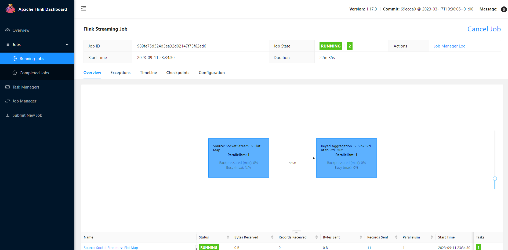

# Flink安装教程

## Local模式

local模式用于本地开发测试。

### 安装步骤

1、下载flink安装包

- [Flink官网下载](https://flink.apache.org/downloads/)
- [清华镜像站](https://mirrors.tuna.tsinghua.edu.cn/)

​			搜 apache --> 进入flink目录，选择版本下载

2、解压flink

`tar -zxvf flink-1.12.2-bin-scala_2.12.tgz`

3、修改配置文件

flink 1.15版本之后，若要打开webui，需要修改配置文件 `conf/flink-conf.yaml`

里面的 `rest.bind-address` 参数 改为`0.0.0.0`


### 启动与测试

1、Flink 附带了一个 bash 脚本，可以用于启动本地集群。

```bash
$ ./bin/start-cluster.sh
Starting cluster.
Starting standalonesession daemon on host.
Starting taskexecutor daemon on host.
```

2、启动webui

http://192.168.56.101:8081/

3、启动测试

Flink 的 Releases 附带了许多的示例作业。你可以任意选择一个，快速部署到已运行的集群上。

```
$ bin/flink run examples/streaming/WordCount.jar
```


实际生产中，job处于一直运行的状态。


本地连接flink: https://www.cnblogs.com/ywjfx/p/14206992.html


## Windows下安装Flink

windows下安装flink，通常用作测试。

### flink1.17部署

1、下载flink1.17

可以上清华镜像站 --> apache --> flink --> 下载flink1.17

2、解压

3、在flink根目录下创建2个文件

- start-cluster.bat脚本内容

```bash
::###############################################################################
::  Licensed to the Apache Software Foundation (ASF) under one
::  or more contributor license agreements.  See the NOTICE file
::  distributed with this work for additional information
::  regarding copyright ownership.  The ASF licenses this file
::  to you under the Apache License, Version 2.0 (the
::  "License"); you may not use this file except in compliance
::  with the License.  You may obtain a copy of the License at
::
::      http://www.apache.org/licenses/LICENSE-2.0
::
::  Unless required by applicable law or agreed to in writing, software
::  distributed under the License is distributed on an "AS IS" BASIS,
::  WITHOUT WARRANTIES OR CONDITIONS OF ANY KIND, either express or implied.
::  See the License for the specific language governing permissions and
:: limitations under the License.
::###############################################################################
 
@echo off
setlocal
 
SET bin=%~dp0
SET FLINK_HOME=%bin%..
SET FLINK_LIB_DIR=%FLINK_HOME%\lib
SET FLINK_PLUGINS_DIR=%FLINK_HOME%\plugins
 
SET JVM_ARGS=-Xmx512m
 
SET FLINK_JM_CLASSPATH=%FLINK_LIB_DIR%\*
 
java %JVM_ARGS% -cp "%FLINK_JM_CLASSPATH%"; org.apache.flink.client.cli.CliFrontend %*
 
endlocal
 
```

- flink.bat

```bash
::###############################################################################
::  Licensed to the Apache Software Foundation (ASF) under one
::  or more contributor license agreements.  See the NOTICE file
::  distributed with this work for additional information
::  regarding copyright ownership.  The ASF licenses this file
::  to you under the Apache License, Version 2.0 (the
::  "License"); you may not use this file except in compliance
::  with the License.  You may obtain a copy of the License at
::
::      http://www.apache.org/licenses/LICENSE-2.0
::
::  Unless required by applicable law or agreed to in writing, software
::  distributed under the License is distributed on an "AS IS" BASIS,
::  WITHOUT WARRANTIES OR CONDITIONS OF ANY KIND, either express or implied.
::  See the License for the specific language governing permissions and
:: limitations under the License.
::###############################################################################
 
@echo off
setlocal
 
SET bin=%~dp0
SET FLINK_HOME=%bin%..
SET FLINK_LIB_DIR=%FLINK_HOME%\lib
SET FLINK_PLUGINS_DIR=%FLINK_HOME%\plugins
 
SET JVM_ARGS=-Xmx512m
 
SET FLINK_JM_CLASSPATH=%FLINK_LIB_DIR%\*
 
java %JVM_ARGS% -cp "%FLINK_JM_CLASSPATH%"; org.apache.flink.client.cli.CliFrontend %*
 
endlocal
 
```


### 安装nc/ncat

windows下安装nc有点麻烦，具体参考：https://lug.ustc.edu.cn/planet/2019/09/how-to-use-nc/

1、下载地址：

https://github.com/andrew-d/static-binaries/blob/master/binaries/windows/x86/ncat.exe 

2、本地执行

`ncat -l 7777`


### 本地运行Flink

1、参考代码

```java
import com.pitaya.tutorial.function.WordCountFlatMapFunction;
import org.apache.flink.api.java.tuple.Tuple2;
import org.apache.flink.client.program.StreamContextEnvironment;
import org.apache.flink.configuration.Configuration;
import org.apache.flink.streaming.api.datastream.DataStream;
import org.apache.flink.streaming.api.environment.StreamExecutionEnvironment;

/**
 * @Description:
 * @Date 2023/09/02 10:36:00
 **/
public class StreamWordCount {
    public static void main(String[] args) throws Exception {
        // 创建流处理执行环境
        Configuration configuration = new Configuration();
        configuration.setInteger("rest.port", 8081);

        StreamExecutionEnvironment env = StreamContextEnvironment.createLocalEnvironmentWithWebUI(configuration);

        // 设置并行度，默认值= 当前计算机的CPU逻辑核数（设置成1即单线程处理）
        env.setParallelism(1);

        // 从socket文本读取数据
        DataStream<String> inputDataStream = env.socketTextStream("127.0.0.1", 7777);
        // 基于数据流进行转换计算
        DataStream<Tuple2<String, Integer>> resultStream
                = inputDataStream.flatMap(new WordCountFlatMapFunction())
                .keyBy(item -> item.f0)
                // .window(TumblingProcessingTimeWindows.of(Time.seconds(1)))
                .sum(1);
        resultStream.print();
        // 执行任务
        env.execute();
    }
}
```

2、pom需要加上依赖

```xml
        <dependency>
            <groupId>org.apache.flink</groupId>
            <artifactId>flink-runtime-web</artifactId>
            <version>1.17.0</version>
        </dependency>
        <dependency>
            <groupId>org.apache.logging.log4j</groupId>
            <artifactId>log4j-core</artifactId>
            <version>2.12.4</version>
        </dependency>
```

3、加上日志配置文件log4j2.xml

```xml
<?xml version="1.0" encoding="UTF-8"?>
<Configuration>
    <Appenders>
        <Console name="STDOUT" target="SYSTEM_OUT">
            <PatternLayout pattern="%d %-5p [%t] %C{2} (%F:%L) - %m%n"/>
        </Console>
        <RollingFile name="RollingFile" fileName="logs/strutslog1.log"
                     filePattern="logs/$${date:yyyy-MM}/app-%d{MM-dd-yyyy}-%i.log.gz">
            <PatternLayout>
                <Pattern>%d{MM-dd-yyyy} %p %c{1.} [%t] -%M-%L- %m%n</Pattern>
            </PatternLayout>
            <Policies>
                <TimeBasedTriggeringPolicy />
                <SizeBasedTriggeringPolicy size="1 KB"/>
            </Policies>
            <DefaultRolloverStrategy fileIndex="max" max="2"/>
        </RollingFile>
    </Appenders>
    <Loggers>
        <Logger name="com.opensymphony.xwork2" level="WAN"/>
        <Logger name="org.apache.struts2" level="WAN"/>
        <Root level="warn">
            <AppenderRef ref="STDOUT"/>
        </Root>
    </Loggers>
</Configuration>
```

4、运行代码

浏览器访问：http://localhost:8081/




## Docker安装Flink


## 集群安装Flink


## k8s安装Flink

