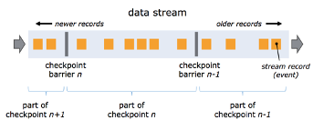
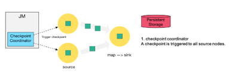
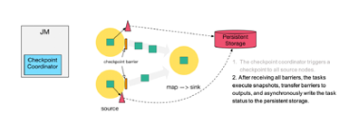
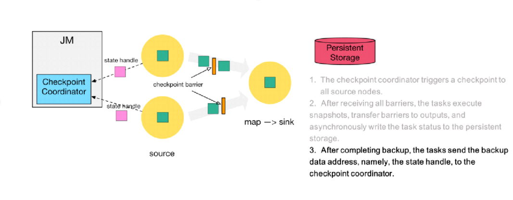
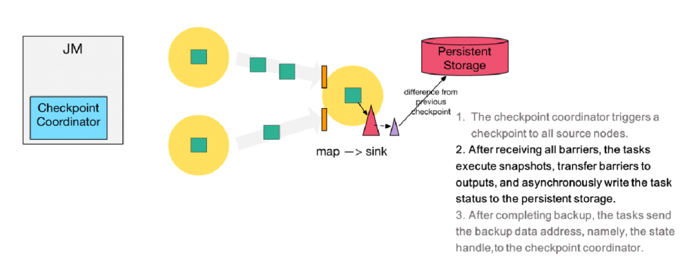
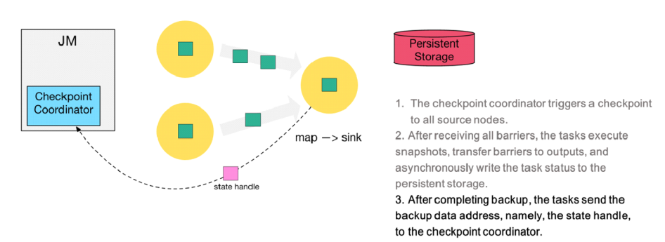
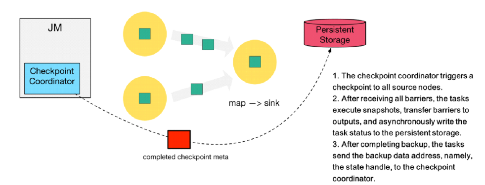

## 一、Flink一致性检查点

> ​		Flink是一个分布式的流处理引擎，而流处理的其中一个特点就是7X24 可用。那么，如何保障Flink作业的持续运行呢? Flink的内部会将应用状态(state)存储到本地内存或者嵌入式的kv数据库(RocksDB)中，由于采用的是分布式架构，Flink需要对本地生成的状态进行持久化存储，以避免因应用或者节点机器故障等原因导致数据的丢失，Flink是通过checkpoint(检查点)的方式将状态写入到远程的持久化存储，从而就可以实现不同语义的结果保障。
>
> ​		为了保证state容错，Flink提供了处理故障的措施，这种措施称之为checkpoint(一致性检查点)。checkpoint是Flink实现容错的核心功能，主要是**周期性地触发checkpoint，将state生成快照持久化到外部存储系统(比如HDFS) **。这样一来，如果Flink程序出现故障，那么就可以从上一次checkpoint中进行状态恢复，从而提供容错保障。另外，通过checkpoint机制，Flink可以实现Exactly-once语义(Flink内部的Exactly-once,关于端到端的exactly_once,Flink是通过两阶段提交协议实现的)。

## 1.1 状态一致性概述

​		当在分布式系统中引入状态时，自然也引入了一致性问题。

​		一致性实际上是"**正确性级别**"的另一种说法，也就是说**在成功处理故障并恢复之后得到的结果，与没有发生任何故障时得到的结果相比，前者到底有多正确**？举例来说，假设要对最近一小时登录的用户计数。在系统经历故障之后，计数结果是多少？如果有偏差，是有漏掉的计数还是重复计数？

在流处理中，一致性可以分为3个级别:

- **at-most-once(最多一次):** 

  这其实是没有正确性保障的委婉说法——故障发生之后，计数结果可能丢失。

- **at-least-once(至少一次):**

  这表示计数结果可能大于正确值，但绝不会小于正确值。也就是说，计数程序在发生故障后**可能多算**，但是**绝不会少算。**

- **exactly-once(严格变一次):**

  这指的是系统保证**在发生故障后得到的计数结果与正确值一致。**既不多算也不少算。**恰好处理一次是最严格的保证，也是最难实现的。**

​		Flink的一个重大价值在于，它**既**保证了**exactly-once**，**又**具有**低延迟和高吞吐**的处理能力。

## 1.2 端到端的状态一致性

​		端到端的一致性保证，意味着结果的正确性贯穿了整个流处理应用的始终；每一个组件都保证了它自己的一致性，整个端到端的一致性级别取决于所有组件中一致性最弱的组件。具体划分如下:

- source端

- - 需要外部源可重设数据的读取位置。
  - 目前我们使用的Kafka Source具有这种特性: **读取数据的时候可以指定offset**。

- flink内部

- - 依赖checkpoint机制

- sink端

​		需要保证从故障恢复时，数据不会重复写入外部系统. 有2种实现形式：幂等写入、事务性写入

## 二、Checkpoint

​		Flink是一个分布式数据处理系统，这种场景下，它需要处理各种异常，例如进程终止、机器故障、网络中断等。因为tasks在本地维护它们的state，Flink必须确保在出现故障的情况下，state不会丢失，并且保持一致性。

​		Flink具体如何保证exactly-once呢? 它使用一种被称为"检查点"（**checkpoint**）的特性，在出现故障时将系统重置回正确状态。下面通过简单的类比来解释检查点的作用。

## 制作一致性检查点

​		Flink的恢复机制**基于应用状态的一致检查点**。**有状态流应用的一致检查点，其实就是所有任务的状态，在某个时间点的一份拷贝（一份快照）；这个时间点，应该是所有任务都恰好处理完一个相同的输入数据的时候**。

​	在为application做一个一致性检查点时，遵循的一个基本算法步骤如下：

​		（1）暂停所有输入流的消费

​		（2）等待所有未被处理的data完全被处理，表示所有tasks已经处理了它们所有的输入数据

​		（3）做检查点：复制每个task的state到一个远端持久性存储。在所有tasks完成了它们的副本后，检查点完成

​		（4）恢复消费输入流

​		此应用有一个source task，消费一个递增数的流，如1，2，3等等。流中的数据被分区到一个基数流，一个偶数流。在一个sum operator中，有两个task，分别用于累加基数与偶数。Source task 存储当前输入流的偏移量作为state。Sum task 将当前的累加和作为state并存储。上图中，在输入偏移量为5时，Flink做了一个检查点，此时两个task的累加和分别为6和9。

​		sum_even: 2+4=6

​		sum_odd: 1+3+5=9

## 从检查点恢复状态

​		在流的执行过程中，Flink定期为application的state做一致性检查点。在发生故障时，Flink使用最新的检查点，以一致性地还原application的状态并重新开始执行。下图展示了恢复的过程：

**step1：重启应用**

(重启后，起初流都是空的)

**step2：从 checkpoint 中读取状态，将状态重置**

- (读取在远程仓库(Storage，这里的仓库指状态后端保存数据指定的三种方式之一)保存的状态)
- 从检查点重新启动应用程序后，其内部状态与检查点完成时的状态完全相同

**step3：开始消费并处理检查点到发生故障之间的所有数据**

**这种检查点的保存和恢复机制可以为应用程序状态提供“精确一次”（exactly-once）的一致性，因为所有算子都会保存检查点并恢复其所有状态，这样一来所有的输入流就都会被重置到检查点完成时的位置**

*（这里要求source源也能记录状态，回退到读取数据7的状态，kafka有相应的偏移指针能完成该操作）*

## 三、Flink的检查点算法

​		checkpoint机制是Flink可靠性的基石，可以**保证Flink集群在某个算子因为某些原因(如 异常退出)出现故障时，能够将整个应用流图的状态恢复到故障之前的某一状态，保证应用流图状态的一致性**。

​		Flink的checkpoint机制原理来自"Chandy-Lamport algorithm"算法(分布式快照算法)的一种变体: 异步 barrier 快照（asynchronous barrier snapshotting）。每个需要checkpoint的应用在启动时，Flink的JobManager为其创建一个 **CheckpointCoordinator**，CheckpointCoordinator全权负责本应用的快照制作。

### 理解Barrier

​		流的barrier是Flink的Checkpoint中的一个核心概念. 多个barrier被插入到数据流中, 然后作为数据流的一部分随着数据流动(有点类似于Watermark).这些barrier不会跨越流中的数据。

​		每个barrier会把数据流分成两部分: 一部分数据进入**当前的快照** , 另一部分数据进入**下一个快照** **.**每个barrier携带着快照的id. barrier 不会暂停数据的流动, 所以非常轻量级.  在流中, 同一时间可以有来源于多个不同快照的多个barrier, 这个意味着可以并发的出现不同的快照。

### Flink的检查点制作过程

- 第一步: **Checkpoint Coordinator** 向所有 source 节点 trigger（触发） Checkpoint. 然后Source Task会在数据流中安插CheckPoint barrier。

  

- 第二步: source 节点向下游广播 barrier，这个 barrier 就是实现 Chandy-Lamport 分布式快照算法的核心，**下游的 task 只有收到所有 input 的 barrier 才会执行相应的 Checkpoint。**

- 第三步: 当 task 完成 state 备份后，会将备份数据的地址（state handle）通知给 Checkpoint coordinator。

  

  - 第四步: 下游的 sink 节点收集齐上游两个 input 的 barrier 之后，会执行本地快照，这里特地展示了 RocksDB incremental Checkpoint 的流程，首先 RocksDB 会全量刷数据到磁盘上（红色大三角表示），然后 Flink 框架会从中选择没有上传的文件进行持久化备份（紫色小三角）。

- 第五步: 同样的，sink 节点在完成自己的 Checkpoint 之后，会将 state handle 返回通知 Coordinator。

  

- 第六步: 最后，当 Checkpoint coordinator 收集齐所有 task 的 state handle，就认为这一次的 Checkpoint 全局完成了，向持久化存储中再备份一个 Checkpoint meta 文件。

  

### 严格一次语义: barrier对齐

​		在多并行度下, 如果要实现严格一次, 则要执行**barrier对齐**。当 job graph 中的每个 operator 接收到 barriers 时，它就会记录下其状态。拥有两个输入流的 Operators（例如 CoProcessFunction）会执行 **barrier 对齐**（barrier alignment） 以便当前快照能够包含消费两个输入流 barrier 之前（但不超过）的所有 events 而产生的状态。

1. 当operator收到数字流的barrier n时, 它就**不能处理(但是可以接收)**来自该流的任何数据记录，直到它从字母流所有输入接收到 barrier n 为止。否则，它会混合属于快照 n 的记录和属于快照 n + 1 的记录。
2. 接收到 barrier n 的流(数字流)暂时被搁置。从这些流接收的记录入**输入缓冲区**, 不会被处理。
3. 图一中的 Checkpoint barrier n之后的数据 123已结到达了算子, 存入到输入缓冲区没有被处理, 只有等到字母流的Checkpoint barrier n到达之后才会开始处理.
4. 一旦最后所有输入流都接收到 barrier n，Operator 就会把缓冲区中 pending 的输出数据发出去，然后把 CheckPoint barrier n 接着往下游发送。这里还会对自身进行快照。

### 至少一次语义: barrier不对齐

​		如果barrier不对齐会怎么样?  会重复消费, 就是**至少一次**语义。

​		假设不对齐, 在字母流的Checkpoint barrier n到达前, 已经处理了1 2 3. 等字母流Checkpoint barrier n到达之后, 会做Checkpoint n.  假设这个时候程序异常错误了, 则重新启动的时候会Checkpoint n之后的数据重新计算. 1 2 3 会被再次被计算, 所以123出现了重复计算。

### 做检查点的性能影响与配置

> 要点：异步检查点、state backed负责、RocksDB state backend增量检查点。

​		**Flink的检查点算法可以在不停止整个application的情况下，从流应用中生成一致性分布式的检查点**。**然而，它会增加application的处理延时（processing latency）**。Flink 实现了轻微调整，以在某些特定条件下缓解性能影响。

​		在一个task对它的状态做检查点时，它会阻塞，并缓存它的输入。因为state可以变的很大，并且检查点的操作需要通过网络写入数据到一个远端存储系统，所以做检查点的操作可能会很容易就花费几秒到几分钟，这对于延时敏感的application来说，延时过长了。**在Flink的设计中，做一个检查点是由state backend负责的**。一个task的state如何精确的被复制，取决于state backend的实现。例如，FileSystem state backend与RocksDB state backend支持异步做检查点。当一个检查点被触发时，state backend在本地创建一个检查点的副本。在本地副本创建完成后，task继续它的正常处理。一个后端线程会异步地复制本地快照到远端存储，并在它完成检查点后提醒task。**异步检查点可以显著地降低一个task从暂停到继续处理数据**，这中间的时间。另外，**RocksDB state backend也有增量检查点的功能，可以减少数据的传输量**。

​		另一个用于减少检查点算法对处理延时影响的技术是：**微调barrier排列步骤**。若是一个应用需要非常短的延时，并且可以容忍at-least-once 状态保证。Flink可以被配置为在buffer alignment时对所有到达的记录做处理，而不是将这些记录为已经到达的barrier缓存下来。对于一个检查点，在它所有的barriers都到达后，operator为它的状态做检查点，现在这里可能也会包括：本应属于下一个检查点的records对state 做的修改。在错误发生时，这些records会被再次处理，也就是说，这里检查点提供的是at-least-once 一致性保证，而不是excatly-once 一致性保证。
