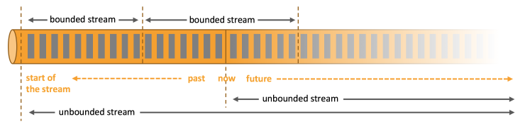
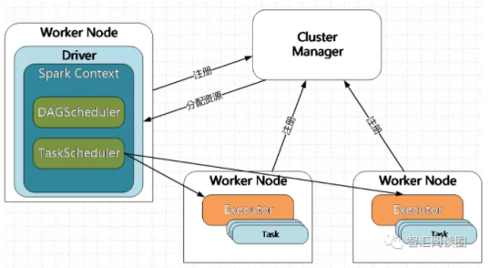
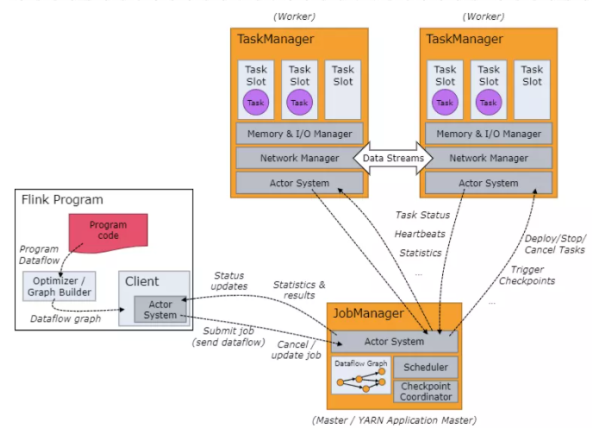

# 一、Flink基础概念与原理

## 什么是Flink？

Flink是一个以 **流** 为核心的高可用、高性能的分布式计算引擎。具备 **流批一体，**高吞吐、低延迟，容错能力，大规模复杂计算等特点，在数据流上提供 **数据分发**、通信等功能。

## 能否详细解释一下数据流、流批一体、容错能力等概念？

**数据流：**所有产生的 **数据** 都天然带有 **时间概念**，把 事件 按照时间顺序排列起来，就形成了一个事件流，也被称作数据流。

**流批一体：**首先必须先明白什么是 **有界数据**  和 **无界数据**

- **有界数据**，就是在一个确定的时间范围内的数据流，有开始，有结束，一旦确定就不会再改变，一般 **批处理** 用来处理有界数据，如上图的 bounded stream。
- **无界数据**，就是持续产生的数据流，数据是无限的，有开始，无结束，一般 **流处理** 用来处理无界数据。如图 unbounded stream。

- Flink的设计思想是以 **流** 为核心，批是流的特例，擅长处理 无界 和 有界 数据， Flink 提供 精确的时间控制能力 和 有状态 计算机制，可以轻松应对无界数据流，同时 提供 **窗口** 处理有界数据流。所以被成为流批一体。

**容错能力：**在分布式系统中，硬件故障、进程异常、应用异常、网络故障等异常无处不在，Flink引擎必须保证故障发生后 不仅可以 **重启** 应用程序，还要 **确保** **其内部状态保持一致**，从最后一次正确的时间点重新出发

- Flink提供 **集群级容错** 和 **应用级容错** 能力

- - **集群级容错：** Flink 与 集群管理器紧密连接，如YARN、Kubernetes，当进程挂掉后，自动重启新进程接管之前的工作。同时具备 **高可用性 ，**可消除所有单点故障，
  - **应用级容错：**Flink 使用 轻量级分布式快照，设计检查点（**checkpoint**）实现可靠容错。

- Flink 利用检查点特性，在框架层面 提供 **Exactly-once** 语义，即端到端的一致性，确保数据仅处理一次，不会重复也不会丢失，**即使出现故障，也能保证数据只写一次**。

## 为什么用 Flink

**问题**：为什么使用 Flink 替代 Spark？

**解答**：主要考虑的是 flink 的**低延迟**、**高吞吐量**和对**流式数据**应用场景更好的支持；另外，flink 可以很好地处理**乱序**数据，而且可以保证 **exactly-once** 的状态一致性。

## Flink 和 Spark Streaming的区别？

**1、运行模式（微批和流**）

**Flink** 和 **Spark Sreaming** **最大的区别**在于：Flink 是标准的实时处理引擎，基于事件驱动，**以流为核心**，而 Spark Streaming 的RDD 实际是一组小批次的RDD集合，是微批（Micro-Batch）的模型，**以批为核心**。

**2、架构模型**

Spark Streaming 在运行时的主要角色包括：

- **Master**: 服务架构集群和资源管理 Master / Yarn Application Master**（Cluster Manager），**主要负责整体集群资源的管理和应用程序调度；
- **Worker**:负责单个节点的资源管理，driver 和 executor 的启动等；
- **Driver**:用户入口程序执行的地方，即 SparkContext 执行的地方，主要是 DGA 生成、stage 划分、task 生成及调度；
- **Executor**:负责执行 task，反馈执行状态和执行结果。

Flink 在运行时主要包含：客户端 Client、作业管理 Jobmanager、任务管理Taskmanager、slot等。

- **Jobmanager**: 协调分布式执行，他们调度任务、协调 checkpoints、协调故障恢复等。至少有一个 JobManager。高可用情况下可以启动多个 JobManager，其中一个选举为 leader，其余为 standby；
- **Taskmanager**: 负责执行具体的 tasks、缓存、交换数据流，至少有一个 TaskManager；
- **Slot**: 每个 task slot 代表 TaskManager 的一个固定部分资源，Slot 的个数代表着 taskmanager 可并行执行的 task 数。

**4、时间机制**

- **Spark**

**Spark Streaming 只支持处理时间**，**Structured streaming 支持处理时间和事件时间**，同时支持 watermark 机制处理滞后数据。

- Flink

Flink 支持了流处理程序在时间上的三个定义：**事件时间 EventTime**、**摄入时间 IngestionTime** 、**处理时间 ProcessingTime**。同时也支持 watermark 机制来处理滞后数据。

**5、容错机制**

- **Spark Streaming At LeastOnce**

​		对于 Spark Streaming 任务，我们可以设置 checkpoint，然后假如发生故障并重启，我们可以从上次 checkpoint 之处恢复，但是这个行为只能使得数据不丢失，可能会重复处理，不能做到恰一次处理语义。

​		Spark Streaming 支持的时间机制有限，**只支持处理时间**。

- **Flink支持Exactly-Once**

Flink 则使用**两阶段提交协议**来解决这个问题。

## Flink四大基石指的是？

**Flink四大基石分别是：Checkpoint（检查点）、State（状态）、Time（时间）、Window（窗口）**。

## 什么是WaterMark

**一般处理数据延迟、消息乱序等问题，通过WaterMark水印来处理**。

水印就是一个时间戳（timestamp），Flink可以给数据流添加水印

- 水印并不会影响原有Eventtime事件时间
- 当数据流添加水印后，会按照水印时间来触发窗口计算,也就是说watermark水印是用来触发窗口计算的
- 设置水印时间，会比事件时间小几秒钟,表示最大允许数据延迟达到多久
- 水印时间 = 事件时间 - 允许延迟时间 (例如：10:09:57 =  10:10:00 - 3s )

【总结要点】

- **水印就是一个时间戳（timestamp），用来解决数据延迟、数据乱序等问题（结合window实现）**
- **当数据流添加水印后，会按照水印时间来触发窗口计算,也就是说watermark水印是用来触发窗口计算的。**
- **设置水印时间，会比事件时间小几秒钟,表示最大允许数据延迟达到多久**
- Watermark是**用于处理乱序事件**的，而正确的处理乱序事件，通常用Watermark机制结合window来实现;
- 数据流中的Watermark用于表示”**timestamp小于Watermark的数据，都已经到达了**“，因此，**window的执行也是由Watermark触发**的。
- **Watermark是一种衡量Event Time进展的机制 --> 延迟触发窗口执行**

## 如果数据延迟非常严重呢？只使用WaterMark可以处理吗？那应该怎么解决？

- **Flink对于迟到数据有三层保障**，先来后到的保障顺序是：

- - **WaterMark => 约等于放宽窗口标准**
  - **allowedLateness => 允许迟到（ProcessingTime超时，但是EventTime没超时）**
  - **sideOutputLateData => 超过迟到时间，另外捕获，之后可以自己批处理合并先前的数据**

  
  
  ​		使用 WaterMark+ EventTimeWindow 机制可以在一定程度上解决数据乱序的问题，但是，WaterMark 水位线也不是万能的，在某些情况下，数据延迟会非常严重，即使通过Watermark + EventTimeWindow也无法等到数据全部进入窗口再进行处理，因为窗口触发计算后，**对于延迟到达的本属于该窗口的数据，Flink默认会将这些延迟严重的数据进行丢弃**
  
  ​		那么如果想要让一定时间范围的延迟数据不会被丢弃，可以使用Allowed Lateness(允许迟到机制/侧道输出机制)设定一个允许延迟的时间和侧道输出对象来解决：即使用**WaterMark + EventTimeWindow + Allowed Lateness方案**（包含侧道输出），可以做到数据不丢失。

## 说一下 Flink 状态机制？

**解答**：Flink 内置的很多算子，包括源 source，数据存储 sink 都是有状态的。在 Flink 中，**状态始终与特定算子相关联**。Flink 会以 **checkpoint** 的形式对各个任务的 状态进行快照，用于保证故障恢复时的**状态一致**性。Flink 通过状态后端来管理状态 和 checkpoint 的存储，状态后端也可以有不同的配置选择。

# CheckPoint

# Flink SQL

# Flink CDC

# Flink调优

 