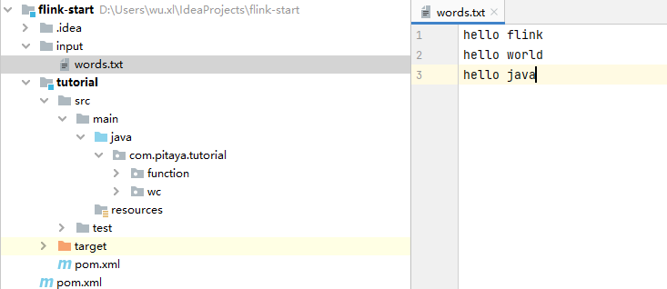
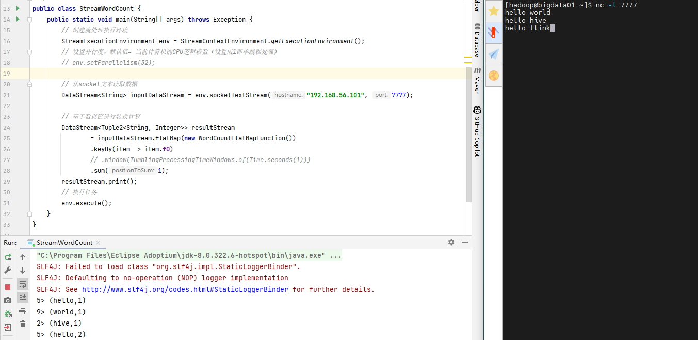

# Flink快速上手

## 添加flink依赖

flink-clients（客户端，也可以省略）。

```xml
    <properties>
        <maven.compiler.source>8</maven.compiler.source>
        <maven.compiler.target>8</maven.compiler.target>
        <flink.version>1.17.0</flink.version>
    </properties>    

	<dependencies>
        <dependency>
            <groupId>org.apache.flink</groupId>
            <artifactId>flink-streaming-java</artifactId>
            <version>${flink.version}</version>
        </dependency>
        <dependency>
            <groupId>org.apache.flink</groupId>
            <artifactId>flink-clients</artifactId>
            <version>${flink.version}</version>
        </dependency>
    </dependencies>
```


## WordCount案例

需求：统计一段文字中，每个单词出现的频次。

### 批处理WordCount

批处理基本思路：先逐行读入文件数据，然后将每一行文字拆分成单词；接着按照单词分组，统计每组数据的个数，就是对应单词的频次。

1、数据准备

- 在工程根目录下新建一个input文件夹，并在下面创建文本文件words.txt



2、参考代码

（1）自定义 FlatMapFunction

```java
package com.pitaya.tutorial.function;

import org.apache.flink.api.common.functions.FlatMapFunction;
import org.apache.flink.api.java.tuple.Tuple2;

import org.apache.flink.util.Collector;

/**
 * @Description: 自定义 FlatMapFunction
 * @Date 2023/09/02 09:59:00
 **/
public class WordCountFlatMapFunction implements FlatMapFunction<String, Tuple2<String, Integer>> {
    @Override
    public void flatMap(String s, Collector<Tuple2<String, Integer>> collector) throws Exception {
        String[] words = s.split(" ");
        // 遍历所有word， 包成二元组输出
        for (String word : words) {
            // collector.collect(new Tuple2<>(str, 1)); // 一样的效果
            collector.collect(Tuple2.of(word, 1));
        }
    }
}
```

（2）实现WC

```java
import org.apache.flink.api.common.functions.FlatMapFunction;
import org.apache.flink.api.java.ExecutionEnvironment;
import org.apache.flink.api.java.operators.AggregateOperator;
import org.apache.flink.api.java.operators.DataSource;
import org.apache.flink.api.java.operators.FlatMapOperator;
import org.apache.flink.api.java.operators.UnsortedGrouping;
import org.apache.flink.api.java.tuple.Tuple2;
import org.apache.flink.util.Collector;

/**
 * @Description:
 * @Date 2023/09/02 09:47:00
 **/
public class BatchWordCount {
    public static void main(String[] args) throws Exception {
        // 1. 创建执行环境
        ExecutionEnvironment env = ExecutionEnvironment.getExecutionEnvironment();
        // 2. 从文件读取数据  按行读取(存储的元素就是每行的文本)
        DataSource<String> lineDS = env.readTextFile("input/words.txt");

        // 3. 转换数据格式
        FlatMapOperator<String, Tuple2<String, Long>> wordAndOne = lineDS.flatMap(new FlatMapFunction<String, Tuple2<String, Long>>() {
            @Override
            public void flatMap(String line, Collector<Tuple2<String, Long>> out) throws Exception {
                String[] words = line.split(" ");
                for (String word : words) {
                    out.collect(Tuple2.of(word,1L));
                }
            }
        });

        // 4. 按照 word 进行分组
        UnsortedGrouping<Tuple2<String, Long>> wordAndOneUG = wordAndOne.groupBy(0);

        // 5. 分组内聚合统计
        AggregateOperator<Tuple2<String, Long>> sum = wordAndOneUG.sum(1);

        // 6. 打印结果
        sum.print();
    }
}
```

（3）代码简化

```java
package com.pitaya.tutorial.wc;

import com.pitaya.tutorial.function.WordCountFlatMapFunction;
import org.apache.flink.api.java.ExecutionEnvironment;
import org.apache.flink.api.java.operators.DataSource;

/**
 * @Description: WordCount简写
 * @Date 2023/09/02 10:10:00
 **/
public class BatchWordCount2 {
    public static void main(String[] args) throws Exception {
        // 1. 创建执行环境
        ExecutionEnvironment env = ExecutionEnvironment.getExecutionEnvironment();
        // 2. 从文件读取数据  按行读取(存储的元素就是每行的文本)
        DataSource<String> lineDS = env.readTextFile("input/words.txt");
        // 对数据集进行处理，按空格分词展开，转换成(word, 1)二元组进行统计
        // 按照第一个位置的word分组
        // 按照第二个位置上的数据求和
        lineDS.flatMap(new WordCountFlatMapFunction())
                .groupBy(0)
                .sum(1)
                .print();
    }
}

```

​		需要注意的是，这种代码的实现方式，是基于DataSet API的，也就是我们对数据的处理转换，是看作数据集来进行操作的。事实上Flink本身是流批统一的处理架构，批量的数据集本质上也是流，没有必要用两套不同的API来实现。所以从Flink 1.12开始，官方推荐的做法是直接使用DataStream API，在提交任务时通过将执行模式设为BATCH来进行批处理：

`$ bin/flink run -Dexecution.runtime-mode=BATCH BatchWordCount.jar`

​		这样，DataSet API就没什么用了，在实际应用中我们只要维护一套DataStream API就可以。这里只是为了方便大家理解，我们依然用DataSet API做了批处理的实现。


### 流处理WordCount

- 批处理=>几组或所有数据到达后才处理；流处理=>有数据来就直接处理，不等数据堆叠到一定数量级
- **这里不像批处理有groupBy => 所有数据统一处理，而是用流处理的keyBy => 每一个数据都对key进行hash计算，进行类似分区的操作，来一个数据就处理一次，所有中间过程都有输出！**
- **并行度：开发环境的并行度默认就是计算机的CPU逻辑核数**


1、参考程序

```java
package com.pitaya.tutorial.wc;

import com.pitaya.tutorial.function.WordCountFlatMapFunction;
import org.apache.flink.api.java.tuple.Tuple2;
import org.apache.flink.client.program.StreamContextEnvironment;
import org.apache.flink.streaming.api.datastream.DataStream;
import org.apache.flink.streaming.api.environment.StreamExecutionEnvironment;

/**
 * @Description:
 * @Date 2023/09/02 10:36:00
 **/
public class StreamWordCount {
    public static void main(String[] args) throws Exception {
        // 创建流处理执行环境
        StreamExecutionEnvironment env = StreamContextEnvironment.getExecutionEnvironment();
        // 设置并行度，默认值= 当前计算机的CPU逻辑核数（设置成1即单线程处理）
        // env.setParallelism(32);

        // 从socket文本读取数据
        DataStream<String> inputDataStream = env.socketTextStream("192.168.56.101", 7777);

        // 基于数据流进行转换计算
        DataStream<Tuple2<String, Integer>> resultStream
                = inputDataStream.flatMap(new WordCountFlatMapFunction())
                .keyBy(item -> item.f0)
                // .window(TumblingProcessingTimeWindows.of(Time.seconds(1)))
                .sum(1);
        resultStream.print();
        // 执行任务
        env.execute();
    }
}

```


2、流式数据源测试

- 通过`nc -lk <port>`打开一个socket服务，用于模拟实时的流数据

`nc -lk 7777`

3、测试效果




