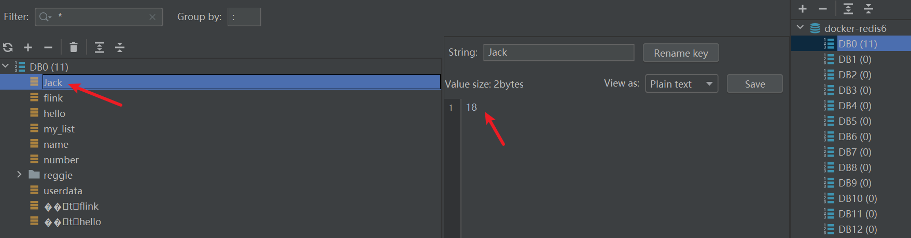

# Flink读取kafka数据写入redis

## 基础环境搭建

### kafka安装

> 简单安装：https://blog.csdn.net/hbtj_1216/article/details/104100389
>
> 集群安装：https://dandelioncloud.cn/article/details/1596443458573385729

本文参考简单安装，但是在配置文件中，尽量将localhost改成主机ip。


1、kakfa常用命令

```bash
# 启动zk
bin/zookeeper-server-start.sh -daemon config/zookeeper.properties

# 启动kafka
bin/kafka-server-start.sh -daemon config/server.properties

# 消费消息
bin/kafka-console-consumer.sh --bootstrap-server 192.168.56.101:9092 --topic test --from-beginning

# 创建topic test
bin/kafka-topics.sh --create --bootstrap-server 192.168.56.101:9092 --partitions 1 --replication-factor 1 --topic test
```

### Redis安装

此处选择用docker部署Redis6。

```bash
# step1: 拉取镜像
$ docker pull redis:6.0

# step2:创建实例并启动
# 预先创建要用的文件
$ sudo mkdir -p /mydata/redis/conf
$ sudo touch /mydata/redis/conf/redis.conf
$ sudo chmod 777 /mydata/redis/*

docker run -p 6379:6379 \
--name redis -v /mydata/redis/data:/data \
-v /mydata/redis/conf/redis.conf:/etc/redis/redis.conf \
-d redis:6.0 redis-server /etc/redis/redis.conf

$ docker ps
```

默认是不持久化的。在配置文件中输入appendonly yes，就可以aof持久化了。

```bash
vim /mydata/redis/conf/redis.conf

appendonly yes

$ docker restart redis
```


## flink读取kafka消息并写入Redis实践

### 引入依赖

```xml
        <dependency>
            <groupId>org.apache.flink</groupId>
            <artifactId>flink-connector-kafka</artifactId>
            <version>${flink.version}</version>
        </dependency>
        <!-- https://mvnrepository.com/artifact/org.apache.bahir/flink-connector-redis -->
        <dependency>
            <groupId>org.apache.bahir</groupId>
            <artifactId>flink-connector-redis_2.12</artifactId>
            <version>1.1.0</version>
        </dependency>
        <dependency>
            <groupId>com.google.code.gson</groupId>
            <artifactId>gson</artifactId>
            <version>2.8.6</version>
        </dependency>
```


### 参考程序

```java
package com.pitaya.tutorial.sink;

import com.google.gson.Gson;
import org.apache.flink.api.common.eventtime.WatermarkStrategy;
import org.apache.flink.api.common.serialization.SimpleStringSchema;
import org.apache.flink.client.program.StreamContextEnvironment;
import org.apache.flink.connector.kafka.source.KafkaSource;
import org.apache.flink.connector.kafka.source.enumerator.initializer.OffsetsInitializer;
import org.apache.flink.streaming.api.datastream.DataStream;
import org.apache.flink.streaming.api.environment.StreamExecutionEnvironment;
import org.apache.flink.streaming.connectors.redis.RedisSink;
import org.apache.flink.streaming.connectors.redis.common.config.FlinkJedisPoolConfig;
import org.apache.flink.streaming.connectors.redis.common.mapper.RedisCommand;
import org.apache.flink.streaming.connectors.redis.common.mapper.RedisCommandDescription;
import org.apache.flink.streaming.connectors.redis.common.mapper.RedisMapper;

/**
 * @Description: flink 消费 kafka 数据并写入 redis
 * @Date 2023/09/02 21:54:00
 **/
public class KafkaSinkRedis {
    public static void main(String[] args) throws Exception {
        StreamExecutionEnvironment env = StreamContextEnvironment.getExecutionEnvironment();

        KafkaSource<String> kafkaSource = KafkaSource.<String>builder()
                .setBootstrapServers("192.168.56.101:9092")
                .setTopics("test")
                .setGroupId("consumer_group1")
                .setStartingOffsets(OffsetsInitializer.latest())
                .setValueOnlyDeserializer(new SimpleStringSchema())
                .build();

        DataStream<String> kafkaStream = env.fromSource(kafkaSource, WatermarkStrategy.noWatermarks(), "kafka-source");

        // 将消息写入Redis
        FlinkJedisPoolConfig jedisPoolConfig = new FlinkJedisPoolConfig.Builder()
                .setHost("192.168.56.101")
                .setPort(6379)
                .build();

        kafkaStream.addSink(new RedisSink<>(jedisPoolConfig, new RedisExampleMapper()));

        env.execute("Kafka to Redis Example");
    }

    public static class RedisExampleMapper implements RedisMapper<String> {

        @Override
        public RedisCommandDescription getCommandDescription() {
            // 使用RPUSH命令将消息写入Redis列表
            return new RedisCommandDescription(RedisCommand.SET);
        }

        @Override
        public String getKeyFromData(String data) {
            Gson gson = new Gson();
            Student student = gson.fromJson(data, Student.class);
            // 设置Redis键
            return student.getName();
        }

        @Override
        public String getValueFromData(String data) {
            Gson gson = new Gson();
            Student student = gson.fromJson(data, Student.class);
            // 设置Redis值
            return student.getAge().toString();
        }
    }

    class Student {
        private String name;
        private Integer age;

        public String getName() {
            return name;
        }

        public void setName(String name) {
            this.name = name;
        }

        public Integer getAge() {
            return age;
        }

        public void setAge(Integer age) {
            this.age = age;
        }
    }
}

```


### 功能测试

1、启动kafka

2、启动redis

3、发送消息

`{"age":18,"name":"Jack"}`

这里建议可以用IDEA的kafka插件 KafkaIytic 发送消息。

4、查询redis是否存在对应的数据




## 参考

https://tobebetterjavaer.com/gongju/gson.html#_04%E3%80%81%E4%BD%BF%E7%94%A8%E6%8C%87%E5%8D%97
