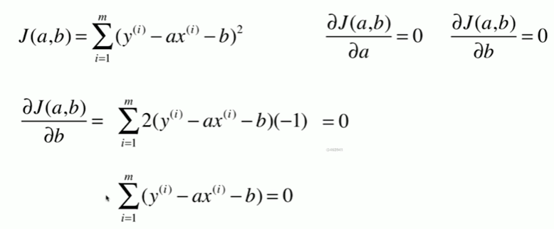

# 第五章、线性回归

## 1.简单线性回归

总结：

## 2.最小二乘法

## 3 简单线性回归的实现

## 4 向量化

## 5.衡量线性回归法的指标 MSE,RMS,MAE

【说明】区别：对量纲是否敏感，使用RMSE采用同样的量纲，误差背后的意义更加明显。

绝对值不是处处可导，不便于求极值。但是完全可以用来评价线性回归算法。

## 6 最好的衡量线性回归法的指标 R Squared

