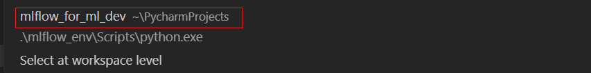
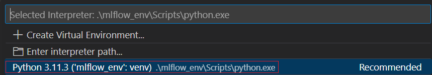
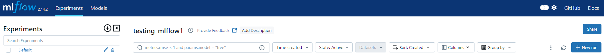

## 前置条件

### 安装virtualenv

1、安装virtualenv

```bash
pip install virtualenv
```

2、安装虚拟环境

选择目录 mlflow_for_ml_dev

```
python -m virtualenv mlflow_env
```

3、激活

```
cd \mlflow_env\Scripts

activate
```


### windows解决ssl模块不可用

【解决方案】安装openssl模块

参考文档：[windows下python中ssl模块不可用的解决办法_windows ssl module in python is not available.-CSDN博客](https://blog.csdn.net/qq_41769892/article/details/96626247)


## 安装mlflow

### pip安装mlflow

1、命令执行
```bash
pip install mlflow
```

2、启动ui

```bash
mlflow ui
```

3、VSCode配置环境

(1) 选择python环境

Ctrl + Shift + P --> Python Selector Interpreter





4、前端页面访问：127.0.0.1:5000




https://github.com/manuelgilm/mlflow_for_ml_dev


官方文档操作：https://mlflow.org/docs/latest/getting-started/intro-quickstart/index.html
