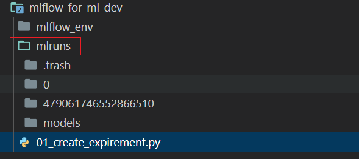
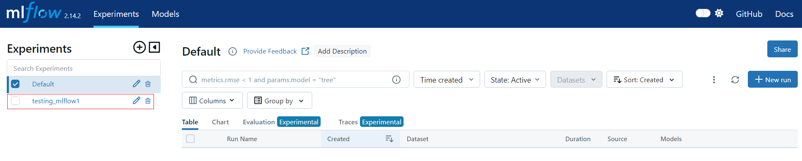

# mlflow初体验

[初试 MLflow 机器学习实验管理平台搭建 - 知乎 (zhihu.com)](https://zhuanlan.zhihu.com/p/161641400)

## 01.创建实验

1、首先，将安装的项目引入到VScode中


2、新建python文件 01_create_expirement.py

```python
import mlflow
print('****** mlflow ******')

if __name__ == '__main__':
    mlflow.create_experiment(
        name='testing_mlflow1',
        artifact_location="testing_mlflow1_artifacts",
        tags={"env":"dev", "version":"1.0.0"}
    )
```

3、执行文件01_create_expirement.py

(1) 执行后自动创建mlruns文件夹



(2) 查看ui 127.0.0.1:5000



4、封装工具类


