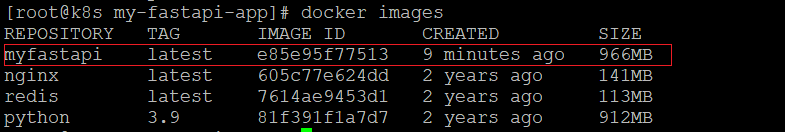
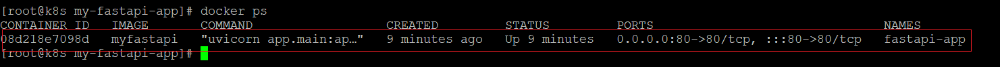
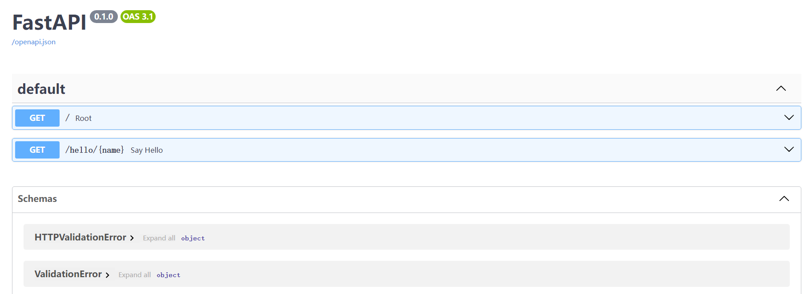

# Docker部署fastapi应用

> 参考：https://cloud.tencent.com/developer/article/1887935
>
> 

## fastapi项目准备

1、创建fastapi项目

2、完成FastAPI 应用程序 main.py 代码

```python
from fastapi import FastAPI
import uvicorn

app = FastAPI()


@app.get("/")
async def root():
    return {"message": "Hello World"}


@app.get("/hello/{name}")
async def say_hello(name: str):
    return {"message": f"Hello {name}"}


import uvicorn

if __name__ == "__main__":
    uvicorn.run("main:app", host="0.0.0.0", port=8080)
```

3、编写requirement.txt

```
-i https://mirrors.aliyun.com/pypi/simple/

fastapi
uvicorn[standard]
```

4、上传到Linux服务器

目录结构如下：

```sh
.
├── app
│   ├── __init__.py
│   └── main.py
├── Dockerfile
└── requirements.txt
```

## docker准备

1、准备Dockerfile

```
# 1、从官方 Python 基础镜像开始
FROM python:3.9

# 2、将当前工作目录设置为 /code
# 这是放置 requirements.txt 文件和应用程序目录的地方
WORKDIR /code

# 3、先复制 requirements.txt 文件
# 由于这个文件不经常更改，Docker 会检测它并在这一步使用缓存，也为下一步启用缓存
COPY ./requirements.txt /code/requirements.txt

# 4、运行 pip 命令安装依赖项
RUN pip install --no-cache-dir --upgrade -r /code/requirements.txt

# 5、复制 FastAPI 项目代码
COPY ./app /code/app

# 6、运行服务
CMD ["uvicorn", "app.main:app", "--host", "0.0.0.0", "--port", "80"]
```

2、构建 Docker Image

在 Dockerfile 打开命令行

```
docker build -t myfastapi .
```

查看镜像：

```
docker images 
```



3、启动容器

```
docker run -d --name fastapi-app -p 80:80 myfastapi
```

查看容器：



## 应用测试

1、访问 http://192.168.56.129/


2、访问 http://192.168.56.129/docs



