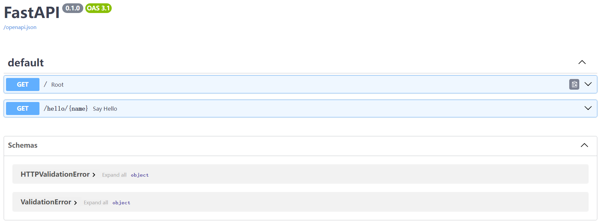

# FastApi初体验

> 参考教程：https://www.runoob.com/fastapi/fastapi-tutorial.html
>
> [FastAPI 快速开发 Web API 项目: 连接 MySQL 数据库](https://juejin.cn/post/7223373957087936549)
>
> [fastapi操作redis](https://developer.aliyun.com/article/899874)
>
> https://blog.csdn.net/wgPython/article/details/107668521
>
> https://blog.csdn.net/weixin_51407397/article/details/131295446

## 一、FastApi安装

### 1.1 安装入门

FastAPI 依赖 Python 3.8 及更高版本。

安装 FastAPI 很简单，这里我们使用 **pip** 命令来安装。pip install fastapi

```bash
pip install fastapi
```

另外我们还需要一个 ASGI 服务器，生产环境可以使用 Uvicorn 或者 Hypercorn：

```bash
pip install "uvicorn[standard]"
```

### 1.2 运行第一个 FastAPI 应用

创建一个名为 main.py 的文件，添加以下代码：

```python
from fastapi import FastAPI

app = FastAPI()

@app.get("/")
def read_root():
    return {"Hello": "World"}
```

在命令行中运行以下命令以启动应用：

```bash
uvicorn main:app --reload
```

现在，打开浏览器并访问 **http://127.0.0.1:8000**，你应该能够看到 FastAPI 自动生成的交互式文档，并在根路径 ("/") 返回的 JSON 响应。

(1) http://127.0.0.1:8000


(2) http://127.0.0.1:8000/docs



### 1.3 Pycharm创建FastApi项目

参考：https://blog.csdn.net/weixin_43895362/article/details/135113909


## 二、第一个 FastAPI 应用

基础代码：

```python
from fastapi import FastAPI
from typing import Union

app = FastAPI()


@app.get("/")
async def root():
    return {"message": "Hello World"}


@app.get("/hello/{name}")
async def say_hello(name: str):
    return {"message": f"Hello {name}"}

@app.get("/items/{item_id}")
def read_item(item_id: int, q: Union[str, None] = None):
    return {"item_id": item_id, "q": q}
```

**代码说明：**

- `@app.get("/items/{item_id}")`：定义了一个路由路径，其中 `{item_id}` 是路径参数，对应于函数参数 `item_id`。
- `def read_item(item_id: int, q: str = None)`：路由处理函数接受一个整数类型的路径参数 `item_id` 和一个可选的字符串类型查询参数 `q`。

在路由操作中，可以使用函数参数声明查询参数。例如，**q: str = None** 表示 **q** 是一个可选的字符串类型查询参数，默认值为 **None**。

## 三、FastApi请求和响应

### 查询参数

以下实例中我们定义了一个 **/items/** 路由，接受两个查询参数 **skip** 和 **limit**，它们的类型均为整数，默认值分别为 **0** 和 **10**。

```python
from fastapi import FastAPI

app = FastAPI()

@app.get("/items/")
def read_item(skip: int = 0, limit: int = 10):
    return {"skip": skip, "limit": limit}
```

(1) 打开浏览器并访问 **http://127.0.0.1:8000/items/**，返回了默认的 JSON 数据：

```json
{
  "skip": 0,
  "limit": 10
}
```

(2) 传递 **GET** 请求的参数 **http://127.0.0.1:8000/items/?skip=1&limit=5**，返回 JSON 数据如下所示：

```json
{
  "skip": 1,
  "limit": 5
}
```


### 请求体

接下来我们创建了一个 **/items/** 路由，使用 **@app.post** 装饰器表示这是一个处理 **POST** 请求的路由。

```py
from pydantic import BaseModel
from fastapi import FastAPI

app = FastAPI()
class Item(BaseModel):
    name: str
    description: str = None
    price: float
    tax: float = None

@app.post("/items/")
def create_item(item: Item):
    return item
```

使用 Pydantic 模型 Item 定义了一个请求体，包含多个字段，其中一些有默认值，更多 Pydantic 介绍参考：[FastAPI Pydantic 模型](https://www.runoob.com/fastapi/fastapi-pydantic.html)。

接下来我们可以打开 **http://127.0.0.1:8000/docs** 来进行 POST 测试：


返回结果如下：


### 响应数据

### 返回 JSON 数据

路由处理函数返回一个字典，该字典将被 FastAPI 自动转换为 JSON 格式，并作为响应发送给客户端：

```python
from fastapi import FastAPI

app = FastAPI()

@app.get("/items/")
def read_item(skip: int = 0, limit: int = 10):
    return {"skip": skip, "limit": limit}
```

### 返回 Pydantic 模型

路由处理函数返回一个 Pydantic 模型实例，FastAPI 将自动将其转换为 JSON 格式，并作为响应发送给客户端：

```python
from pydantic import BaseModel
from fastapi import FastAPI

app = FastAPI()
class Item(BaseModel):
    name: str
    description: str = None
    price: float
    tax: float = None

@app.post("/items/")
def create_item(item: Item):
    return item
```

### 请求头和 Cookie

