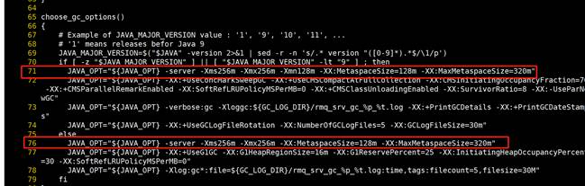
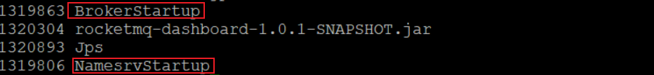
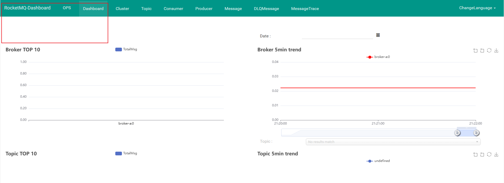

## RockerMq安装

### 前期准备

1、安装jdk

参考：[centos环境下java安装](https://blog.csdn.net/axing2015/article/details/83614800)


### 安装RockerMq

1、下载

https://rocketmq.apache.org/dowloading/releases/

2、解压

```sh
unzip rocketmq-all-4.9.5-bin-release.zip
```

3、重命名

```
mv rocketmq-all-4.9.5-bin-release rocketmq-all-4.9.5
```

4、配置环境变量

```
vim /etc/profile

# 加入如下值
export NAMESRV_ADDR=IP:9876
```

5、修改broker的配置文件

```bash
namesrvAddr=IP:9876
autoCreateTopicEnable=true
brokerIP1=IP
```

6、修改nameServer的运行脚本

进入bin目录下，修改runserver.sh文件,将71行和76行的Xms和Xmx等改小一点



7、修改broker的配置文件

进入conf目录下，修改broker.conf文件

```conf
brokerClusterName = DefaultCluster
brokerName = broker-a
brokerId = 0
deleteWhen = 04
fileReservedTime = 48
brokerRole = ASYNC_MASTER
flushDiskType = ASYNC_FLUSH


namesrvAddr=IP:9876
autoCreateTopicEnable=true
brokerIP1=IP
```

**添加参数解释**

- namesrvAddr：nameSrv地址可以写localhost因为nameSrv和broker在一个服务器

- autoCreateTopicEnable：自动创建主题，不然需要手动创建出来

- brokerIP1：broker也需要一个公网ip，如果不指定，那么是阿里云的内网地址，我们再本地无法连接使用

8、启动

Tips: 首先在安装目录下创建一个logs文件夹，用于存放日志

```bash
# 启动nameSrv
nohup sh bin/mqnamesrv > ./logs/namesrv.log &

# 启动broker 这里的-c是指定使用的配置文件
nohup sh bin/mqbroker -c conf/broker.conf > ./logs/broker.log &
```

查看启动结果：`jps`




###  RocketMQ控制台的安装RocketMQ-Console

Rocketmq 控制台可以可视化MQ的消息发送！

旧版本源码是在rocketmq-external里的rocketmq-console，新版本已经单独拆分成dashboard


**1、下载**


网址： https://github.com/apache/rocketmq-dashboard

下载地址：

https://github.com/apache/rocketmq-dashboard/archive/refs/tags/rocketmq-dashboard-1.0.0.zip


这里走个捷径：

https://blog.csdn.net/li_2277/article/details/134523830


直接下载安装包执行即可。端口号：8088


**2、启动：**

```bash
nohup java -jar ./rocketmq-dashboard-1.0.1-SNAPSHOT.jar rocketmq.config.namesrvAddr=10.118.79.16:9876 > ./rocketmq-all-4.9.5/logs/dashboard.log &
```

**3、登录**

http://10.118.79.16:8088/#/




