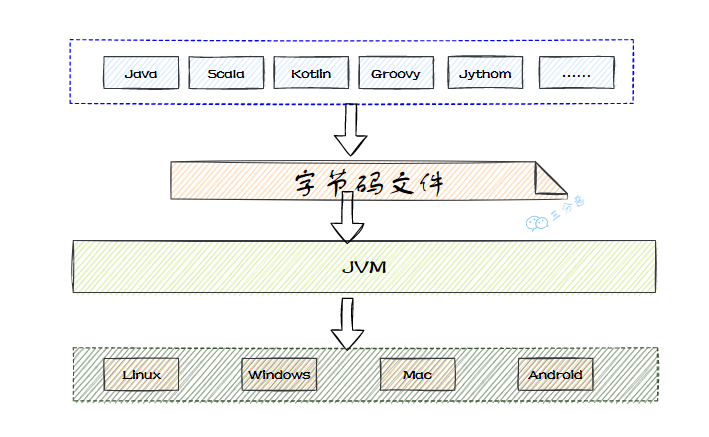
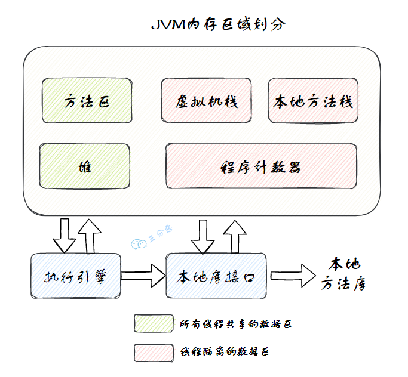
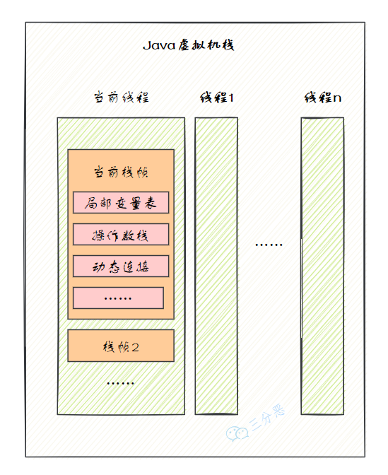

# Java虚拟机八股文

## 一、引言

### 1.什么是 JVM?

JVM，也就是 Java 虚拟机，它是 Java 实现跨平台的基石。

Java 程序运行的时候，编译器会将 Java 源代码（.java）编译成平台无关的 Java 字节码文件（.class），接下来对应平台的 JVM 会对字节码文件进行解释，翻译成对应平台的机器指令并运行。

同时，任何可以通过 Java 编译的语言，比如说 Groovy、Kotlin、Scala 等，都可以在 JVM 上运行。

### 51.说说 JVM 的组织架构（补充）

推荐阅读：[大白话带你认识 JVM](https://javabetter.cn/jvm/what-is-jvm.html)

JVM 大致可以划分为三个部门：类加载器、运行时数据区和执行引擎。

① 类加载器

负责从文件系统、网络或其他来源加载 Class 文件，将 Class 文件中的二进制数据读入到内存当中。

② 运行时数据区

JVM 在执行 Java 程序时，需要在内存中分配空间来处理各种数据，这些内存区域主要包括方法区、堆、栈、程序计数器和本地方法栈。

③ 执行引擎

执行引擎是 JVM 的心脏，负责执行字节码。它包括一个虚拟处理器，还包括即时编译器（JIT Compiler）和垃圾回收器（Garbage Collector）。

## 二、内存管理

### 2.能说一下 JVM 的内存区域吗？

> 推荐阅读：[深入理解 JVM 的运行时数据区](https://javabetter.cn/jvm/neicun-jiegou.html)

JVM 的内存区域，有时叫 JVM 的内存结构，有时也叫 JVM 运行时数据区，按照 Java 的虚拟机规范，可以细分为`程序计数器`、`虚拟机栈`、`本地方法栈`、`堆`、`方法区`等。

其中`方法区`和`堆`是线程共享的，`虚拟机栈`、`本地方法栈`和`程序计数器`是线程私有的。

#### 介绍一下程序计数器？

程序计数器（Program Counter Register）也被称为 PC 寄存器，是一块较小的内存空间。它可以看作是当前线程所执行的字节码行号指示器。

#### 介绍一下 Java 虚拟机栈？

Java 虚拟机栈（Java Virtual Machine Stack），通常指的就是“栈”，它的生命周期与线程相同。

当线程执行一个方法时，会创建一个对应的栈帧，用于存储局部变量表、操作数栈、动态链接、方法出口等信息，然后栈帧会被压入栈中。当方法执行完毕后，栈帧会从栈中移除。

#### 介绍一下本地方法栈？

本地方法栈（Native Method Stacks）与虚拟机栈相似，区别在于虚拟机栈是为 JVM 执行 Java 编写的方法服务的，而本地方法栈是为 Java 调用本地（native）方法服务的，由 C/C++ 编写。

在本地方法栈中，主要存放了 native 方法的局部变量、动态链接和方法出口等信息。当一个 Java 程序调用一个 native 方法时，JVM 会切换到本地方法栈来执行这个方法。

