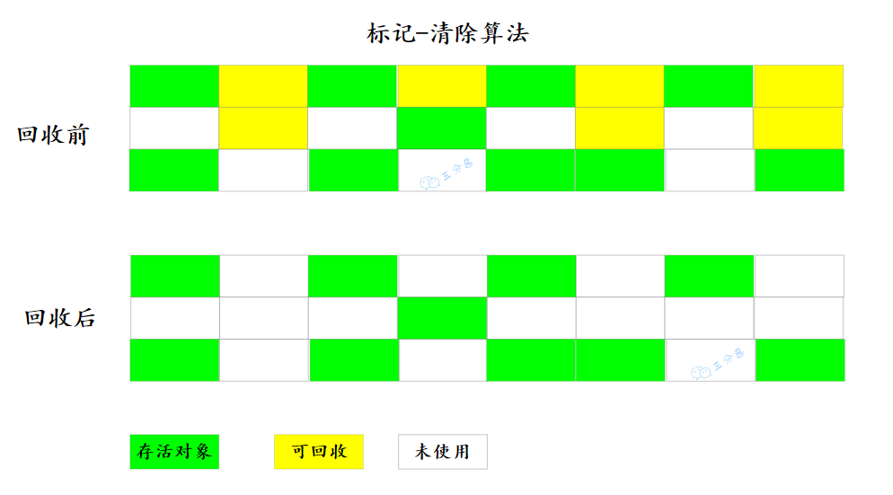

# Java虚拟机八股文

## 一、引言

### 1.什么是 JVM?

JVM，也就是 Java 虚拟机，它是 Java 实现跨平台的基石。

Java 程序运行的时候，编译器会将 Java 源代码（.java）编译成平台无关的 Java 字节码文件（.class），接下来对应平台的 JVM 会对字节码文件进行解释，翻译成对应平台的机器指令并运行。

同时，任何可以通过 Java 编译的语言，比如说 Groovy、Kotlin、Scala 等，都可以在 JVM 上运行。

### 51.说说 JVM 的组织架构（补充）

推荐阅读：[大白话带你认识 JVM](https://javabetter.cn/jvm/what-is-jvm.html)

JVM 大致可以划分为三个部门：类加载器、运行时数据区和执行引擎。

① 类加载器

负责从文件系统、网络或其他来源加载 Class 文件，将 Class 文件中的二进制数据读入到内存当中。

② 运行时数据区

JVM 在执行 Java 程序时，需要在内存中分配空间来处理各种数据，这些内存区域主要包括方法区、堆、栈、程序计数器和本地方法栈。

③ 执行引擎

执行引擎是 JVM 的心脏，负责执行字节码。它包括一个虚拟处理器，还包括即时编译器（JIT Compiler）和垃圾回收器（Garbage Collector）。

## 二、内存管理

### 2.能说一下 JVM 的内存区域吗？

> 推荐阅读：[深入理解 JVM 的运行时数据区](https://javabetter.cn/jvm/neicun-jiegou.html)

JVM 的内存区域，有时叫 JVM 的内存结构，有时也叫 JVM 运行时数据区，按照 Java 的虚拟机规范，可以细分为`程序计数器`、`虚拟机栈`、`本地方法栈`、`堆`、`方法区`等。

其中`方法区`和`堆`是线程共享的，`虚拟机栈`、`本地方法栈`和`程序计数器`是线程私有的。

#### 介绍一下程序计数器？

程序计数器（Program Counter Register）也被称为 PC 寄存器，是一块较小的内存空间。它可以看作是当前线程所执行的字节码行号指示器。

#### 介绍一下 Java 虚拟机栈？

Java 虚拟机栈（Java Virtual Machine Stack），通常指的就是“栈”，它的生命周期与线程相同。

当线程执行一个方法时，会创建一个对应的栈帧，用于存储局部变量表、操作数栈、动态链接、方法出口等信息，然后栈帧会被压入栈中。当方法执行完毕后，栈帧会从栈中移除。

#### 介绍一下本地方法栈？

本地方法栈（Native Method Stacks）与虚拟机栈相似，区别在于虚拟机栈是为 JVM 执行 Java 编写的方法服务的，而本地方法栈是为 Java 调用本地（native）方法服务的，由 C/C++ 编写。

在本地方法栈中，主要存放了 native 方法的局部变量、动态链接和方法出口等信息。当一个 Java 程序调用一个 native 方法时，JVM 会切换到本地方法栈来执行这个方法。

#### 介绍一下 Java 堆？

堆（heap）是 JVM 中最大的一块内存区域，被所有线程共享，在 JVM 启动时创建，主要用来存储对象的。

以前，Java 中“几乎”所有的对象都会在堆中分配，但随着 JIT 编译器的发展和逃逸技术的逐渐成熟，“所有的对象都会分配到堆上”就不再那么绝对了。

从 JDK 7 开始，JVM 已经默认开启逃逸分析了，意味着如果某些方法中的对象引用没有被返回或者未被方法体外使用（也就是未逃逸出去），那么对象可以直接在栈上分配内存。

堆也是[垃圾收集器](https://javabetter.cn/jvm/gc-collector.html)管理的目标区域，因此一些资料中也会把 Java 堆称作“GC 堆”（Garbage Collected Heap）。

从内存回收的角度来看，由于垃圾收集器大部分都是基于分代收集理论设计的，所以堆也会被划分为`新生代`、`老年代`、`Eden空间`、`From Survivor空间`、`To Survivor空间`等。

#### 堆和栈的区别是什么？

堆属于线程共享的内存区域，几乎所有的对象都在堆上分配，生命周期不由单个方法调用所决定，可以在方法调用结束后继续存在，直到不再被任何变量引用，然后被垃圾收集器回收。

栈属于线程私有的内存区域，主要存储局部变量、方法参数、对象引用等，通常随着方法调用的结束而自动释放，不需要垃圾收集器处理。

#### 介绍一下方法介绍一下方法区？

方法区并不真实存在，属于 Java 虚拟机规范中的一个逻辑概念，用于存储已被 JVM 加载的类信息、常量、静态变量、即时编译器编译后的代码缓存等。

在 HotSpot 虚拟机中，方法区的实现称为永久代（PermGen），但在 Java 8 及之后的版本中，已经被元空间（Metaspace）所替代。

### 3.说一下 JDK1.6、1.7、1.8 内存区域的变化？

JDK1.6、1.7/1.8 内存区域发生了变化，主要体现在方法区的实现：

- JDK1.6 使用永久代实现方法区：

  

- JDK1.7 时发生了一些变化，将字符串常量池、静态变量，存放在堆上

- 在 JDK1.8 时彻底干掉了永久代，而在直接内存中划出一块区域作为**元空间**，运行时常量池、类常量池都移动到元空间。

### 4.为什么使用元空间替代永久代作为方法区的实现？

Java 虚拟机规范规定的方法区只是换种方式实现。有客观和主观两个原因。

- 客观上**使用永久代来实现方法区的决定的设计导致了 Java 应用更容易遇到内存溢出的问题**（永久代有-XX：MaxPermSize 的上限，即使不设置也有默认大小，而 J9 和 JRockit 只要没有触碰到进程可用内存的上限，例如 32 位系统中的 4GB 限制，就不会出问题），而且有极少数方法 （例如 String::intern()）会因永久代的原因而导致不同虚拟机下有不同的表现。
- 主观上当 Oracle 收购 BEA 获得了 JRockit 的所有权后，准备把 JRockit 中的优秀功能，譬如 Java Mission Control 管理工具，移植到 HotSpot 虚拟机时，但因为两者对方法区实现的差异而面临诸多困难。考虑到 HotSpot 未来的发展，在 JDK 6 的 时候 HotSpot 开发团队就有放弃永久代，逐步改为采用本地内存（Native Memory）来实现方法区的计划了，到了 JDK 7 的 HotSpot，已经把原本放在永久代的字符串常量池、静态变量等移出，而到了 JDK 8，终于完全废弃了永久代的概念，改用与 JRockit、J9 一样在本地内存中实现的元空间（Meta-space）来代替，把 JDK 7 中永久代还剩余的内容（主要是类型信息）全部移到元空间中。

### 5.对象创建的过程了解吗？

当我们使用 new 关键字创建一个对象的时候，JVM 首先会检查 new 指令的参数是否能在常量池中定位到一个类的符号引用，然后检查这个符号引用代表的类是否已被加载、解析和初始化过。如果没有，就先执行相应的类加载过程。

如果已经加载，JVM 会为新生对象分配内存，内存分配完成之后，JVM 将分配到的内存空间初始化为**零值**（成员变量，数值类型是 0，布尔类型是 false，对象类型是 null），接下来**设置对象头**，对象头里包含了对象是哪个类的实例、对象的哈希码、对象的 GC 分代年龄等信息。

最后，JVM 会执行构造方法（`<init>`），将成员变量赋值为预期的值，这样一个对象就创建完成了。

#### 对象的销毁过程了解吗？

对象创建完成后，就可以通过引用来访问对象的方法和属性，当对象不再被任何引用指向时，对象就会变成垃圾。

垃圾收集器会通过**可达性分析算法**判断对象是否存活，如果对象不可达，就会被回收。

垃圾收集器会通过**标记清除、标记复制、标记整理**等算法来回收内存，将对象占用的内存空间释放出来。

常用的垃圾收集器有 CMS、G1、ZGC 等，它们的回收策略和效率不同，可以根据具体的场景选择合适的垃圾收集器。

### 6.什么是指针碰撞？什么是空闲列表？

在**堆内存分配对象**时，主要使用两种策略：**指针碰撞和空闲列表**。

①、指针碰撞（Bump the Pointer）

假设堆内存是一个连续的空间，分为两个部分，一部分是已经被使用的内存，另一部分是未被使用的内存。

在分配内存时，Java 虚拟机维护一个指针，指向下一个可用的内存地址，每次分配内存时，只需要将指针向后移动（碰撞）一段距离，然后将这段内存分配给对象实例即可。

②、空闲列表（Free List）

JVM 维护一个列表，记录堆中所有未占用的内存块，每个空间块都记录了大小和地址信息。

当有新的对象请求内存时，JVM 会遍历空闲列表，寻找足够大的空间来存放新对象。

分配后，如果选中的空闲块未被完全利用，剩余的部分会作为一个新的空闲块加入到空闲列表中。

指针碰撞适用于管理简单、碎片化较少的内存区域（如年轻代），而空闲列表适用于内存碎片化较严重或对象大小差异较大的场景（如老年代）。

### 13.如何判断对象仍然存活？

有两种方式，**引用计数算法（reference counting）和可达性分析算法**。

- **引用计数算法**

  引用计数器的算法是这样的：在对象中添加一个引用计数器，每当有一个地方引用它时，计数器值就加一；当引用失效时，计数器值就减一；任何时刻计数器为零的对象就是不可能再被使用的。

  

- **可达性分析算法**

  **目前 Java 虚拟机的主流垃圾回收器采取的是可达性分析算法**。这个算法的实质在于将一系列 GC Roots 作为初始的存活对象合集（Gc Root Set），然后从该合集出发，探索所有能够被该集合引用到的对象，并将其加入到该集合中，这个过程我们也称之为标记（mark）。最终，未被探索到的对象便是死亡的，是可以回收的。

### 14.Java 中可作为 GC Roots 的引用有哪几种？

1. 推荐阅读：[深入理解垃圾回收机制](https://javabetter.cn/jvm/gc.html)
2. 推荐阅读：[R 大的所谓“GC roots”](https://www.zhihu.com/question/53613423/answer/135743258)

所谓的 GC Roots，就是一组**必须活跃的引用**，不是对象，它们是程序运行时的起点，是一切引用链的源头。在 Java 中，GC Roots 包括以下几种：

- 虚拟机栈中的引用（方法的参数、局部变量等）
- 本地方法栈中 JNI 的引用
- 类静态变量
- 运行时常量池中的常量（String 或 Class 类型）

### 17.Java 堆的内存分区了解吗？

按照垃圾收集，将 Java 堆划分为**新生代 （Young Generation）**和**老年代（Old Generation）**两个区域，新生代存放存活时间短的对象，而每次回收后存活的少量对象，将会逐步晋升到老年代中存放。

而新生代又可以分为三个区域，eden、from、to，比例是 8：1：1，而新生代的内存分区同样是从垃圾收集的角度来分配的。

### 18.垃圾收集算法了解吗？

垃圾收集算法主要有三种，分别是**标记-清除算法**、**标记-复制算法**和**标记-整理算法**。

#### 说说标记-清除算法？

`标记-清除`（Mark-Sweep）算法分为两个阶段：

- **标记**：标记所有需要回收的对象
- **清除**：回收所有被标记的对象

优点是实现简单，缺点是回收过程中会产生**内存碎片**。

#### 说说标记-复制算法？

`标记-复制`（Mark-Copy）算法可以解决标记-清除算法的内存碎片问题，因为它将内存空间划分为两块，每次只使用其中一块。当这一块的内存用完了，就将还存活着的对象复制到另外一块上面，然后清理掉这一块。

缺点是**浪费了一半的内存空间**。

#### 说说标记-整理算法？

`标记-整理`（Mark-Compact）算法是标记-清除复制算法的升级版，它不再划分内存空间，而是将存活的对象向内存的一端移动，然后清理边界以外的内存。

**缺点是移动对象的成本比较高**。

### 19.说一下新生代的区域划分？

新生代的垃圾收集主要采用标记-复制算法，因为新生代的存活对象比较少，每次复制少量的存活对象效率比较高。

