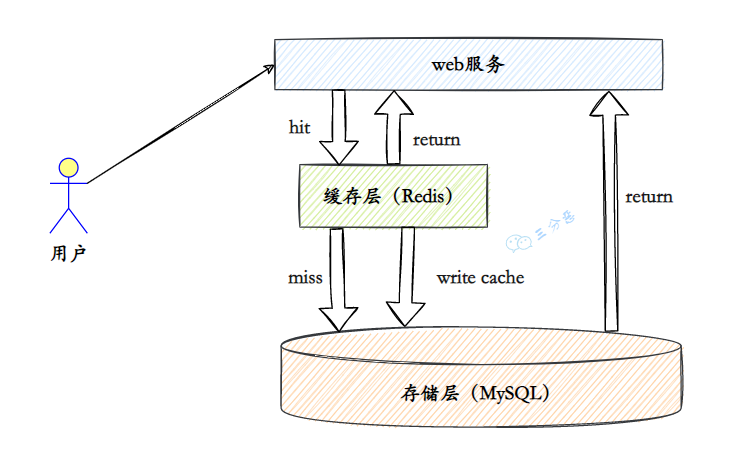
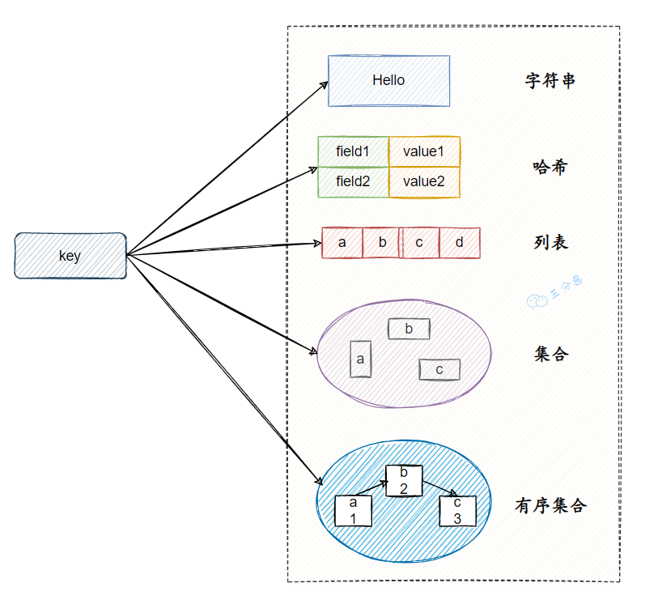
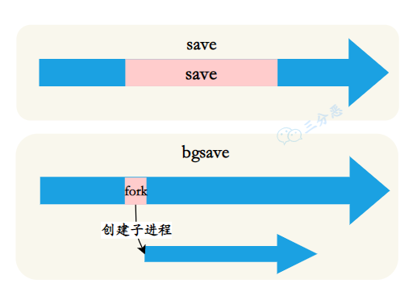

# Redis面试题整理

> 鸣谢：参考**三分恶**的文章
>
> 原文链接：https://mp.weixin.qq.com/s/iJtNJYgirRugNBnzxkbB4Q

## 基础

### 1.说说什么是Redis?

​	Redis是一种**基于键值对（key-value）的NoSQL数据库**。

​	比一般键值对数据库强大的地方，Redis中的value支持string（字符串）、hash（哈希）、 list（列表）、set（集合）、zset（有序集合）、Bitmaps（位图）、 HyperLogLog、GEO（地理信息定位）等多种数据结构，因此 Redis可以满足很多的应用场景。

​	而且因为Redis会将所有数据都存放在内存中，所以它的读写性能非常出色。

​	不仅如此，Redis还可以将内存的数据利用快照和日志的形式保存到硬盘上，这样在发生类似断电或者机器故障的时候，内存中的数据不会“丢失”。

​	除了上述功能以外，Redis还提供了键过期、发布订阅、事务、流水线、Lua脚本等附加功能。

### [2.Redis可以用来干什么？](https://itwanger.gitee.io/tobebetterjavaer/#/docs/sidebar/sanfene/redis?id=_2redis可以用来干什么？)

1. 缓存

​	这是Redis应用最广泛地方，基本所有的Web应用都会使用Redis作为缓存，来降低数据源压力，提高响应速度。

2. 计数器 Redis天然支持计数功能，而且计数性能非常好，可以用来记录浏览量、点赞量等等。

3. 排行榜 Redis提供了列表和有序集合数据结构，合理地使用这些数据结构可以很方便地构建各种排行榜系统。

4. 社交网络 赞/踩、粉丝、共同好友/喜好、推送、下拉刷新。

5. 消息队列 Redis提供了发布订阅功能和阻塞队列的功能，可以满足一般消息队列功能。

6. 分布式锁 分布式环境下，利用Redis实现分布式锁，也是Redis常见的应用。

Redis的应用一般会结合项目去问，以一个电商项目的用户服务为例：

- Token存储：用户登录成功之后，使用Redis存储Token
- 登录失败次数计数：使用Redis计数，登录失败超过一定次数，锁定账号
- 地址缓存：对省市区数据的缓存
- 分布式锁：分布式环境下登录、注册等操作加分布式锁

### 3.Redis 有哪些数据结构？

Redis有五种基本数据结构。

**string**

字符串最基础的数据结构。字符串类型的值实际可以是字符串（简单的字符串、复杂的字符串（例如JSON、XML））、数字 （整数、浮点数），甚至是二进制（图片、音频、视频），但是值最大不能超过512MB。

字符串主要有以下几个典型使用场景：

- 缓存功能
- 计数
- 共享Session
- 限速

**hash**

哈希类型是指键值本身又是一个键值对结构。

哈希主要有以下典型应用场景：

- 缓存用户信息
- 缓存对象

**list**

列表（list）类型是用来存储多个有序的字符串。列表是一种比较灵活的数据结构，它可以充当栈和队列的角色

列表主要有以下几种使用场景：

- 消息队列
- 文章列表

**set**

集合（set）类型也是用来保存多个的字符串元素，但和列表类型不一 样的是，集合中不允许有重复元素，并且集合中的元素是无序的。

集合主要有如下使用场景：

- 标签（tag）
- 共同关注

**sorted set**

有序集合中的元素可以排序。但是它和列表使用索引下标作为排序依据不同的是，它给每个元素设置一个权重（score）作为排序的依据。

有序集合主要应用场景：

- 用户点赞统计
- 用户排序

###  4.Redis为什么快呢？

Redis的速度⾮常的快，单机的Redis就可以⽀撑每秒十几万的并发，相对于MySQL来说，性能是MySQL的⼏⼗倍。速度快的原因主要有⼏点：

1. **完全基于内存操作**
2. 使⽤单线程，避免了线程切换和竞态产生的消耗
3. 基于⾮阻塞的IO多路复⽤机制
4. C语⾔实现，优化过的数据结构，基于⼏种基础的数据结构，redis做了⼤量的优化，性能极⾼

###  5.能说一下I/O多路复用吗？

引用知乎上一个高赞的回答来解释什么是I/O多路复用。假设你是一个老师，让30个学生解答一道题目，然后检查学生做的是否正确，你有下面几个选择：

- 第一种选择：按顺序逐个检查，先检查A，然后是B，之后是C、D。。。这中间如果有一个学生卡住，全班都会被耽误。这种模式就好比，你用循环挨个处理socket，根本不具有并发能力。
- 第二种选择：你创建30个分身，每个分身检查一个学生的答案是否正确。 这种类似于为每一个用户创建一个进程或者- 线程处理连接。
- 第三种选择，你站在讲台上等，谁解答完谁举手。这时C、D举手，表示他们解答问题完毕，你下去依次检查C、D的答案，然后继续回到讲台上等。此时E、A又举手，然后去处理E和A。

第一种就是阻塞IO模型，第三种就是I/O复用模型。

​	Linux系统有三种方式实现IO多路复用：select、poll和epoll。

​	例如epoll方式是将用户socket对应的fd注册进epoll，然后epoll帮你监听哪些socket上有消息到达，这样就避免了大量的无用操作。此时的socket应该采用非阻塞模式。

​	这样，整个过程只在进行select、poll、epoll这些调用的时候才会阻塞，收发客户消息是不会阻塞的，整个进程或者线程就被充分利用起来，这就是事件驱动，所谓的reactor模式。

### 6.Redis为什么早期选择单线程？

官方解释：https://redis.io/topics/faq

官方FAQ表示，因为Redis是基于内存的操作，CPU成为Redis的瓶颈的情况很少见，Redis的瓶颈最有可能是内存的大小或者网络限制。

如果想要最大程度利用CPU，可以在一台机器上启动多个Redis实例。

PS：网上有这样的回答，吐槽官方的解释有些敷衍，其实就是历史原因，开发者嫌多线程麻烦，后来这个CPU的利用问题就被抛给了使用者。

同时FAQ里还提到了， **Redis 4.0 之后开始变成多线程，除了主线程外，它也有后台线程在处理一些较为缓慢的操作，例如清理脏数据、无用连接的释放、大 Key 的删除等等**。

### 7.Redis6.0使用多线程是怎么回事?

Redis不是说用单线程的吗？怎么6.0成了多线程的？

Redis6.0的多线程是用多线程来处理数据的**读写和协议解析**，但是Redis**执行命令**还是单线程的。

这样做的⽬的是因为Redis的性能瓶颈在于⽹络IO⽽⾮CPU，使⽤多线程能提升IO读写的效率，从⽽整体提⾼Redis的性能。

## 持久化

### 8.Redis持久化⽅式有哪些？有什么区别？

Redis持久化⽅案分为RDB和AOF两种。

#### RDB

​	RDB持久化是把当前进程数据生成**快照**保存到硬盘的过程，触发RDB持久化过程分为手动触发和自动触发。

​	RDB⽂件是⼀个压缩的⼆进制⽂件，通过它可以还原某个时刻数据库的状态。由于RDB⽂件是保存在硬盘上的，所以即使Redis崩溃或者退出，只要RDB⽂件存在，就可以⽤它来恢复还原数据库的状态。

​	手动触发分别对应save和bgsave命令:

- save命令：阻塞当前Redis服务器，直到RDB过程完成为止，对于内存比较大的实例会造成长时间阻塞，线上环境不建议使用。
- bgsave命令：Redis进程执行fork操作创建子进程，RDB持久化过程由子进程负责，完成后自动结束。阻塞只发生在fork阶段，一般时间很短。

以下场景会自动触发RDB持久化：

- 使用save相关配置，如“save m n”。表示m秒内数据集存在n次修改时，自动触发bgsave；
- 如果从节点执行全量复制操作，主节点自动执行bgsave生成RDB文件并发送给从节点；
- 执行debug reload命令重新加载Redis时，也会自动触发save操作；
- 默认情况下执行shutdown命令时，如果没有开启AOF持久化功能则自动执行bgsave。

#### **AOF**

​	AOF（append only file）持久化：以**独立日志**的方式记录每次写命令， 重启时再重新执行AOF文件中的命令达到恢复数据的目的。AOF的主要作用是解决了数据持久化的实时性，目前已经是Redis持久化的主流方式。

​	AOF的工作流程操作：命令写入 （append）、文件同步（sync）、文件重写（rewrite）、重启加载 （load）。

流程如下：

1）所有的写入命令会追加到aof_buf（缓冲区）中。

2）AOF缓冲区根据对应的策略向硬盘做同步操作。

3）随着AOF文件越来越大，需要定期对AOF文件进行重写，达到压缩 的目的。

4）当Redis服务器重启时，可以加载AOF文件进行数据恢复。

### 9.RDB 和 AOF 各自有什么优缺点？

#### **RDB | 优点**

1. 只有一个紧凑的二进制文件 `dump.rdb`，非常适合备份、全量复制的场景。
2. **容灾性好**，可以把RDB文件拷贝道远程机器或者文件系统张，用于容灾恢复。
3. **恢复速度快**，RDB恢复数据的速度远远快于AOF的方式

#### **RDB | 缺点**

1. **实时性低**，RDB 是间隔一段时间进行持久化，没法做到实时持久化/秒级持久化。如果在这一间隔事件发生故障，数据会丢失。
2. **存在兼容问题**，Redis演进过程存在多个格式的RDB版本，存在老版本Redis无法兼容新版本RDB的问题。

### 10.RDB和AOF如何选择？

- 一般来说， 如果想达到足以媲美数据库的 **数据安全性**，应该 **同时使用两种持久化功能**。在这种情况下，当 Redis 重启的时候会优先载入 AOF 文件来恢复原始的数据，因为在通常情况下 AOF 文件保存的数据集要比 RDB 文件保存的数据集要完整。
- 如果 **可以接受数分钟以内的数据丢失**，那么可以 **只使用 RDB 持久化**。
- 有很多用户都只使用 AOF 持久化，但并不推荐这种方式，因为定时生成 RDB 快照（snapshot）非常便于进行数据备份， 并且 RDB 恢复数据集的速度也要比 AOF 恢复的速度要快，除此之外，使用 RDB 还可以避免 AOF 程序的 bug。
- 如果只需要数据在服务器运行的时候存在，也可以不使用任何持久化方式。

### 11.Redis的数据恢复？

当Redis发生了故障，可以从RDB或者AOF中恢复数据。

恢复的过程也很简单，把RDB或者AOF文件拷贝到Redis的数据目录下，如果使用AOF恢复，配置文件开启AOF，然后启动redis-server即可。

**Redis** 启动时加载数据的流程：

1. AOF持久化开启且存在AOF文件时，**优先加载AOF文件**。
2. AOF关闭或者AOF文件不存在时，加载RDB文件。
3. 加载AOF/RDB文件成功后，Redis启动成功。
4. AOF/RDB文件存在错误时，Redis启动失败并打印错误信息。

### 12.Redis 4.0 的混合持久化了解吗？

​	重启 Redis 时，我们很少使用 `RDB` 来恢复内存状态，因为会丢失大量数据。我们通常使用 AOF 日志重放，但是重放 AOF 日志性能相对 `RDB` 来说要慢很多，这样在 Redis 实例很大的情况下，启动需要花费很长的时间。

​	**Redis 4.0** 为了解决这个问题，带来了一个新的持久化选项——**混合持久化**。将 `rdb` 文件的内容和增量的 AOF 日志文件存在一起。这里的 AOF 日志不再是全量的日志，而是 **自持久化开始到持久化结束** 的这段时间发生的增量 AOF 日志，通常这部分 AOF 日志很小：

于是在 Redis 重启的时候，可以先加载 `rdb` 的内容，然后再重放增量 AOF 日志就可以完全替代之前的 AOF 全量文件重放，重启效率因此大幅得到提升。

## 高可用

Redis保证高可用主要有三种方式：主从、哨兵、集群。

### 13.主从复制了解吗？

**主从复制**，是指将一台 Redis 服务器的数据，复制到其他的 Redis 服务器。前者称为 **主节点(master)**，后者称为 **从节点(slave)**。且数据的复制是 **单向** 的，只能由主节点到从节点。Redis 主从复制支持 **主从同步** 和 **从从同步** 两种，后者是 Redis 后续版本新增的功能，以减轻主节点的同步负担。

> 主从复制主要的作用?

- **数据冗余：** 主从复制实现了数据的热备份，是持久化之外的一种数据冗余方式。
- **故障恢复：** 当主节点出现问题时，可以由从节点提供服务，实现快速的故障恢复 *(实际上是一种服务的冗余)*。
- **负载均衡：** 在主从复制的基础上，配合读写分离，可以由主节点提供写服务，由从节点提供读服务 *（即写 Redis 数据时应用连接主节点，读 Redis 数据时应用连接从节点）*，分担服务器负载。尤其是在写少读多的场景下，通过多个从节点分担读负载，可以大大提高 Redis 服务器的并发量。
- **高可用基石：** 除了上述作用以外，**主从复制还是哨兵和集群能够实施的基础**，因此说主从复制是 Redis 高可用的基础。

### 14.Redis主从有几种常见的拓扑结构？

Redis的复制拓扑结构可以支持单层或多层复制关系，根据拓扑复杂性可以分为以下三种：一主一从、一主多从、树状主从结构。

1.一主一从结构

一主一从结构是最简单的复制拓扑结构，用于主节点出现宕机时从节点提供故障转移支持。

2.一主多从结构

一主多从结构（又称为星形拓扑结构）使得应用端可以利用多个从节点实现读写分离（见图6-5）。对于读占比较大的场景，可以把读命令发送到从节点来分担主节点压力。

3.树状主从结构

树状主从结构（又称为树状拓扑结构）使得从节点不但可以复制主节点数据，同时可以作为其他从节点的主节点继续向下层复制。通过引入复制中间层，可以有效降低主节点负载和需要传送给从节点的数据量.

### 15.Redis的主从复制原理了解吗？

Redis主从复制的工作流程大概可以分为如下几步：

1. 保存主节点（master）信息 这一步只是保存主节点信息，保存主节点的ip和port。
2. 主从建立连接 从节点（slave）发现新的主节点后，会尝试和主节点建立网络连接。
3. 发送ping命令 连接建立成功后从节点发送ping请求进行首次通信，主要是检测主从之间网络套接字是否可用、主节点当前是否可接受处理命令。
4. 权限验证 如果主节点要求密码验证，从节点必须正确的密码才能通过验证。
5. 同步数据集 主从复制连接正常通信后，主节点会把持有的数据全部发送给从节点。
6. 命令持续复制 接下来主节点会持续地把写命令发送给从节点，保证主从数据一致性。

### 16.说说主从数据同步的方式？

Redis在2.8及以上版本使用psync命令完成主从数据同步，同步过程分为：全量复制和部分复制。

### 17.主从复制存在哪些问题呢？

主从复制虽好，但也存在一些问题：

- 一旦主节点出现故障，需要手动将一个从节点晋升为主节点，同时需要修改应用方的主节点地址，还需要命令其他从节点去复制新的主节点，整个过程都需要人工干预。
- 主节点的写能力受到单机的限制。
- 主节点的存储能力受到单机的限制。

第一个问题是Redis的高可用问题，第二、三个问题属于Redis的分布式问题。

### 18.Redis Sentinel（哨兵）了解吗？

主从复制存在一个问题，没法完成自动故障转移。所以我们需要一个方案来完成自动故障转移，它就是Redis Sentinel（哨兵）。

Redis Sentinel ，它由两部分组成，哨兵节点和数据节点：

- **哨兵节点：** 哨兵系统由一个或多个哨兵节点组成，哨兵节点是特殊的 Redis 节点，不存储数据，对数据节点进行监控。
- **数据节点：** 主节点和从节点都是数据节点；

在复制的基础上，哨兵实现了 **自动化的故障恢复** 功能，下面是官方对于哨兵功能的描述：

- **监控（Monitoring）：** 哨兵会不断地检查主节点和从节点是否运作正常。
- **自动故障转移（Automatic failover）：** 当 **主节点** 不能正常工作时，哨兵会开始 **自动故障转移操作**，它会将失效主节点的其中一个 **从节点升级为新的主节点**，并让其他从节点改为复制新的主节点。
- **配置提供者（Configuration provider）：** 客户端在初始化时，通过连接哨兵来获得当前 Redis 服务的主节点地址。
- **通知（Notification）：** 哨兵可以将故障转移的结果发送给客户端。

其中，监控和自动故障转移功能，使得哨兵可以及时发现主节点故障并完成转移。而配置提供者和通知功能，则需要在与客户端的交互中才能体现。

