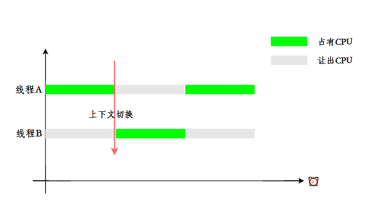
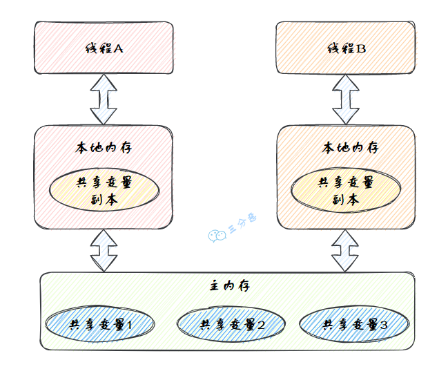

> 图文详解 60 道Java并发面试高频题，这次面试，一定吊打面试官，整理：火龙果
>
> 戳[转载链接open in new window](https://mp.weixin.qq.com/s/bImCIoYsH_JEzTkBx2lj4A)，作者：三分恶，戳[原文链接](https://mp.weixin.qq.com/s/1jhBZrAb7bnvkgN1TgAUpw)

## 基础

### 1.并行跟并发有什么区别？

从操作系统的角度来看，线程是CPU分配的最小单位。

- 并行就是同一时刻，两个线程都在执行。这就要求有两个CPU去分别执行两个线程。
- 并发就是同一时刻，只有一个执行，但是一个时间段内，两个线程都执行了。并发的实现依赖于CPU切换线程，因为切换的时间特别短，所以基本对于用户是无感知的。


### 2.说说什么是进程和线程？

要说线程，必须得先说说进程。

- 进程：进程是代码在数据集合上的一次运行活动，是**系统进行资源分配和调度的基本单位**。
- 线程：线程是进程的一个执行路径，一个进程中至少有一个线程，进程中的多个线程共享进程的资源。

操作系统在分配资源时是把资源分配给进程的， 但是 CPU 资源比较特殊，它是被分配到线程的，因为真正要占用CPU运行的是线程，所以也说**线程是 CPU分配的基本单位**。

比如在Java中，当我们启动 main 函数其实就启动了一个JVM进程，而 main 函数在的线程就是这个进程中的一个线程，也称主线程。


一个进程中有多个线程，多个线程共用进程的堆和方法区资源，但是每个线程有自己的程序计数器和栈。

### 3.说说线程有几种创建方式？

Java中[创建线程](https://so.csdn.net/so/search?q=创建线程&spm=1001.2101.3001.7020)主要有三种方式，分别为继承Thread类、实现Runnable接口、实现Callable接口。

- 继承 Thread 类，重写 run()方法，调用 start()方法启动线程

  ```java
  public class ThreadTest {
  
      /**
       * 继承Thread类
       */
      public static class MyThread extends Thread {
          @Override
          public void run() {
              System.out.println("This is child thread");
          }
      }
  
      public static void main(String[] args) {
          MyThread thread = new MyThread();
          thread.start();
      }
  }
  ```

- 实现 Runnable 接口，重写 run()方法

  ```java
  public class RunnableTask implements Runnable {
      public void run() {
          System.out.println("Runnable!");
      }
  
      public static void main(String[] args) {
          RunnableTask task = new RunnableTask();
          new Thread(task).start();
      }
  }
  ```

  上面两种都是没有返回值的，但是如果我们需要获取线程的执行结果，该怎么办呢？

- 实现 Callable 接口，重写 call()方法，这种方式可以通过 FutureTask 获取任务执行的返回值

  ```java
  
  public class CallerTask implements Callable<String> {
      public String call() throws Exception {
          return "Hello,i am running!";
      }
  
      public static void main(String[] args) {
          //创建异步任务
          FutureTask<String> task=new FutureTask<String>(new CallerTask());
          //启动线程
          new Thread(task).start();
          try {
              //等待执行完成，并获取返回结果
              String result=task.get();
              System.out.println(result);
          } catch (InterruptedException e) {
              e.printStackTrace();
          } catch (ExecutionException e) {
              e.printStackTrace();
          }
      }
  }
  
  ```

### 4.为什么调用 start()方法时会执行 run()方法，那怎么不直接调用 run()方法？

JVM 执行 start 方法，会先创建一条线程，由创建出来的新线程去执行 thread 的 run 方法，这才起到多线程的效果。


**为什么我们不能直接调用 run()方法？**

也很清楚， 如果直接调用 Thread 的 run()方法，那么 run 方法还是运行在主线程中，相当于顺序执行，就起不到多线程的效果。


### 5.线程有哪些常用的调度方法？


#### 线程等待与通知

在 Object 类中有一些方法可以用于线程的等待与通知。

①、`wait()`：当一个线程 A 调用一个共享变量的 `wait()` 方法时， 线程 A 会被阻塞挂起，直到发生下面几种情况才会返回 ：

- 线程 A 调用了共享对象 `notify()`或者 `notifyAll()` 方法；
- 其他线程调用了线程 A 的 `interrupt()` 方法，线程 A 抛出 InterruptedException 异常返回。

②、`wait(long timeout)` ：这个方法相比 `wait()` 方法多了一个超时参数，它的不同之处在于，如果线程 A 调用共享对象的 `wait(long timeout)`方法后，没有在指定的 timeout 时间内被其它线程唤醒，那么这个方法还是会因为超时而返回。

③、`wait(long timeout, int nanos)`，其内部调用的是 `wait(long timout)` 方法。

唤醒线程主要有下面两个方法：

①、`notify()`：一个线程 A 调用共享对象的 `notify()` 方法后，会唤醒一个在这个共享变量上调用 wait 系列方法后被挂起的线程。

一个共享变量上可能会有多个线程在等待，具体唤醒哪个等待的线程是随机的。

②、`notifyAll()`：不同于在共享变量上调用 `notify()` 方法会唤醒被阻塞到该共享变量上的一个线程，notifyAll 方法会唤醒所有在该共享变量上调用 wait 系列方法而被挂起的线程。

Thread 类还提供了一个 `join()` 方法，意思是如果一个线程 A 执行了 `thread.join()`，当前线程 A 会等待 thread 线程终止之后才从 `thread.join()` 返回。

#### 线程休眠

`sleep(long millis)`：Thread 类中的静态方法，当一个执行中的线程 A 调用了 Thread 的 sleep 方法后，线程 A 会暂时让出指定时间的执行权。

但是线程 A 所拥有的监视器资源，比如锁，还是持有不让出的。指定的睡眠时间到了后该方法会正常返回，接着参与 CPU 的调度，获取到 CPU 资源后就可以继续运行。

#### 让出优先权

`yield()`：Thread 类中的静态方法，当一个线程调用 yield 方法时，实际是在暗示线程调度器，当前线程请求让出自己的 CPU，但是线程调度器可能会“装看不见”忽略这个暗示。

#### 线程中断

Java 中的线程中断是一种线程间的协作模式，通过设置线程的中断标志并不能直接终止该线程的执行，而是被中断的线程会根据中断状态自行处理。

- `void interrupt()` ：中断线程，例如，当线程 A 运行时，线程 B 可以调用线程 `interrupt()` 方法来设置线程的中断标志为 true 并立即返回。设置标志仅仅是设置标志, 线程 B 实际并没有被中断，会继续往下执行。
- `boolean isInterrupted()` 方法： 检测当前线程是否被中断。
- `boolean interrupted()` 方法： 检测当前线程是否被中断，与 isInterrupted 不同的是，该方法如果发现当前线程被中断，则会清除中断标志。

> 可参考这篇帖子来进一步学习 [interrupt 方法](https://www.cnblogs.com/myseries/p/10918819.html)


假如面试官问：“**请说说 sleep 和 wait 的区别**，该如何回答呢？”

答：`sleep()` 和 `wait()` 是 Java 中用于暂停当前线程的两个重要方法，sleep 是让当前线程休眠，不涉及对象类，也不需要获取对象的锁，属于 Thread 类的方法；wait 是让获得对象锁的线程实现等待，前提要获得对象的锁，属于 Object 类的方法。

它们之间的区别主要有以下几点：

① **所属类**：

- `sleep()` 方法专属于 `Thread` 类。
- `wait()` 方法专属于 `Object` 类。

② **锁行为**：

当线程执行 sleep 方法时，它不会释放任何锁。也就是说，如果一个线程在持有某个对象的锁时调用了 sleep，它在睡眠期间仍然会持有这个锁。

```java
class SleepDoesNotReleaseLock {

    private static final Object lock = new Object();

    public static void main(String[] args) throws InterruptedException {
        Thread sleepingThread = new Thread(() -> {
            synchronized (lock) {
                System.out.println("Thread 1 会继续持有锁，并且进入睡眠状态");
                try {
                    Thread.sleep(5000);
                } catch (InterruptedException e) {
                    e.printStackTrace();
                }
                System.out.println("Thread 1 醒来了，并且释放了锁");
            }
        });

        Thread waitingThread = new Thread(() -> {
            synchronized (lock) {
                System.out.println("Thread 2 进入同步代码块");
            }
        });

        sleepingThread.start();
        Thread.sleep(1000);
        waitingThread.start();
    }
}
```

输出结果：

```
Thread 1 会继续持有锁，并且进入睡眠状态
Thread 1 醒来了，并且释放了锁
Thread 2 进入同步代码块
```

从输出中我们可以看到，waitingThread 必须等待 sleepingThread 完成睡眠后才能进入同步代码块。

而当线程执行 wait 方法时，它会释放它持有的那个对象的锁，这使得其他线程可以有机会获取该对象的锁。

```java
class WaitReleasesLock {

    private static final Object lock = new Object();

    public static void main(String[] args) throws InterruptedException {
        Thread waitingThread = new Thread(() -> {
            synchronized (lock) {
                try {
                    System.out.println("Thread 1 持有锁，准备等待 5 秒");
                    lock.wait(5000);
                    System.out.println("Thread 1 醒来了，并且退出同步代码块");
                } catch (InterruptedException e) {
                    e.printStackTrace();
                }
            }
        });

        Thread notifyingThread = new Thread(() -> {
            synchronized (lock) {
                System.out.println("Thread 2 尝试唤醒等待中的线程");
                lock.notify();
                System.out.println("Thread 2 执行完了 notify");
            }
        });

        waitingThread.start();
        Thread.sleep(1000);
        notifyingThread.start();
    }
}
```

输出结果：

```
Thread 1 持有锁，准备等待 5 秒
Thread 2 尝试唤醒等待中的线程
Thread 2 执行完了 notify
Thread 1 醒来了，并且退出同步代码块
```

这表明 waitingThread 在调用 wait 后确实释放了锁。

③ **使用条件**：

- `sleep()` 方法可以在任何地方被调用。
- `wait()` 方法必须在同步代码块或同步方法中被调用，这是因为调用 `wait()` 方法的前提是当前线程必须持有对象的锁。否则会抛出 `IllegalMonitorStateException` 异常。


④ **唤醒方式**：

- `sleep()` 方法在指定的时间过后，线程会自动唤醒继续执行。
- `wait()` 方法需要依靠 `notify()`、`notifyAll()` 方法或者 `wait()` 方法中指定的等待时间到期来唤醒线程。

⑤ **异常**：

- `sleep()` 方法在等待期间，如果线程被中断，会抛出 `InterruptedException`。
- 如果线程被中断或等待时间到期时，`wait()` 方法同样会在等待期间抛出 `InterruptedException`。

我们来通过代码再感受一下 `sleep()` 和 `wait()` 在用法上的区别，先看 `sleep()` 的用法：

```java
class SleepExample {
    public static void main(String[] args) {
        Thread thread = new Thread(() -> {
            System.out.println("线程准备休眠 2 秒");
            try {
                Thread.sleep(2000); // 线程将睡眠2秒
            } catch (InterruptedException e) {
                e.printStackTrace();
            }
            System.out.println("线程醒来了");
        });

        thread.start();
    }
}

```

再来看 `wait()` 的用法：

```java
class WaitExample {
    public static void main(String[] args) {
        final Object lock = new Object();

        Thread thread = new Thread(() -> {
            synchronized (lock) {
                try {
                    System.out.println("线程准备等待 2 秒");
                    lock.wait(2000); // 线程会等待2秒，或者直到其他线程调用 lock.notify()/notifyAll()
                    System.out.println("线程结束等待");
                } catch (InterruptedException e) {
                    e.printStackTrace();
                }
            }
        });

        thread.start();
    }
}
```

### 6.线程有几种状态？

在 Java 中，线程共有六种状态：

| 状态         | 说明                                                         |
| ------------ | ------------------------------------------------------------ |
| NEW          | 初始状态：线程被创建，但还没有调用 start()方法               |
| RUNNABLE     | 运行状态：Java 线程将操作系统中的就绪和运行两种状态笼统的称作“运行” |
| BLOCKED      | 阻塞状态：表示线程阻塞于锁                                   |
| WAITING      | 等待状态：表示线程进入等待状态，进入该状态表示当前线程需要等待其他线程做出一些特定动作（通知或中断） |
| TIME_WAITING | 超时等待状态：该状态不同于 WAITIND，它是可以在指定的时间自行返回的 |
| TERMINATED   | 终止状态：表示当前线程已经执行完毕                           |

线程在自身的生命周期中， 并不是固定地处于某个状态，而是随着代码的执行在不同的状态之间进行切换，Java 线程状态变化如图示：


###  7.什么是线程上下文切换？

使用多线程的目的是为了充分利用 CPU，但是我们知道，并发其实是一个 CPU 来应付多个线程。


为了让用户感觉多个线程是在同时执行的， CPU 资源的分配采用了时间片轮转也就是给每个线程分配一个时间片，线程在时间片内占用 CPU 执行任务。当线程使用完时间片后，就会处于就绪状态并让出 CPU 让其他线程占用，这就是**上下文切换**。



### 8.守护线程了解吗？

Java 中的线程分为两类，分别为 **daemon 线程（守护线程）**和 **user 线程（用户线程）**。

在 JVM 启动时会调用 main 方法，main 方法所在的线程就是一个用户线程。其实在 JVM 内部同时还启动了很多守护线程， 比如垃圾回收线程。

那么守护线程和用户线程有什么区别呢？区别之一是当最后一个非守护线程束时， JVM 会正常退出，而不管当前是否存在守护线程，也就是说**守护线程是否结束并不影响 JVM 退出**。换而言之，**只要有一个用户线程还没结束，正常情况下 JVM 就不会退出**。


### 9.线程间有哪些通信方式？


①、**volatile 和 synchronized 关键字**

[关键字 volatile](https://javabetter.cn/thread/volatile.html) 用来修饰成员变量，告知程序任何对该变量的访问均需要从共享内存中获取，而对它的改变必须同步刷新回共享内存，保证所有线程对变量访问的可见性。

- 从共享内存读
- 写同步进共享内存

[关键字 synchronized](https://javabetter.cn/thread/synchronized-1.html) 可以修饰方法，或者以同步代码块的形式来使用，确保多个线程在同一个时刻，只能有一个线程在执行某个方法或某个代码块。

②、**等待/通知机制**

一个线程调用共享对象的 `wait()` 方法时，它会进入该对象的等待池，并释放已经持有的该对象的锁，进入等待状态，直到其他线程调用相同对象的 `notify()` 或 `notifyAll()` 方法。

一个线程调用共享对象的 `notify()` 方法时，它会唤醒在该对象等待池中等待的一个线程，使其进入锁池，等待获取锁。

[Condition](https://javabetter.cn/thread/condition.html) 也提供了类似的方法，`await()` 负责等待、`signal()` 和 `signalAll()` 负责通知。

通常与锁（特别是 [ReentrantLock](https://javabetter.cn/thread/reentrantLock.html)）一起使用，为线程提供了一种等待某个条件成真的机制，并允许其他线程在该条件变化时通知等待线程。更灵活、更强大。

③、**管道输入/输出流**

管道输入/输出流和普通的文件输入/输出流或者网络输入/输出流不同，它主要用于线程之间的数据传输，而传输的媒介为内存。

[管道输入/输出流](https://javabetter.cn/io/piped.html)主要包括了如下 4 种具体实现：PipedOutputStream、PipedInputStream、 PipedReader 和 PipedWriter，前两种面向字节，而后两种面向字符。

④、**使用 Thread.join()**

如果一个线程 A 执行了 `thread.join()`语句，其含义是：当前线程 A 等待 thread 线程终止之后才从 `thread.join()`返回。

⑤、**使用 ThreadLocal**

[ThreadLocal](https://javabetter.cn/thread/ThreadLocal.html) 是 Java 中提供的一种用于实现线程局部变量的工具。它允许每个线程都拥有自己的独立副本，从而实现线程隔离。**ThreadLocal 可以用于解决多线程中共享对象的线程安全问题**。

那其实除了上面提到的这些，还有很多通信工具类 [CountDownLatch](https://javabetter.cn/thread/CountDownLatch.html)、[CyclicBarrier](https://javabetter.cn/thread/CountDownLatch.html)、[Semaphore](https://javabetter.cn/thread/CountDownLatch.html) 等并发工具类。


## ThreadLocal

###  10.ThreadLocal 是什么？

ThreadLocal，也就是线程本地变量。如果你创建了一个 ThreadLocal 变量，那么访问这个变量的每个线程都会有这个变量的一个本地拷贝，多个线程操作这个变量的时候，实际是操作自己本地内存里面的变量，从而起到线程隔离的作用，避免了线程安全问题。


- 创建

创建了一个 ThreadLoca 变量 localVariable，任何一个线程都能并发访问 localVariable。

```java
//创建一个ThreadLocal变量
public static ThreadLocal<String> localVariable = new ThreadLocal<>();
```

- 写入

线程可以在任何地方使用 localVariable，写入变量。

```java
localVariable.set("鄙人三某”);
```

- 读取

线程在任何地方读取的都是它写入的变量。

```java
localVariable.get();
```

### 11.你在工作中用到过 ThreadLocal 吗？

有用到过的，用来做用户信息上下文的存储。

我们的系统应用是一个典型的 MVC 架构，登录后的用户每次访问接口，都会在请求头中携带一个 token，在控制层可以根据这个 token，解析出用户的基本信息。那么问题来了，假如在服务层和持久层都要用到用户信息，比如 rpc 调用、更新用户获取等等，那应该怎么办呢？

一种办法是显式定义用户相关的参数，比如账号、用户名……这样一来，我们可能需要大面积地修改代码，多少有点瓜皮，那该怎么办呢？

这时候我们就可以用到 ThreadLocal，在控制层拦截请求把用户信息存入 ThreadLocal，这样我们在任何一个地方，都可以取出 ThreadLocal 中存的用户数据。


## Java内存模型

###  18.说一下你对Java内存模型（JMM）的理解？

​	Java内存模型（Java Memory Model，JMM），是一种抽象的模型，被定义出来屏蔽各种硬件和操作系统的内存访问差异。

​	JMM定义了线程和主内存之间的抽象关系：线程之间的共享变量存储在`主内存`（Main Memory）中，每个线程都有一个私有的`本地内存`（Local Memory），本地内存中存储了该线程以读/写共享变量的副本。

​	Java内存模型的抽象图：




本地内存是JMM的 一个抽象概念，并不真实存在。它其实涵盖了缓存、写缓冲区、寄存器以及其他的硬件和编译器优化。


​	图里面的是一个双核 CPU 系统架构 ，每个核有自己的控制器和运算器，其中控制器包含一组寄存器和操作控制器，运算器执行算术逻辅运算。每个核都有自己的一级缓存，在有些架构里面还有一个所有 CPU 共享的二级缓存。 那么 Java 内存模型里面的工作内存，就对应这里的 Ll 缓存或者 L2 缓存或者 CPU 寄存器。

###  19.说说你对原子性、可见性、有序性的理解？

原子性、有序性、可见性是并发编程中非常重要的基础概念，JMM的很多技术都是围绕着这三大特性展开。

- **原子性**：原子性指的是一个操作是不可分割、不可中断的，要么全部执行并且执行的过程不会被任何因素打断，要么就全不执行。
- **可见性**：可见性指的是一个线程修改了某一个共享变量的值时，其它线程能够立即知道这个修改。
- **有序性**：有序性指的是对于一个线程的执行代码，从前往后依次执行，单线程下可以认为程序是有序的，但是并发时有可能会发生指令重排。

> 分析下面几行代码的原子性？

```java
int i = 2;
int j = i;
i++;
i = i + 1;
```

- 第1句是基本类型赋值，是原子性操作。
- 第2句先读i的值，再赋值到j，两步操作，不能保证原子性。
- 第3和第4句其实是等效的，先读取i的值，再+1，最后赋值到i，三步操作了，不能保证原子性。

> 原子性、可见性、有序性都应该怎么保证呢？

- 原子性：JMM只能保证基本的原子性，如果要保证一个代码块的原子性，需要使用`synchronized `。
- 可见性：Java是利用`volatile`关键字来保证可见性的，除此之外，`final`和`synchronized`也能保证可见性。
- 有序性：`synchronized`或者`volatile`都可以保证多线程之间操作的有序性。

(synchronized可以保证三个特性，原子性最难保证；可见性最好保证)

### 20.那说说什么是指令重排？


## 并发工具类

### 39.CountDownLatch（倒计数器）了解吗？

CountDownLatch，倒计数器，有两个常见的应用场景[18]：

**场景1：协调子线程结束动作：等待所有子线程运行结束**

CountDownLatch允许一个或多个线程等待其他线程完成操作。

例如，我们很多人喜欢玩的王者荣耀，开黑的时候，得等所有人都上线之后，才能开打。

![王者荣耀等待玩家确认-来源参考[18]](image/javathread-50.jpeg)


CountDownLatch模仿这个场景(参考[18])：

创建大乔、兰陵王、安其拉、哪吒和铠等五个玩家，主线程必须在他们都完成确认后，才可以继续运行。

在这段代码中，`new CountDownLatch(5)`用户创建初始的latch数量，各玩家通过`countDownLatch.countDown()`完成状态确认，主线程通过`countDownLatch.await()`等待。

```java
public static void main(String[] args) throws InterruptedException {
    CountDownLatch countDownLatch = new CountDownLatch(5);

    Thread 大乔 = new Thread(countDownLatch::countDown);
    Thread 兰陵王 = new Thread(countDownLatch::countDown);
    Thread 安其拉 = new Thread(countDownLatch::countDown);
    Thread 哪吒 = new Thread(countDownLatch::countDown);
    Thread 铠 = new Thread(() -> {
        try {
            // 稍等，上个卫生间，马上到...
            Thread.sleep(1500);
            countDownLatch.countDown();
        } catch (InterruptedException ignored) {}
    });

    大乔.start();
    兰陵王.start();
    安其拉.start();
    哪吒.start();
    铠.start();
    countDownLatch.await();
    System.out.println("所有玩家已经就位！");
}
```

