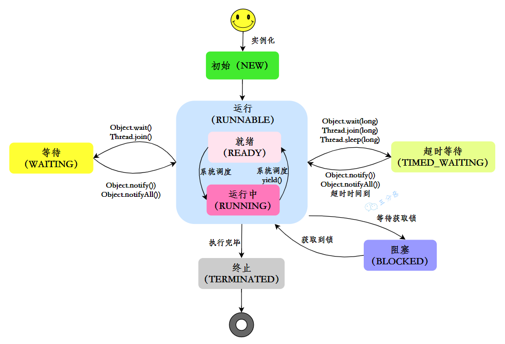
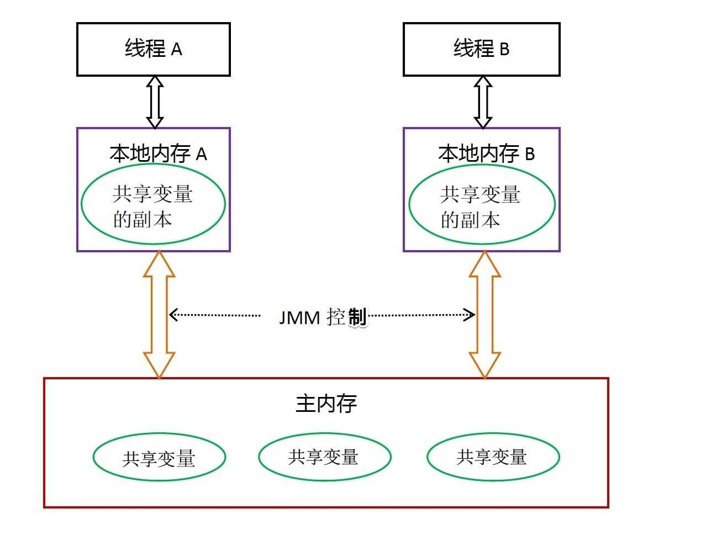
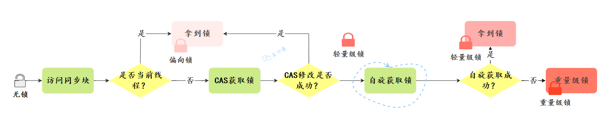
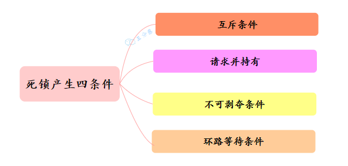

# 并发编程总结

> 图文详解 60 道Java并发面试高频题，这次面试，一定吊打面试官，整理：火龙果
>
> 戳[转载链接](https://mp.weixin.qq.com/s/bImCIoYsH_JEzTkBx2lj4A)，作者：三分恶，戳[原文链接](https://mp.weixin.qq.com/s/1jhBZrAb7bnvkgN1TgAUpw)

## 一、基础

### 1.并行跟并发有什么区别？

从操作系统的角度来看，线程是CPU分配的最小单位。

- 并行就是同一时刻，两个线程都在执行。这就要求有两个CPU去分别执行两个线程。
- 并发就是同一时刻，只有一个执行，但是一个时间段内，两个线程都执行了。并发的实现依赖于CPU切换线程，因为切换的时间特别短，所以基本对于用户是无感知的。


### 2.说说什么是进程和线程？

要说线程，必须得先说说进程。

- 进程：进程是代码在数据集合上的一次运行活动，是**系统进行资源分配和调度的基本单位**。
- 线程：线程是进程的一个执行路径，一个进程中至少有一个线程，进程中的多个线程共享进程的资源。

操作系统在分配资源时是把资源分配给进程的， 但是 CPU 资源比较特殊，它是被分配到线程的，因为真正要占用CPU运行的是线程，所以也说**线程是 CPU分配的基本单位**。

比如在Java中，当我们启动 main 函数其实就启动了一个JVM进程，而 main 函数在的线程就是这个进程中的一个线程，也称主线程。


一个进程中有多个线程，多个线程共用进程的堆和方法区资源，但是每个线程有自己的程序计数器和栈。

### 3.说说线程有几种创建方式？

Java中[创建线程](https://so.csdn.net/so/search?q=创建线程&spm=1001.2101.3001.7020)主要有三种方式，分别为继承Thread类、实现Runnable接口、实现Callable接口。

- 继承 Thread 类，重写 run()方法，调用 start()方法启动线程

  ```java
  public class ThreadTest {
  
      /**
       * 继承Thread类
       */
      public static class MyThread extends Thread {
          @Override
          public void run() {
              System.out.println("This is child thread");
          }
      }
  
      public static void main(String[] args) {
          MyThread thread = new MyThread();
          thread.start();
      }
  }
  ```

- 实现 Runnable 接口，重写 run()方法

  ```java
  public class RunnableTask implements Runnable {
      public void run() {
          System.out.println("Runnable!");
      }
  
      public static void main(String[] args) {
          RunnableTask task = new RunnableTask();
          new Thread(task).start();
      }
  }
  ```

  上面两种都是没有返回值的，但是如果我们需要获取线程的执行结果，该怎么办呢？

- 实现 Callable 接口，重写 call()方法，这种方式可以通过 FutureTask 获取任务执行的返回值

  ```java
  
  public class CallerTask implements Callable<String> {
      public String call() throws Exception {
          return "Hello,i am running!";
      }
  
      public static void main(String[] args) {
          //创建异步任务
          FutureTask<String> task=new FutureTask<String>(new CallerTask());
          //启动线程
          new Thread(task).start();
          try {
              //等待执行完成，并获取返回结果
              String result=task.get();
              System.out.println(result);
          } catch (InterruptedException e) {
              e.printStackTrace();
          } catch (ExecutionException e) {
              e.printStackTrace();
          }
      }
  }
  
  ```

### 4.为什么调用 start()方法时会执行 run()方法，那怎么不直接调用 run()方法？

JVM 执行 start 方法，会先创建一条线程，由创建出来的新线程去执行 thread 的 run 方法，这才起到多线程的效果。


**为什么我们不能直接调用 run()方法？**

也很清楚， 如果直接调用 Thread 的 run()方法，那么 run 方法还是运行在主线程中，相当于顺序执行，就起不到多线程的效果。


### 5.线程有哪些常用的调度方法？


#### 线程等待与通知

在 Object 类中有一些方法可以用于线程的等待与通知。

①、`wait()`：当一个线程 A 调用一个共享变量的 `wait()` 方法时， 线程 A 会被阻塞挂起，直到发生下面几种情况才会返回 ：

- 线程 A 调用了共享对象 `notify()`或者 `notifyAll()` 方法；
- 其他线程调用了线程 A 的 `interrupt()` 方法，线程 A 抛出 InterruptedException 异常返回。

②、`wait(long timeout)` ：这个方法相比 `wait()` 方法多了一个超时参数，它的不同之处在于，如果线程 A 调用共享对象的 `wait(long timeout)`方法后，没有在指定的 timeout 时间内被其它线程唤醒，那么这个方法还是会因为超时而返回。

③、`wait(long timeout, int nanos)`，其内部调用的是 `wait(long timout)` 方法。

唤醒线程主要有下面两个方法：

①、`notify()`：一个线程 A 调用共享对象的 `notify()` 方法后，会唤醒一个在这个共享变量上调用 wait 系列方法后被挂起的线程。

一个共享变量上可能会有多个线程在等待，具体唤醒哪个等待的线程是随机的。

②、`notifyAll()`：不同于在共享变量上调用 `notify()` 方法会唤醒被阻塞到该共享变量上的一个线程，notifyAll 方法会唤醒所有在该共享变量上调用 wait 系列方法而被挂起的线程。

Thread 类还提供了一个 `join()` 方法，意思是如果一个线程 A 执行了 `thread.join()`，当前线程 A 会等待 thread 线程终止之后才从 `thread.join()` 返回。

#### 线程休眠

`sleep(long millis)`：Thread 类中的静态方法，当一个执行中的线程 A 调用了 Thread 的 sleep 方法后，线程 A 会暂时让出指定时间的执行权。

但是线程 A 所拥有的监视器资源，比如锁，还是持有不让出的。指定的睡眠时间到了后该方法会正常返回，接着参与 CPU 的调度，获取到 CPU 资源后就可以继续运行。

#### 让出优先权

`yield()`：Thread 类中的静态方法，当一个线程调用 yield 方法时，实际是在暗示线程调度器，当前线程请求让出自己的 CPU，但是线程调度器可能会“装看不见”忽略这个暗示。

#### 线程中断

Java 中的线程中断是一种线程间的协作模式，通过设置线程的中断标志并不能直接终止该线程的执行，而是被中断的线程会根据中断状态自行处理。

- `void interrupt()` ：中断线程，例如，当线程 A 运行时，线程 B 可以调用线程 `interrupt()` 方法来设置线程的中断标志为 true 并立即返回。设置标志仅仅是设置标志, 线程 B 实际并没有被中断，会继续往下执行。
- `boolean isInterrupted()` 方法： 检测当前线程是否被中断。
- `boolean interrupted()` 方法： 检测当前线程是否被中断，与 isInterrupted 不同的是，该方法如果发现当前线程被中断，则会清除中断标志。

> 可参考这篇帖子来进一步学习 [interrupt 方法](https://www.cnblogs.com/myseries/p/10918819.html)


假如面试官问：“**请说说 sleep 和 wait 的区别**，该如何回答呢？”

答：`sleep()` 和 `wait()` 是 Java 中用于暂停当前线程的两个重要方法，sleep 是让当前线程休眠，不涉及对象类，也不需要获取对象的锁，属于 Thread 类的方法；wait 是让获得对象锁的线程实现等待，前提要获得对象的锁，属于 Object 类的方法。

它们之间的区别主要有以下几点：

① **所属类**：

- `sleep()` 方法专属于 `Thread` 类。
- `wait()` 方法专属于 `Object` 类。

② **锁行为**：

当线程执行 sleep 方法时，它不会释放任何锁。也就是说，如果一个线程在持有某个对象的锁时调用了 sleep，它在睡眠期间仍然会持有这个锁。

```java
class SleepDoesNotReleaseLock {

    private static final Object lock = new Object();

    public static void main(String[] args) throws InterruptedException {
        Thread sleepingThread = new Thread(() -> {
            synchronized (lock) {
                System.out.println("Thread 1 会继续持有锁，并且进入睡眠状态");
                try {
                    Thread.sleep(5000);
                } catch (InterruptedException e) {
                    e.printStackTrace();
                }
                System.out.println("Thread 1 醒来了，并且释放了锁");
            }
        });

        Thread waitingThread = new Thread(() -> {
            synchronized (lock) {
                System.out.println("Thread 2 进入同步代码块");
            }
        });

        sleepingThread.start();
        Thread.sleep(1000);
        waitingThread.start();
    }
}
```

输出结果：

```
Thread 1 会继续持有锁，并且进入睡眠状态
Thread 1 醒来了，并且释放了锁
Thread 2 进入同步代码块
```

从输出中我们可以看到，waitingThread 必须等待 sleepingThread 完成睡眠后才能进入同步代码块。

而当线程执行 wait 方法时，它会释放它持有的那个对象的锁，这使得其他线程可以有机会获取该对象的锁。

```java
class WaitReleasesLock {

    private static final Object lock = new Object();

    public static void main(String[] args) throws InterruptedException {
        Thread waitingThread = new Thread(() -> {
            synchronized (lock) {
                try {
                    System.out.println("Thread 1 持有锁，准备等待 5 秒");
                    lock.wait(5000);
                    System.out.println("Thread 1 醒来了，并且退出同步代码块");
                } catch (InterruptedException e) {
                    e.printStackTrace();
                }
            }
        });

        Thread notifyingThread = new Thread(() -> {
            synchronized (lock) {
                System.out.println("Thread 2 尝试唤醒等待中的线程");
                lock.notify();
                System.out.println("Thread 2 执行完了 notify");
            }
        });

        waitingThread.start();
        Thread.sleep(1000);
        notifyingThread.start();
    }
}
```

输出结果：

```
Thread 1 持有锁，准备等待 5 秒
Thread 2 尝试唤醒等待中的线程
Thread 2 执行完了 notify
Thread 1 醒来了，并且退出同步代码块
```

这表明 waitingThread 在调用 wait 后确实释放了锁。

③ **使用条件**：

- `sleep()` 方法可以在任何地方被调用。
- `wait()` 方法必须在同步代码块或同步方法中被调用，这是因为调用 `wait()` 方法的前提是当前线程必须持有对象的锁。否则会抛出 `IllegalMonitorStateException` 异常。


④ **唤醒方式**：

- `sleep()` 方法在指定的时间过后，线程会自动唤醒继续执行。
- `wait()` 方法需要依靠 `notify()`、`notifyAll()` 方法或者 `wait()` 方法中指定的等待时间到期来唤醒线程。

⑤ **异常**：

- `sleep()` 方法在等待期间，如果线程被中断，会抛出 `InterruptedException`。
- 如果线程被中断或等待时间到期时，`wait()` 方法同样会在等待期间抛出 `InterruptedException`。

我们来通过代码再感受一下 `sleep()` 和 `wait()` 在用法上的区别，先看 `sleep()` 的用法：

```java
class SleepExample {
    public static void main(String[] args) {
        Thread thread = new Thread(() -> {
            System.out.println("线程准备休眠 2 秒");
            try {
                Thread.sleep(2000); // 线程将睡眠2秒
            } catch (InterruptedException e) {
                e.printStackTrace();
            }
            System.out.println("线程醒来了");
        });

        thread.start();
    }
}

```

再来看 `wait()` 的用法：

```java
class WaitExample {
    public static void main(String[] args) {
        final Object lock = new Object();

        Thread thread = new Thread(() -> {
            synchronized (lock) {
                try {
                    System.out.println("线程准备等待 2 秒");
                    lock.wait(2000); // 线程会等待2秒，或者直到其他线程调用 lock.notify()/notifyAll()
                    System.out.println("线程结束等待");
                } catch (InterruptedException e) {
                    e.printStackTrace();
                }
            }
        });

        thread.start();
    }
}
```

### 6.线程有几种状态？

在 Java 中，线程共有六种状态：

| 状态         | 说明                                                         |
| ------------ | ------------------------------------------------------------ |
| NEW          | 初始状态：线程被创建，但还没有调用 start()方法               |
| RUNNABLE     | 运行状态：Java 线程将操作系统中的就绪和运行两种状态笼统的称作“运行” |
| BLOCKED      | 阻塞状态：表示线程阻塞于锁                                   |
| WAITING      | 等待状态：表示线程进入等待状态，进入该状态表示当前线程需要等待其他线程做出一些特定动作（通知或中断） |
| TIME_WAITING | 超时等待状态：该状态不同于 WAITIND，它是可以在指定的时间自行返回的 |
| TERMINATED   | 终止状态：表示当前线程已经执行完毕                           |

线程在自身的生命周期中， 并不是固定地处于某个状态，而是随着代码的执行在不同的状态之间进行切换，Java 线程状态变化如图示：



###  7.什么是线程上下文切换？

使用多线程的目的是为了充分利用 CPU，但是我们知道，并发其实是一个 CPU 来应付多个线程。


为了让用户感觉多个线程是在同时执行的， CPU 资源的分配采用了时间片轮转也就是给每个线程分配一个时间片，线程在时间片内占用 CPU 执行任务。当线程使用完时间片后，就会处于就绪状态并让出 CPU 让其他线程占用，这就是**上下文切换**。


### 8.守护线程了解吗？

Java 中的线程分为两类，分别为 **daemon 线程（守护线程）**和 **user 线程（用户线程）**。

在 JVM 启动时会调用 main 方法，main 方法所在的线程就是一个用户线程。其实在 JVM 内部同时还启动了很多守护线程， 比如垃圾回收线程。

那么守护线程和用户线程有什么区别呢？区别之一是当最后一个非守护线程束时， JVM 会正常退出，而不管当前是否存在守护线程，也就是说**守护线程是否结束并不影响 JVM 退出**。换而言之，**只要有一个用户线程还没结束，正常情况下 JVM 就不会退出**。


### 9.线程间有哪些通信方式？


①、**volatile 和 synchronized 关键字**

[关键字 volatile](https://javabetter.cn/thread/volatile.html) 用来修饰成员变量，告知程序任何对该变量的访问均需要从共享内存中获取，而对它的改变必须同步刷新回共享内存，保证所有线程对变量访问的可见性。

- 从共享内存读
- 写同步进共享内存

[关键字 synchronized](https://javabetter.cn/thread/synchronized-1.html) 可以修饰方法，或者以同步代码块的形式来使用，确保多个线程在同一个时刻，只能有一个线程在执行某个方法或某个代码块。

②、**等待/通知机制**

一个线程调用共享对象的 `wait()` 方法时，它会进入该对象的等待池，并释放已经持有的该对象的锁，进入等待状态，直到其他线程调用相同对象的 `notify()` 或 `notifyAll()` 方法。

一个线程调用共享对象的 `notify()` 方法时，它会唤醒在该对象等待池中等待的一个线程，使其进入锁池，等待获取锁。

[Condition](https://javabetter.cn/thread/condition.html) 也提供了类似的方法，`await()` 负责等待、`signal()` 和 `signalAll()` 负责通知。

通常与锁（特别是 [ReentrantLock](https://javabetter.cn/thread/reentrantLock.html)）一起使用，为线程提供了一种等待某个条件成真的机制，并允许其他线程在该条件变化时通知等待线程。更灵活、更强大。

③、**管道输入/输出流**

管道输入/输出流和普通的文件输入/输出流或者网络输入/输出流不同，它主要用于线程之间的数据传输，而传输的媒介为内存。

[管道输入/输出流](https://javabetter.cn/io/piped.html)主要包括了如下 4 种具体实现：PipedOutputStream、PipedInputStream、 PipedReader 和 PipedWriter，前两种面向字节，而后两种面向字符。

④、**使用 Thread.join()**

如果一个线程 A 执行了 `thread.join()`语句，其含义是：当前线程 A 等待 thread 线程终止之后才从 `thread.join()`返回。

⑤、**使用 ThreadLocal**

[ThreadLocal](https://javabetter.cn/thread/ThreadLocal.html) 是 Java 中提供的一种用于实现线程局部变量的工具。它允许每个线程都拥有自己的独立副本，从而实现线程隔离。**ThreadLocal 可以用于解决多线程中共享对象的线程安全问题**。

那其实除了上面提到的这些，还有很多通信工具类 [CountDownLatch](https://javabetter.cn/thread/CountDownLatch.html)、[CyclicBarrier](https://javabetter.cn/thread/CountDownLatch.html)、[Semaphore](https://javabetter.cn/thread/CountDownLatch.html) 等并发工具类。


## 二、ThreadLocal

###  10.ThreadLocal 是什么？

ThreadLocal，也就是线程本地变量。如果你创建了一个 ThreadLocal 变量，那么访问这个变量的每个线程都会有这个变量的一个本地拷贝，多个线程操作这个变量的时候，实际是操作自己本地内存里面的变量，从而起到线程隔离的作用，避免了线程安全问题。


- 创建

创建了一个 ThreadLoca 变量 localVariable，任何一个线程都能并发访问 localVariable。

```java
//创建一个ThreadLocal变量
public static ThreadLocal<String> localVariable = new ThreadLocal<>();
```

- 写入

线程可以在任何地方使用 localVariable，写入变量。

```java
localVariable.set("鄙人三某”);
```

- 读取

线程在任何地方读取的都是它写入的变量。

```java
localVariable.get();
```

#### 除了 ThreadLocal，还有什么解决线程安全问题的方法？

①、Java 中的 synchronized 关键字可以用于方法和代码块，确保同一时间只有一个线程可以执行特定的代码段。

```java
public synchronized void method() {
    // 线程安全的操作
}
```

②、Java 并发包（java.util.concurrent.locks）中提供了 Lock 接口和一些实现类，如 ReentrantLock。相比于 synchronized，ReentrantLock 提供了公平锁和非公平锁。

```java
ReentrantLock lock = new ReentrantLock();

public void method() {
    lock.lock();
    try {
        // 线程安全的操作
    } finally {
        lock.unlock();
    }
}
```

③、Java 并发包还提供了一组原子变量类（如 AtomicInteger，AtomicLong 等），它们利用 CAS（比较并交换），实现了无锁的原子操作，适用于简单的计数器场景。

```java
AtomicInteger atomicInteger = new AtomicInteger(0);

public void increment() {
    atomicInteger.incrementAndGet();
}
```

④、Java 并发包提供了一些线程安全的集合类，如 ConcurrentHashMap，CopyOnWriteArrayList 等。这些集合类内部实现了必要的同步策略，提供了更高效的并发访问。

```java
ConcurrentHashMap<String, String> map = new ConcurrentHashMap<>();
```

⑤、volatile 变量保证了变量的可见性，修改操作是立即同步到主存的，读操作从主存中读取。

```java
private volatile boolean flag = false;
```

### 11.你在工作中用到过 ThreadLocal 吗？

有用到过的，用来做用户信息上下文的存储。


我们的系统应用是一个典型的 MVC 架构，登录后的用户每次访问接口，都会在请求头中携带一个 token，在控制层可以根据这个 token，解析出用户的基本信息。那么问题来了，假如在服务层和持久层都要用到用户信息，比如 rpc 调用、更新用户获取等等，那应该怎么办呢？

这时候我们就可以用到 ThreadLocal，在控制层拦截请求把用户信息存入 ThreadLocal，这样我们在任何一个地方，都可以取出 ThreadLocal 中存的用户数据。


很多其它场景的 cookie、session 等等数据隔离也都可以通过 ThreadLocal 去实现。

我们常用的数据库连接池也用到了 ThreadLocal：

- 数据库连接池的连接交给 ThreadLoca 进行管理，保证当前线程的操作都是同一个 Connnection。

### 12.ThreadLocal 怎么实现的呢？

我们看一下 ThreadLocal 的 set(T)方法，发现先获取到当前线程，再获取`ThreadLocalMap`，然后把元素存到这个 map 中。

```java
    public void set(T value) {
        //获取当前线程
        Thread t = Thread.currentThread();
        //获取ThreadLocalMap
        ThreadLocalMap map = getMap(t);
        //讲当前元素存入map
        if (map != null)
            map.set(this, value);
        else
            createMap(t, value);
    }
```

ThreadLocal 实现的秘密都在这个`ThreadLocalMap`了， Thread 类中定义了一个类型为`ThreadLocal.ThreadLocalMap`的成员变量`threadLocals`。

```java
public class Thread implements Runnable {
   //ThreadLocal.ThreadLocalMap是Thread的属性
   ThreadLocal.ThreadLocalMap threadLocals = null;
}
```

ThreadLocalMap 既然被称为 Map，那么毫无疑问它是<key,value>型的数据结构。我们都知道 map 的本质是一个个<key,value>形式的节点组成的数组，那 ThreadLocalMap 的节点是什么样的呢？

```java
static class Entry extends WeakReference<ThreadLocal<?>> {
    /** The value associated with this ThreadLocal. */
    Object value;

    //节点类
    Entry(ThreadLocal<?> k, Object v) {
        //key赋值
        super(k);
        //value赋值
        value = v;
    }
}
```

ThreadLocalMap 是 ThreadLocal 的静态内部类，它内部维护了一个 Entry 数组，key 是 ThreadLocal 对象，value 是线程的局部变量本身。


早期的 ThreadLocal 不是这样的，它的 ThreadLocalMap 中使用 Thread 作为 key，这也是最简单的实现方式。


优化后的方案有两个好处，**一个是 Map 中存储的键值对变少了；另一个是 ThreadLocalMap 的生命周期和线程一样长，线程销毁的时候，ThreadLocalMap 也会被销毁**。

Entry 继承了 WeakReference，它限定了 key 是一个弱引用，弱引用的好处是当内存不足时，JVM 会回收 ThreadLocal 对象，并且将其对应的 Entry 的 value 设置为 null，这样在很大程度上可以避免内存泄漏。

```java
static class Entry extends WeakReference<ThreadLocal<?>> {
    /** The value associated with this ThreadLocal. */
    Object value;

    //节点类
    Entry(ThreadLocal<?> k, Object v) {
        //key赋值
        super(k);
        //value赋值
        value = v;
    }
}
```


【总结】

ThreadLocal 的实现原理就是，每个线程维护一个 Map，key 为 ThreadLocal 对象，value 为想要实现线程隔离的对象。

1、当需要存线程隔离的对象时，通过 ThreadLocal 的 set 方法将对象存入 Map 中。

2、当需要取线程隔离的对象时，通过 ThreadLocal 的 get 方法从 Map 中取出对象。

3、Map 的大小由 ThreadLocal 对象的多少决定。


#### 什么是弱引用，什么是强引用？

强引用，比如说 `User user = new User("沉默王二")` 中，user 就是一个强引用，`new User("沉默王二")` 就是一个强引用对象。

当 user 被置为 null 时（`user = null`），`new User("沉默王二")` 将会被垃圾回收；如果 user 不被置为 null，即便是内存空间不足，JVM 也不会回收 `new User("沉默王二")` 这个强引用对象，宁愿抛出 OutOfMemoryError。

弱引用，比如说下面这段代码：

```java
ThreadLocal<User> userThreadLocal = new ThreadLocal<>();
userThreadLocal.set(new User("沉默王二"));
```

①、userThreadLocal 是一个强引用，`new ThreadLocal<>()` 是一个强引用对象；

②、`new User("沉默王二")` 是一个强引用对象。

③、在 ThreadLocalMap 中，`key = new ThreadLocal<>()` 是一个弱引用对象。当 JVM 进行垃圾回收时，如果发现了弱引用对象，就会将其回收。


其关系链就是：

- ThreadLocal 强引用 -> ThreadLocal 对象。
- Thread 强引用 -> ThreadLocalMap。
- `ThreadLocalMap[i]` 强引用了 -> Entry。
- Entry.key 弱引用 -> ThreadLocal 对象。
- Entry.value 强引用 -> 线程的局部变量对象。

### 13.ThreadLocal 内存泄露是怎么回事？

通常情况下，随着线程 Thread 的结束，其内部的 ThreadLocalMap 也会被回收，从而避免了内存泄漏。

但如果一个线程一直在运行，并且其 `ThreadLocalMap` 中的 Entry.value 一直指向某个强引用对象，那么这个对象就不会被回收，从而导致内存泄漏。当 Entry 非常多时，可能就会引发更严重的内存溢出问题。


#### 那怎么解决内存泄漏问题呢？

很简单，使用完 ThreadLocal 后，及时调用 `remove()` 方法释放内存空间。

```java
try {
    threadLocal.set(value);
    // 执行业务操作
} finally {
    threadLocal.remove(); // 确保能够执行清理
}
```

`remove()` 方法会将当前线程的 ThreadLocalMap 中的所有 key 为 null 的 Entry 全部清除，这样就能避免内存泄漏问题。

```java
private void remove(ThreadLocal<?> key) {
    Entry[] tab = table;
    int len = tab.length;
    int i = key.threadLocalHashCode & (len-1);
    for (Entry e = tab[i];
            e != null;
            e = tab[i = nextIndex(i, len)]) {
        if (e.get() == key) {
            e.clear();
            expungeStaleEntry(i);
            return;
        }
    }
}

public void clear() {
    this.referent = null;
}
```

#### 那为什么 key 要设计成弱引用？

弱引用的好处是，当内存不足的时候，JVM 会主动回收掉弱引用的对象。

比如说：

```java
WeakReference key = new WeakReference(new ThreadLocal());
```

key 是弱引用，`new WeakReference(new ThreadLocal())` 是弱引用对象，当 JVM 进行垃圾回收时，如果发现了弱引用对象，就会将其回收。一旦 key 被回收，ThreadLocalMap 在进行 set、get 的时候就会对 key 为 null 的 Entry 进行清理。


总结一下，在 ThreadLocal 被垃圾收集后，下一次访问 ThreadLocalMap 时，Java 会自动清理那些键为 null 的条目（参照源码中的 replaceStaleEntry 方法），这个过程会在执行 ThreadLocalMap 相关操作（如 `get()`, `set()`, `remove()`）时触发。

#### 你了解哪些 ThreadLocal 的改进方案？

在 JDK 20 Early-Access Build 28 版本中，出现了 ThreadLocal 的改进方案，即 `ScopedValue`。

还有 Netty 中的 FastThreadLocal，它是 Netty 对 ThreadLocal 的优化，它内部维护了一个索引常量 index，每次创建 FastThreadLocal 中都会自动+1，用来取代 hash 冲突带来的损耗，用空间换时间。

```java
private final int index;

public FastThreadLocal() {
    index = InternalThreadLocalMap.nextVariableIndex();
}
public static int nextVariableIndex() {
    int index = nextIndex.getAndIncrement();
    if (index < 0) {
        nextIndex.decrementAndGet();
    }
    return index;
}
```

### 14.ThreadLocalMap 的源码看过吗？

ThreadLocalMap 虽然被叫做 Map，其实它是没有实现 Map 接口的，但是结构还是和 HashMap 比较类似的，主要关注的是两个要素：`元素数组`和`散列方法`。


- 元素数组

一个 table 数组，存储 Entry 类型的元素，Entry 是 ThreaLocal 弱引用作为 key，Object 作为 value 的结构。

```java
 private Entry[] table;
```

- 散列方法

散列方法就是怎么把对应的 key 映射到 table 数组的相应下标，ThreadLocalMap 用的是**哈希取余法**，取出 key 的 threadLocalHashCode，然后和 table 数组长度减一&运算（相当于取余）。

```java
int i = key.threadLocalHashCode & (table.length - 1);
```

这里的 threadLocalHashCode 计算有点东西，每创建一个 ThreadLocal 对象，它就会新增`0x61c88647`，这个值很特殊，它是**斐波那契数** 也叫 **黄金分割数**。`hash`增量为 这个数字，带来的好处就是 `hash` **分布非常均匀**。

```java
    private static final int HASH_INCREMENT = 0x61c88647;

    private static int nextHashCode() {
        return nextHashCode.getAndAdd(HASH_INCREMENT);
    }
```

### 15.ThreadLocalMap 怎么解决 Hash 冲突的？

我们可能都知道 HashMap 使用了链表来解决冲突，也就是所谓的**链地址法**。

ThreadLocalMap 没有使用链表，自然也不是用链地址法来解决冲突了，它用的是另外一种方式——**开放定址法**。开放定址法是什么意思呢？简单来说，就是**这个坑被人占了，那就接着去找空着的坑**。


如上图所示，如果我们插入一个 value=27 的数据，通过 hash 计算后应该落入第 4 个槽位中，而槽位 4 已经有了 Entry 数据，而且 Entry 数据的 key 和当前不相等。此时就会线性向后查找，一直找到 Entry 为 null 的槽位才会停止查找，把元素放到空的槽中。

在 get 的时候，也会根据 ThreadLocal 对象的 hash 值，定位到 table 中的位置，然后判断该槽位 Entry 对象中的 key 是否和 get 的 key 一致，如果不一致，就判断下一个位置。

### 16.ThreadLocalMap 扩容机制了解吗？

在 ThreadLocalMap.set()方法的最后，如果执行完启发式清理工作后，未清理到任何数据，且当前散列数组中`Entry`的数量已经达到了列表的扩容阈值`(len*2/3)`，就开始执行`rehash()`逻辑：

```java
if (!cleanSomeSlots(i, sz) && sz >= threshold)
    rehash();
```

再着看 rehash()具体实现：这里会先去清理过期的 Entry，然后还要根据条件判断`size >= threshold - threshold / 4` 也就是`size >= threshold* 3/4`来决定是否需要扩容。

```java
private void rehash() {
    //清理过期Entry
    expungeStaleEntries();

    //扩容
    if (size >= threshold - threshold / 4)
        resize();
}

//清理过期Entry
private void expungeStaleEntries() {
    Entry[] tab = table;
    int len = tab.length;
    for (int j = 0; j < len; j++) {
        Entry e = tab[j];
        if (e != null && e.get() == null)
            expungeStaleEntry(j);
    }
}
```

接着看看具体的`resize()`方法，扩容后的`newTab`的大小为老数组的两倍，然后遍历老的 table 数组，散列方法重新计算位置，开放地址解决冲突，然后放到新的`newTab`，遍历完成之后，`oldTab`中所有的`entry`数据都已经放入到`newTab`中了，然后 table 引用指向`newTab`


### 17.父子线程怎么共享数据？

父线程能用 ThreadLocal 来给子线程传值吗？毫无疑问，不能。那该怎么办？

这时候可以用到另外一个类——`InheritableThreadLocal `。

使用起来很简单，在主线程的 InheritableThreadLocal 实例设置值，在子线程中就可以拿到了。

```java
public class InheritableThreadLocalTest {

    public static void main(String[] args) {
        final ThreadLocal threadLocal = new InheritableThreadLocal();
        // 主线程
        threadLocal.set("不擅技术");
        //子线程
        Thread t = new Thread() {
            @Override
            public void run() {
                super.run();
                System.out.println("鄙人三某 ，" + threadLocal.get());
            }
        };
        t.start();
    }
}
```

原理很简单，在 Thread 类里还有另外一个变量：

```java
ThreadLocal.ThreadLocalMap inheritableThreadLocals = null;
```

在 Thread.init 的时候，如果父线程的`inheritableThreadLocals`不为空，就把它赋给当前线程（子线程）的`inheritableThreadLocals `。

```java
if (inheritThreadLocals && parent.inheritableThreadLocals != null)
    this.inheritableThreadLocals =
        ThreadLocal.createInheritedMap(parent.inheritableThreadLocals);
```


## 三、Java内存模型

###  18.说一下你对Java内存模型（JMM）的理解？

​	Java内存模型（Java Memory Model，JMM），是一种抽象的模型，被定义出来屏蔽各种硬件和操作系统的内存访问差异。

​	Java内存模型的抽象图：



​	JMM定义了线程和主内存之间的抽象关系：线程之间的共享变量存储在`主内存`（Main Memory）中，每个线程都有一个私有的`本地内存`（Local Memory），本地内存中存储了该线程以读/写共享变量的副本，用来进行线程内部的读写操作。

- 当一个线程更改了本地内存中共享变量的副本后，它需要将这些更改刷新到主内存中，以确保其他线程可以看到这些更改。
- 当一个线程需要读取共享变量时，它可能首先从本地内存中读取。如果本地内存中的副本是过时的，线程将从主内存中重新加载共享变量的最新值到本地内存中。


本地内存是JMM的 一个抽象概念，并不真实存在。它其实涵盖了缓存、写缓冲区、寄存器以及其他的硬件和编译器优化。


​	图里面的是一个双核 CPU 系统架构 ，每个核有自己的控制器和运算器，其中控制器包含一组寄存器和操作控制器，运算器执行算术逻辅运算。每个核都有自己的一级缓存，在有些架构里面还有一个所有 CPU 共享的二级缓存。 那么 Java 内存模型里面的工作内存，就对应这里的 Ll 缓存或者 L2 缓存或者 CPU 寄存器。

#### 为什么线程要用自己的内存？

第一，在多线程环境中，如果所有线程都直接操作主内存中的共享变量，会引发更多的内存访问竞争，这不仅影响性能，还增加了线程安全问题的复杂度。通过让每个线程使用本地内存，可以减少对主内存的直接访问和竞争，从而提高程序的并发性能。

第二，现代 CPU 为了优化执行效率，可能会对指令进行乱序执行（指令重排序）。使用本地内存（CPU 缓存和寄存器）可以在不影响最终执行结果的前提下，使得 CPU 有更大的自由度来乱序执行指令，从而提高执行效率。


###  19.说说你对原子性、可见性、有序性的理解？

原子性、有序性、可见性是并发编程中非常重要的基础概念，JMM的很多技术都是围绕着这三大特性展开。

- **原子性**：原子性指的是一个操作是不可分割、不可中断的，要么全部执行并且执行的过程不会被任何因素打断，要么就全不执行。
- **可见性**：可见性指的是一个线程修改了某一个共享变量的值时，其它线程能够立即知道这个修改。
- **有序性**：有序性指的是对于一个线程的执行代码，从前往后依次执行，单线程下可以认为程序是有序的，但是并发时有可能会发生指令重排。

> 分析下面几行代码的原子性？

```java
int i = 2;
int j = i;
i++;
i = i + 1;
```

- 第1句是基本类型赋值，是原子性操作。
- 第2句先读i的值，再赋值到j，两步操作，不能保证原子性。
- 第3和第4句其实是等效的，先读取i的值，再+1，最后赋值到i，三步操作了，不能保证原子性。

> 原子性、可见性、有序性都应该怎么保证呢？

- 原子性：JMM只能保证基本的原子性，如果要保证一个代码块的原子性，需要使用`synchronized `。
- 可见性：Java是利用`volatile`关键字来保证可见性的，除此之外，`final`和`synchronized`也能保证可见性。
- 有序性：`synchronized`或者`volatile`都可以保证多线程之间操作的有序性。

(synchronized可以保证三个特性，原子性最难保证；可见性最好保证)

### 20.那说说什么是指令重排？

在执行程序时，为了提高性能，编译器和处理器常常会对指令做重排序。重排序分 3 种类型。

1. 编译器优化的重排序。编译器在不改变单线程程序语义的前提下，可以重新安排语句的执行顺序。
2. 指令级并行的重排序。现代处理器采用了指令级并行技术（Instruction-Level Parallelism，ILP）来将多条指令重叠执行。如果不存在数据依赖性，处理器可以改变语句对应 机器指令的执行顺序。
3. 内存系统的重排序。由于处理器使用缓存和读/写缓冲区，这使得加载和存储操作看上去可能是在乱序执行。

从 Java 源代码到最终实际执行的指令序列，会分别经历下面 3 种重排序，如图：


我们比较熟悉的双重校验单例模式就是一个经典的指令重排的例子，`Singleton instance=new Singleton();`对应的 JVM 指令分为三步：分配内存空间-->初始化对象--->对象指向分配的内存空间，但是经过了编译器的指令重排序，第二步和第三步就可能会重排序。


JMM 属于语言级的内存模型，它确保在不同的编译器和不同的处理器平台之上，通过禁止特定类型的编译器重排序和处理器重排序，为程序员提供一致的内存可见性保证。

### 21.指令重排有限制吗？happens-before 了解吗？

指令重排也是有一些限制的，有两个规则`happens-before`和`as-if-serial`来约束。

happens-before 的定义：

- 如果一个操作 happens-before 另一个操作，那么第一个操作的执行结果将对第二个操作可见，而且第一个操作的执行顺序排在第二个操作之前。
- 两个操作之间存在 happens-before 关系，并不意味着 Java 平台的具体实现必须要按照 happens-before 关系指定的顺序来执行。如果重排序之后的执行结果，与按 happens-before 关系来执行的结果一致，那么这种重排序并不非法。

happens-before 和我们息息相关的有六大规则：


- **程序顺序规则**：一个线程中的每个操作，happens-before 于该线程中的任意后续操作。
- **监视器锁规则**：对一个锁的解锁，happens-before 于随后对这个锁的加锁。
- **volatile 变量规则**：对一个 volatile 域的写，happens-before 于任意后续对这个 volatile 域的读。
- **传递性**：如果 A happens-before B，且 B happens-before C，那么 A happens-before C。
- **start()规则**：如果线程 A 执行操作 ThreadB.start()（启动线程 B），那么 A 线程的 ThreadB.start()操作 happens-before 于线程 B 中的任意操作。
- **join()规则**：如果线程 A 执行操作 ThreadB.join()并成功返回，那么线程 B 中的任意操作 happens-before 于线程 A 从 ThreadB.join()操作成功返回。

### 22.as-if-serial 又是什么？单线程的程序一定是顺序的吗？

as-if-serial 语义的意思是：不管怎么重排序（编译器和处理器为了提高并行度），**单线程程序的执行结果不能被改变**。编译器、runtime 和处理器都必须遵守 as-if-serial 语义。

**为了遵守 as-if-serial 语义，编译器和处理器不会对存在数据依赖关系的操作做重排序**，因为这种重排序会改变执行结果。但是，如果操作之间不存在数据依赖关系，这些操作就可能被编译器和处理器重排序。为了具体说明，请看下面计算圆面积的代码示例。

```java
double pi = 3.14;   // A
double r = 1.0;   // B
double area = pi * r * r;   // C
```

上面 3 个操作的数据依赖关系：


A 和 C 之间存在数据依赖关系，同时 B 和 C 之间也存在数据依赖关系。因此在最终执行的指令序列中，C 不能被重排序到 A 和 B 的前面（C 排到 A 和 B 的前面，程序的结果将会被改变）。但 A 和 B 之间没有数据依赖关系，编译器和处理器可以重排序 A 和 B 之间的执行顺序。

所以最终，程序可能会有两种执行顺序：


as-if-serial 语义把单线程程序保护了起来，遵守 as-if-serial 语义的编译器、runtime 和处理器共同编织了这么一个“楚门的世界”：单线程程序是按程序的“顺序”来执行的。as- if-serial 语义使单线程情况下，我们不需要担心重排序的问题，可见性的问题。


### 23.volatile 实现原理了解吗？

推荐阅读：[volatile 关键字解析](https://javabetter.cn/thread/volatile.html)

volatile 关键字主要有两个作用，一个是保证变量的内存可见性，一个是禁止指令重排序。

#### volatile 怎么保证可见性的呢？

当一个变量被声明为 volatile 时，Java 内存模型会确保所有线程看到该变量时的值是一致的。

相比synchronized的加锁方式来解决共享变量的内存可见性问题，volatile就是更轻量的选择，它没有上下文切换的额外开销成本。

volatile可以确保对某个变量的更新对其他线程马上可见，**一个变量被声明为volatile 时，线程在写入变量时不会把值缓存在寄存器或者其他地方，而是会把值刷新回主内存 当其它线程读取该共享变量 ，会从主内存重新获取最新值**，而不是使用当前线程的本地内存中的值。

例如，我们声明一个 volatile 变量 volatile int x = 0，线程A修改x=1，修改完之后就会把新的值刷新回主内存，线程B读取x的时候，就会清空本地内存变量，然后再从主内存获取最新值。


#### volatile怎么保证有序性的呢？

重排序可以分为编译器重排序和处理器重排序，valatile保证有序性，就是通过分别限制这两种类型的重排序。

为了实现volatile的内存语义，编译器在生成字节码时，会在指令序列中插入**内存屏障**来禁止特定类型的处理器重排序。

1. 在每个volatile写操作的前面插入一个`StoreStore`屏障
2. 在每个volatile写操作的后面插入一个`StoreLoad`屏障
3. 在每个volatile读操作的后面插入一个`LoadLoad`屏障
4. 在每个volatile读操作的后面插入一个`LoadStore`屏障


在程序执行期间，为了提高性能，编译器和处理器会对指令进行重排序。但涉及到 volatile 变量时，它们必须遵循一定的规则：

- 写 volatile 变量的操作之前的操作不会被编译器重排序到写操作之后。
- 读 volatile 变量的操作之后的操作不会被编译器重排序到读操作之前。

这意味着 volatile 变量的写操作总是发生在任何后续读操作之前。

## 四、锁

### 24.synchronized 用过吗？怎么使用？

在 Java 中，synchronized 是最常用的锁，它使用简单，并且可以保证线程安全，避免多线程并发访问时出现数据不一致的情况。

synchronized 可以用在方法和代码块中。

1、修饰方法：作用于当前对象实例加锁，进入同步代码前要获得 **当前对象实例的锁**

```java
public synchronized void increment() {
    this.count++;
}
```

2、修饰静态方法：也就是给当前类加锁，会作⽤于类的所有对象实例 ，进⼊同步代码前要获得当前 class 的锁。因为静态成员不属于任何⼀个实例对象，是类成员（ static 表明这是该类的⼀个静态资源，不管 new 了多少个对象，只有⼀份）。

如果⼀个线程 A 调⽤⼀个实例对象的⾮静态 synchronized ⽅法，⽽线程 B 需要调⽤这个实例对象所属类的静态 synchronized ⽅法，是允许的，不会发⽣互斥现象，因为访问静态 synchronized ⽅法占⽤的锁是当前类的锁，⽽访问⾮静态 synchronized ⽅法占⽤的锁是当前实例对象锁。
```java
public static synchronized void increment() {
    count++;
}
```

- **修饰代码块** ：指定加锁对象，对给定对象/类加锁。 synchronized(this|object) 表示进⼊同步代码库前要获得给定对象的锁。 synchronized(类.class) 表示进⼊同步代码前要获得 当前 **class** 的锁

```java
public void increment() {
    synchronized (this) {
        this.count++;
    }
}
```

### 25.synchronized 的实现原理？

#### synchronized是怎么加锁的呢？

我们使用 synchronized 的时候，发现不用自己去 lock 和 unlock，是因为 JVM 帮我们把这个事情做了。

1. synchronized 修饰代码块时，JVM 采用`monitorenter`、`monitorexit`两个指令来实现同步，`monitorenter` 指令指向同步代码块的开始位置， `monitorexit` 指令则指向同步代码块的结束位置。

   反编译一段 synchronized 修饰代码块代码，`javap -c -s -v -l SynchronizedDemo.class`，可以看到相应的字节码指令。

   


2. synchronized 修饰同步方法时，JVM 采用`ACC_SYNCHRONIZED`标记符来实现同步，这个标识指明了该方法是一个同步方法。

同样可以写段代码反编译看一下。


#### synchronized 锁住的是什么呢？

> 锁住的是对象（对象监视器Monitor）

monitorenter、monitorexit 或者 ACC_SYNCHRONIZED 都是**基于 Monitor 实现**的。

实例对象结构里有对象头，对象头里面有一块结构叫 Mark Word，Mark Word 指针指向了**monitor**。

所谓的Monitor其实是一种**同步工具**，也可以说是一种**同步机制**。在Java虚拟机（HotSpot）中，Monitor是由**ObjectMonitor实现**的，可以叫做内部锁，或者Monitor锁。

**ObjectMonitor的工作原理**：

1、ObjectMonitor有两个队列：_WaitSet、_EntryList，用来保存ObjectWaiter 对象列表。

2、_owner，获取 Monitor 对象的线程进入 _owner 区时， _count + 1。如果线程调用了 wait() 方法，此时会释放 Monitor 对象， _owner 恢复为空， _count - 1。同时该等待线程进入 _WaitSet 中，等待被唤醒。

```java
ObjectMonitor() {
    _header       = NULL;
    _count        = 0; // 记录线程获取锁的次数
    _waiters      = 0,
    _recursions   = 0;  //锁的重入次数
    _object       = NULL;
    _owner        = NULL;  // 指向持有ObjectMonitor对象的线程
    _WaitSet      = NULL;  // 处于wait状态的线程，会被加入到_WaitSet
    _WaitSetLock  = 0 ;
    _Responsible  = NULL ;
    _succ         = NULL ;
    _cxq          = NULL ;
    FreeNext      = NULL ;
    _EntryList    = NULL ;  // 处于等待锁block状态的线程，会被加入到该列表
    _SpinFreq     = 0 ;
    _SpinClock    = 0 ;
    OwnerIsThread = 0 ;
  }

```

可以类比一个去医院就诊的例子[18]：

首先，患者在**门诊大厅**前台或自助挂号机**进行挂号**；

随后，挂号结束后患者找到对应的**诊室就诊**：

- 诊室每次只能有一个患者就诊；
- 如果此时诊室空闲，直接进入就诊；
- 如果此时诊室内有其它患者就诊，那么当前患者进入**候诊室**，等待叫号；

就诊结束后，**走出就诊室**，候诊室的**下一位候诊患者**进入就诊室。


这个过程就和Monitor机制比较相似：

**门诊大厅**：所有待进入的线程都必须先在**入口Entry Set**挂号才有资格；

**就诊室**：就诊室**_Owner**里里只能有一个线程就诊，就诊完线程就自行离开

**候诊室**：就诊室繁忙时，进入**等待区（Wait Set）**，就诊室空闲的时候就从**等待区（Wait Set）**叫新的线程


所以我们就知道了，同步是锁住的什么东西：

monitorenter，在判断拥有同步标识 ACC_SYNCHRONIZED 抢先进入此方法的线程会优先拥有 Monitor 的 owner ，此时计数器 +1。

monitorexit，当执行完退出后，计数器 -1，归 0 后被其他进入的线程获得。

### 26.除了原子性，synchronized 可见性，有序性，可重入性怎么实现？

#### synchronized 怎么保证可见性？

- 线程加锁前，将清空工作内存中共享变量的值，从而使用共享变量时需要从主内存中重新读取最新的值。
- 线程加锁后，其它线程无法获取主内存中的共享变量。
- 线程解锁前，必须把共享变量的最新值刷新到主内存中。

#### synchronized 怎么保证有序性？

synchronized 同步的代码块，具有排他性，一次只能被一个线程拥有，所以 synchronized 保证同一时刻，代码是单线程执行的。

因为 as-if-serial 语义的存在，单线程的程序能保证最终结果是有序的，但是不保证不会指令重排。

所以 synchronized 保证的有序是执行结果的有序性，而不是防止指令重排的有序性。

#### synchronized 怎么实现可重入的呢？

synchronized 是可重入锁，也就是说，**允许一个线程二次请求自己持有对象锁的临界资源，这种情况称为可重入锁**。

之所以，是可重入的。是因为 synchronized 锁对象有个计数器，他会记录下线程获取锁的次数，会随着线程获取锁后 +1 计数，当线程执行完毕后 -1，直到清零释放锁。

### 27.锁升级？synchronized 优化了解吗？

推荐阅读：[偏向锁、轻量级锁、重量级锁到底是什么？](https://javabetter.cn/thread/synchronized.html)

#### 什么是锁升级？

在 Java 对象头里，有一块结构，叫`Mark Word`，里面会记录锁的状态。

Mark Word 会记录对象自身的运行数据，如**哈希码、GC 分代年龄、锁状态标志、偏向时间戳（Epoch）** 等。

其中的锁状态标志位就是用来记录锁的状态的，有四种状态：

①、无锁状态，在这个状态下，没有线程试图获取锁。

②、偏向锁，当第一个线程访问同步块时，锁会进入偏向模式。

Mark Word 会被设置为偏向模式，并且存储了获取它的线程 ID。

**偏向锁的目的是消除同一线程的后续锁获取和释放的开销。如果同一线程再次请求锁，就无需再次同步**。

③、当有多个线程竞争锁，但没有锁竞争的强烈迹象（即线程交替执行同步块）时，偏向锁会升级为轻量级锁。

线程尝试通过[CAS 操作](https://javabetter.cn/thread/cas.html)（Compare-And-Swap）将对象头的 Mark Word 替换为指向锁记录的指针。如果成功，当前线程获取轻量级锁；如果失败，说明有竞争。

④、重量级锁，当锁竞争激烈时，轻量级锁会膨胀为重量级锁。

重量级锁通过将对象头的 Mark Word 指向监视器（Monitor）对象来实现，该对象包含了锁的持有者、锁的等待队列等信息。


#### synchronized 做了哪些优化？

在 JDK1.6 之前，synchronized 是直接调用 ObjectMonitor 的 enter 和 exit 实现的，这种锁也被称为**重量级锁**。这也是为什么很多声音说不要用 synchronized 的原因，有点“谈虎色变”的感觉。

从 JDK 1.6 开始，HotSpot 对 Java 中的锁进行优化，如增加了适应性自旋、锁消除、锁粗化、轻量级锁和偏向锁等优化策略，极大提升了 synchronized 的性能。

**①、偏向锁**：当一个线程首次获得锁时，JVM 会将锁标记为偏向这个线程，将锁的标志位设置为偏向模式，并且在对象头中记录下该线程的 ID。

之后，当相同的线程再次请求这个锁时，就无需进行额外的同步。如果另一个线程尝试获取这个锁，偏向模式会被撤销，并且锁会升级为轻量级锁。

**②、轻量级锁**：多个线程在不同时段获取同一把锁，即不存在锁竞争的情况，也就没有线程阻塞。针对这种情况，JVM 采用轻量级锁来避免线程的阻塞与唤醒。

当一个线程尝试获取轻量级锁时，它会在自己的栈帧中创建一个锁记录（Lock Record），然后尝试使用 CAS 操作将对象头的 Mark Word 替换为指向锁记录的指针。

如果成功，该线程持有锁；如果失败，表示有其他线程竞争，锁会升级为重量级锁。

**③、自旋锁**：当线程尝试获取轻量级锁失败时，它会进行自旋，即循环检查锁是否可用，以避免立即进入阻塞状态。

自旋的次数不是固定的，而是根据之前在同一个锁上的自旋时间和锁的状态动态调整的。

**④、锁粗化**：如果 JVM 检测到一系列连续的锁操作实际上是在单一线程中完成的，则会将多个锁操作合并为一个更大范围的锁操作，这可以减少锁请求的次数。

锁粗化主要针对循环内连续加锁解锁的情况进行优化。

**⑤、锁消除**：JVM 的即时编译器（[JIT](https://javabetter.cn/jvm/jit.html)）可以在运行时进行代码分析，如果发现某些锁操作不可能被多个线程同时访问，那么这些锁操作就会被完全消除。锁消除可以减少不必要的同步开销。

#### 锁升级的过程是什么样的？

无锁-->偏向锁---> 轻量级锁---->重量级锁，这个方向基本上是不可逆的。


大体上省简的升级过程是这样的：



### 28.说说 synchronized 和 ReentrantLock 的区别？

[synchronized](https://javabetter.cn/thread/synchronized-1.html) 是一个关键字，而 Lock 属于一个接口，其实现类主要有 [ReentrantLock](https://javabetter.cn/thread/reentrantLock.html)、[ReentrantReadWriteLock](https://javabetter.cn/thread/ReentrantReadWriteLock.html)。

可以从锁的实现、功能特点、性能等几个维度去回答这个问题：

**锁的实现：** synchronized是Java语言的关键字，基于JVM实现。而ReentrantLock是基于JDK的API层面实现的（一般是lock()和unlock()方法配合try/finally 语句块来完成。）

**性能：** 在JDK1.6锁优化以前，synchronized的性能比ReenTrantLock差很多。但是JDK6开始，增加了适应性自旋、锁消除等，两者性能就差不多了。

**功能特点：** ReentrantLock 比 synchronized 增加了一些高级功能，如等待可中断、可实现公平锁、可实现选择性通知。

- ReentrantLock提供了一种能够中断等待锁的线程的机制，通过lock.lockInterruptibly()来实现这个机制
- ReentrantLock可以指定是公平锁还是非公平锁。而synchronized只能是非公平锁。所谓的公平锁就是先等待的线程先获得锁。
- synchronized与wait()和notify()/notifyAll()方法结合实现等待/通知机制，ReentrantLock类借助Condition接口与newCondition()方法实现。
- ReentrantLock需要手工声明来加锁和释放锁，一般跟finally配合释放锁。而synchronized不用手动释放锁。
- Lock 还提供了`newCondition()`方法来创建等待通知条件[Condition](https://javabetter.cn/thread/condition.html)，比 synchronized 与 `wait()`、 `notify()/notifyAll()`方法的组合更强大。

下面的表格列出出了两种锁之间的区别：


### 29.AQS 了解多少？

推荐阅读：[到底什么是 AQS?](https://javabetter.cn/thread/aqs.html)

AQS，全称是 AbstractQueuedSynchronizer，中文意思是**抽象队列同步器**，由 Doug Lea 设计，是 Java 并发包`java.util.concurrent`的核心框架类，许多同步类的实现都依赖于它，如 ReentrantLock、Semaphore、CountDownLatch 等。

AQS 的思想是，**如果被请求的共享资源空闲，则当前线程能够成功获取资源；否则，它将进入一个等待队列，当有其他线程释放资源时，系统会挑选等待队列中的一个线程，赋予其资源**。整个过程通过维护一个 int 类型的状态和一个先进先出（FIFO）的队列，来实现对共享资源的管理。


①、AQS 使用一个 volatile 修饰的 int 类型的成员变量 state 来表示同步状态，修改同步状态成功即为获得锁，volatile 保证了变量在多线程之间的可见性，修改 State 值时通过 CAS 机制来保证修改的原子性。

```java
private volatile int state;
```

②、同步队列是通过内部定义的 Node 类来实现的，每个 Node 包含了等待状态、前后节点、线程的引用等。

```java
static final class Node {
    static final int CANCELLED =  1;
    static final int SIGNAL    = -1;
    static final int CONDITION = -2;
    static final int PROPAGATE = -3;

    volatile Node prev;

    volatile Node next;

    volatile Thread thread;
}
```

AQS 支持两种同步方式：

- **独占模式**：这种方式下，每次只能有一个线程持有锁，例如 ReentrantLock。一个线程使用独占方式获取了资源，其它线程就会在获取失败后被阻塞。
- **共享模式：**这种方式下，多个线程可以同时获取锁，例如 Semaphore 和 CountDownLatch。一个线程使用共享方式获取了资源，另外一个线程还可以通过**CAS**的方式进行获取。

子类可以通过继承 AQS 并实现它的方法来管理同步状态，这些方法包括：

- `tryAcquire`：独占方式尝试获取资源，成功则返回 true，失败则返回 false；
- `tryRelease`：独占方式尝试释放资源；
- `tryAcquireShared(int arg)`：共享方式尝试获取资源；
- `tryReleaseShared(int arg)`：共享方式尝试释放资源；
- `isHeldExclusively()`：该线程是否正在独占资源

如果共享资源被占用，需要一种特定的阻塞等待唤醒机制来保证锁的分配，AQS 会将竞争共享资源失败的线程添加到一个 CLH 队列中。


先简单了解一下CLH：Craig、Landin and Hagersten 队列，是 **单向链表实现的队列**。申请线程只在本地变量上自旋，**它不断轮询前驱的状态**，如果发现 **前驱节点释放了锁就结束自旋**.

AQS 中的队列是 **CLH 变体的虚拟双向队列**，通过将每条请求共享资源的线程封装成一个节点来实现锁的分配：


在 CLH 锁中，当一个线程尝试获取锁并失败时，它会将自己添加到队列的尾部并自旋，等待前一个节点的线程释放锁。

AQS 中的 CLH 变体等待队列拥有以下特性：

- AQS 中队列是个双向链表，也是 FIFO 先进先出的特性；

- 通过 Head、Tail 头尾两个节点来组成队列结构，通过 volatile 修饰保证可见性

- Head 指向节点为已获得锁的节点，是一个虚拟节点，节点本身不持有具体线程；

- 获取不到同步状态，会将节点进行自旋获取锁，自旋一定次数失败后会将线程阻塞，相对于 CLH 队列性能较好；

### 30.ReentrantLock 实现原理？

[ReentrantLock](https://javabetter.cn/thread/reentrantLock.html) 是可重入的独占锁，只能有一个线程可以获取该锁，其它获取该锁的线程会被阻塞。

可重入表示当前线程获取该锁后再次获取不会被阻塞，也就意味着同一个线程可以多次获得同一个锁而不会发生死锁。

ReentrantLock 的加锁和解锁：

```java
// 创建非公平锁
ReentrantLock lock = new ReentrantLock();
// 获取锁操作
lock.lock();
try {
    // 执行代码逻辑
} catch (Exception ex) {
    // ...
} finally {
    // 解锁操作
    lock.unlock();
}
```

`new ReentrantLock()`构造函数默认创建的是非公平锁 NonfairSync。

#### 公平锁 FairSync

1、公平锁是指**多个线程按照申请锁的顺序来获取锁**，线程直接进入队列中排队，队列中的第一个线程才能获得锁。

2、公平锁的**优点**是**等待锁的线程不会饿死**。**缺点**是**整体吞吐效率相对非公平锁要低**，等待队列中除第一个线程以外的所有线程都会阻塞，CPU 唤醒阻塞线程的开销比非公平锁大。

#### 非公平锁 NonfairSync

非公平锁是多个线程加锁时直接尝试获取锁，获取不到才会到等待队列的队尾等待。但如果此时锁刚好可用，那么这个线程可以无需阻塞直接获取到锁。

**非公平锁**的**优点**是可以**减少唤起线程的开销，整体的吞吐效率高**，因为线程有几率不阻塞直接获得锁，CPU 不必唤醒所有线程。**缺点**是处于**等待队列中的线程可能会饿死**，或者等很久才会获得锁。

在非公平锁模式下，锁可能会授予刚刚请求它的线程，而不考虑等待时间。

ReentrantLock 内部通过一个计数器来跟踪锁的持有次数。

当线程调用`lock()`方法获取锁时，ReentrantLock 会检查当前状态，判断锁是否已经被其他线程持有。如果没有被持有，则当前线程将获得锁；如果锁已被其他线程持有，则当前线程将根据锁的公平性策略，可能会被加入到等待队列中。

线程首次获取锁时，计数器值变为 1；如果同一线程再次获取锁，计数器增加；每释放一次锁，计数器减 1。

当线程调用`unlock()`方法时，ReentrantLock 会将持有锁的计数减 1，如果计数到达 0，则释放锁，并唤醒等待队列中的线程来竞争锁。


### ReentrantLock 怎么实现公平锁的？

ReentrantLock 的默认构造方法创建的是非公平锁 NonfairSync。

```java
public ReentrantLock() {
    sync = new NonfairSync();
}
```

可以通过有参构造方法传递 true 参数来创建公平锁 FairSync。

```java
ReentrantLock lock = new ReentrantLock(true);
--- ReentrantLock
// true 代表公平锁，false 代表非公平锁
public ReentrantLock(boolean fair) {
    sync = fair ? new FairSync() : new NonfairSync();
}
```

FairSync、NonfairSync 都是 ReentrantLock 的内部类，分别实现了公平锁和非公平锁的逻辑。

#### 非公平锁和公平锁有什么不同？

①、公平锁意味着在多个线程竞争锁时，获取锁的顺序与线程请求锁的顺序相同，即先来先服务（FIFO）。

虽然能保证锁的顺序，但实现起来比较复杂，因为需要额外维护一个有序队列。


②、非公平锁不保证线程获取锁的顺序，当锁被释放时，任何请求锁的线程都有机会获取锁，而不是按照请求的顺序。

相对来说，非公平锁会有更好的性能，因为它的吞吐量比较大。当然，非公平锁让获取锁的时间变得更加不确定，可能会导致在阻塞队列中的线程长期处于饥饿状态。

#### 怎么实现一个非公平锁呢？

要实现一个非公平锁，只需要在创建 ReentrantLock 实例时，不传递任何参数或者传递 false 给它的构造方法就好了。

### 32.CAS 了解多少？

推荐阅读：[一文彻底搞清楚 Java 实现 CAS 的原理](https://javabetter.cn/thread/cas.html)

CAS（Compare-and-Swap）是一种乐观锁的实现方式，全称为“比较并交换”，是一种无锁的原子操作。

在 Java 中，我们可以使用 [synchronized](https://javabetter.cn/thread/synchronized-1.html)关键字和 `CAS` 来实现加锁效果。

**synchronized 是悲观锁**，尽管随着 JDK 版本的升级，synchronized 关键字已经“轻量级”了很多，但依然是悲观锁，**线程开始执行第一步就要获取锁，一旦获得锁，其他的线程进入后就会阻塞并等待锁**。

**CAS 是乐观锁，线程执行的时候不会加锁**，它会假设此时没有冲突，然后完成某项操作；如果因为冲突失败了就重试，直到成功为止。

在 CAS 中，有这样三个值：

- V：要更新的变量(var)
- E：预期值(expected)
- N：新值(new)

比较并交换的过程如下：

判断 V 是否等于 E，如果等于，将 V 的值设置为 N；如果不等，说明已经有其它线程更新了 V，于是当前线程放弃更新，什么都不做。

这里的预期值 E 本质上指的是“旧值”。

这个比较和替换的操作是原子的，即不可中断，确保了数据的一致性。

举个例子，变量当前的值为 0，需要将其更新为 1，可以借助 AtomicInteger 类的 compareAndSet 方法来实现。

```java
AtomicInteger atomicInteger = new AtomicInteger(0);
int expect = 0;
int update = 1;
atomicInteger.compareAndSet(expect, update);
```

compareAndSet 就是一个 CAS 方法，它调用的是 Unsafe 的 compareAndSwapInt。


Unsafe 对 CAS 的实现是通过 C++ 实现的，它的具体实现和操作系统、CPU 都有关系。

Linux 的 X86 下主要是通过 cmpxchgl 这个指令在 CPU 上完成 CAS 操作的，但在多处理器情况下，必须使用 lock 指令加锁来完成。当然，不同的操作系统和处理器在实现方式上肯定会有所不同。

### 33.CAS 有什么问题？如何解决？

CAS 存在三个经典问题。


#### 什么是 ABA 问题？如何解决？

如果一个位置的值原来是 A，后来被改为 B，再后来又被改回 A，那么进行 CAS 操作的线程将无法知晓该位置的值在此期间已经被修改过。

可以使用版本号/时间戳的方式来解决 ABA 问题。

比如说，每次变量更新时，不仅更新变量的值，还更新一个版本号。CAS 操作时不仅要求值匹配，还要求版本号匹配。

```java
public class OptimisticLockExample {
    private int version;
    private int value;

    public synchronized boolean updateValue(int newValue, int currentVersion) {
        if (this.version == currentVersion) {
            this.value = newValue;
            this.version++;
            return true;
        }
        return false;
    }
}
```

Java 的 AtomicStampedReference 类就实现了这种机制，它会同时检查引用值和 stamp 是否都相等。


#### 循环性能开销

自旋 CAS，如果一直循环执行，一直不成功，会给 CPU 带来非常大的执行开销。

> 怎么解决循环性能开销问题？

在 Java 中，很多使用自旋 CAS 的地方，会有一个自旋次数的限制，超过一定次数，就停止自旋。

#### 只能保证一个变量的原子操作

CAS 保证的是对一个变量执行操作的原子性，如果对多个变量操作时，CAS 目前无法直接保证操作的原子性的。

> 怎么解决只能保证一个变量的原子操作问题？

- 可以考虑改用锁来保证操作的原子性
- 可以考虑合并多个变量，将多个变量封装成一个对象，通过 AtomicReference 来保证原子性。

### 34.Java 有哪些保证原子性的方法？如何保证多线程下 i++ 结果正确？


- 使用循环原子类，例如 AtomicInteger，实现 i++原子操作
- 使用 juc 包下的锁，如 ReentrantLock ，对 i++操作加锁 lock.lock()来实现原子性
- 使用 synchronized，对 i++操作加锁

### 35.原子操作类了解多少？

当程序更新一个变量时，如果多线程同时更新这个变量，可能得到期望之外的值，比如变量 i=1，A 线程更新 i+1，B 线程也更新 i+1，经过两个线程操作之后可能 i 不等于 3，而是等于 2。因为 A 和 B 线程在更新变量 i 的时候拿到的 i 都是 1，这就是线程不安全的更新操作，一般我们会使用 synchronized 来解决这个问题，synchronized 会保证多线程不会同时更新变量 i。

其实除此之外，还有更轻量级的选择，Java 从 JDK 1.5 开始提供了 java.util.concurrent.atomic 包，这个包中的原子操作类提供了一种用法简单、性能高效、线程安全地更新一个变量的方式。

因为变量的类型有很多种，所以在 Atomic 包里一共提供了 13 个类，属于 4 种类型的原子更新方式，分别是原子更新基本类型、原子更新数组、原子更新引用和原子更新属性（字段）。


Atomic 包里的类基本都是使用 Unsafe 实现的包装类。

使用原子的方式更新基本类型，Atomic 包提供了以下 3 个类：

- AtomicBoolean：原子更新布尔类型。
- AtomicInteger：原子更新整型。
- AtomicLong：原子更新长整型。

通过原子的方式更新数组里的某个元素，Atomic 包提供了以下 4 个类：

- AtomicIntegerArray：原子更新整型数组里的元素。
- AtomicLongArray：原子更新长整型数组里的元素。
- AtomicReferenceArray：原子更新引用类型数组里的元素。

原子更新基本类型的 AtomicInteger，只能更新一个变量，如果要原子更新多个变量，就需要使用这个原子更新引用类型提供的类。Atomic 包提供了以下 3 个类：

- AtomicReference：原子更新引用类型。
- AtomicReferenceFieldUpdater：原子更新引用类型里的字段。
- AtomicMarkableReference：原子更新带有标记位的引用类型。可以原子更新一个布尔类型的标记位和引用类型。构造方法是 AtomicMarkableReference（V initialRef，boolean initialMark）。

如果需原子地更新某个类里的某个字段时，就需要使用原子更新字段类，Atomic 包提供了以下 3 个类进行原子字段更新：

- AtomicIntegerFieldUpdater：原子更新整型的字段的更新器。
- AtomicLongFieldUpdater：原子更新长整型字段的更新器。
- AtomicStampedReference：原子更新带有版本号的引用类型。该类将整数值与引用关联起来，可用于原子的更新数据和数据的版本号，可以解决使用 CAS 进行原子更新时可能出现的 ABA 问题。

### 36.AtomicInteger 的原理？

一句话概括：**使用 CAS 实现**。

以 AtomicInteger 的添加方法为例：

```java
    public final int getAndIncrement() {
        return unsafe.getAndAddInt(this, valueOffset, 1);
    }
```

通过`Unsafe`类的实例来进行添加操作，来看看具体的 CAS 操作：

```java
public final int getAndAddInt(Object var1, long var2, int var4) {
    int var5;
    do {
        var5 = this.getIntVolatile(var1, var2);
    } while(!this.compareAndSwapInt(var1, var2, var5, var5 + var4));

    return var5;
}
```

compareAndSwapInt 是一个 native 方法，基于 CAS 来操作 int 类型变量。其它的原子操作类基本都是大同小异。

### 37.线程死锁了解吗？该如何避免？

死锁发生在多个线程相互等待对方释放锁资源，导致所有线程都无法继续执行。


#### 为什么会产生死锁呢？



- **互斥条件**：资源不能被多个线程共享，一次只能由一个线程使用。如果一个线程已经占用了一个资源，其他请求该资源的线程必须等待，直到资源被释放。
- **持有并等待条件**：一个线程至少已经持有至少一个资源，且正在等待获取额外的资源，这些额外的资源被其他线程占有。

- **不可剥夺条件**：资源不能被强制从一个线程中抢占过来，只能由持有资源的线程主动释放。
- **循环等待条件**：存在一种线程资源的循环链，每个线程至少持有一个其他线程所需要的资源，然后又等待下一个线程所占有的资源。这形成了一个循环等待的环路。

#### 该如何避免死锁呢？

理解产生死锁的这四个必要条件后，就可以采取相应的措施来避免死锁，换句话说，就是**至少破坏死锁发生的一个条件**。

- **破坏互斥条件**：这通常不可行，因为加锁就是为了互斥。
- **破坏持有并等待条件**：一种方法是要求线程在开始执行前一次性地申请所有需要的资源。
- **破坏非抢占条件**：占用部分资源的线程进一步申请其他资源时，如果申请不到，可以主动释放它占有的资源。
- **破坏循环等待条件**：对所有资源类型进行排序，强制每个线程按顺序申请资源，这样可以避免循环等待的发生。

### 38.那死锁问题怎么排查呢？

首先从系统级别上排查，比如说在 Linux 生产环境中，可以先使用 top ps 等命令查看进程状态，看看是否有进程占用了过多的资源。

接着，使用 JDK 自带的一些性能监控工具进行排查，比如说 jps、jstat、jinfo、jmap、jstack、jcmd 等等。

比如说，使用 `jps -l` 查看当前 Java 进程，然后使用 `jstack 进程号` 查看当前 Java 进程的线程堆栈信息，看看是否有线程在等待锁资源。

来编写一个死锁程序：

```java
class DeadLockDemo {
    private static final Object lock1 = new Object();
    private static final Object lock2 = new Object();

    public static void main(String[] args) {
        new Thread(() -> {
            synchronized (lock1) {
                System.out.println("线程1获取到了锁1");
                try {
                    Thread.sleep(1000);
                } catch (InterruptedException e) {
                    e.printStackTrace();
                }
                synchronized (lock2) {
                    System.out.println("线程1获取到了锁2");
                }
            }
        }).start();

        new Thread(() -> {
            synchronized (lock2) {
                System.out.println("线程2获取到了锁2");
                try {
                    Thread.sleep(1000);
                } catch (InterruptedException e) {
                    e.printStackTrace();
                }
                synchronized (lock1) {
                    System.out.println("线程2获取到了锁1");
                }
            }
        }).start();
    }
}
```

创建了两个线程，每个线程都试图按照不同的顺序获取两个[锁（lock1 和 lock2）](https://javabetter.cn/thread/thread-bring-some-problem.html#活跃性问题)。这种锁的获取顺序不一致很容易导致死锁。

运行这段代码，果然卡住了。


运行 `jstack pid` 命令，可以看到死锁的线程信息。诚不欺我！


也可以使用一些可视化的性能监控工具，比如说 JConsole、VisualVM 等。


推荐阅读：

- [JVM 性能监控工具之命令行篇](https://javabetter.cn/jvm/console-tools.html)
- [JVM 性能监控工具之可视化篇](https://javabetter.cn/jvm/view-tools.html)
- [阿里开源的 Java 诊断神器 Arthas](https://javabetter.cn/jvm/arthas.html)

### 61.聊聊如何进行线程同步？（补充）

所谓同步，即协同步调，按预定的先后次序访问共享资源，以免造成混乱。

线程同步是多线程编程中的一个核心概念，它涉及到在多线程环境下如何安全地访问和修改共享资源的问题。

当有一个线程在对内存进行操作时，其他线程都不可以对这个内存地址进行操作，直到该线程完成操作， 其他线程才能对该内存地址进行操作。

如果多个线程同时读写某个共享资源（如变量、文件等），而没有适当的同步机制，就可能导致数据不一致、数据损坏等问题的出现。

线程同步的实现方式有 6 种：互斥量、读写锁、条件变量、自旋锁、屏障、信号量。

- **互斥量**：互斥量（mutex）是一种最基本的同步手段，本质上是一把锁，在访问共享资源前先对互斥量进行加锁，访问完后再解锁。对互斥量加锁后，任何其他试图再次对互斥量加锁的线程都会被阻塞，直到当前线程解锁。

- **互斥量**：互斥量（mutex）是一种最基本的同步手段，本质上是一把锁，在访问共享资源前先对互斥量进行加锁，访问完后再解锁。对互斥量加锁后，任何其他试图再次对互斥量加锁的线程都会被阻塞，直到当前线程解锁。

- **读写锁**：[读写锁open in new window](https://javabetter.cn/thread/ReentrantReadWriteLock.html)有三种状态，读模式加锁、写模式加锁和不加锁；一次只有一个线程可以占有写模式的读写锁，但是可以有多个线程同时占有读模式的读写锁。非常适合读多写少的场景。

- **条件变量**：[条件变量open in new window](https://javabetter.cn/thread/condition.html)是一种同步手段，它允许线程在满足特定条件时才继续执行，否则进入等待状态。条件变量通常与互斥量一起使用，以防止竞争条件的发生。

- **自旋锁**：自旋锁是一种锁的实现方式，它不会让线程进入睡眠状态，而是一直循环检测锁是否被释放。自旋锁适用于锁的持有时间非常短的情况。

- 信号量：信号量（[Semaphoreopen in new window](https://javabetter.cn/thread/CountDownLatch.html)）本质上是一个计数器，用于为多个进程提供共享数据对象的访问。

  > 推荐阅读：[牛客：可能是全网最全的线程同步方式总结了](https://blog.nowcoder.net/n/7571c2a5ef82480380fea53875b8187b)

### 69.聊聊悲观锁和乐观锁？(补充)

对于悲观锁来说，它总是认为每次访问共享资源时会发生冲突，所以必须对每次数据操作加上锁，以保证临界区的程序同一时间只能有一个线程在执行。

悲观锁的代表有 [synchronized 关键字](https://javabetter.cn/thread/synchronized-1.html)和 [Lock 接口](https://javabetter.cn/thread/reentrantLock.html)

乐观锁，顾名思义，它是乐观派。乐观锁总是假设对共享资源的访问没有冲突，线程可以不停地执行，无需加锁也无需等待。一旦多个线程发生冲突，乐观锁通常使用一种称为 [CAS](https://javabetter.cn/thread/cas.html) 的技术来保证线程执行的安全性。

由于乐观锁假想操作中没有锁的存在，因此不太可能出现死锁的情况，换句话说，乐观锁天生免疫死锁。

- 乐观锁多用于“读多写少“的环境，避免频繁加锁影响性能；
- 悲观锁多用于”写多读少“的环境，避免频繁失败和重试影响性能。


## 五、并发工具类

### 39.CountDownLatch（倒计数器）了解吗？

> 1. 等待所有子线程运行结束
> 2. 统一各线程动作开始的时机

CountDownLatch，倒计数器，有两个常见的应用场景[18]：

**场景1：协调子线程结束动作：等待所有子线程运行结束**

CountDownLatch允许一个或多个线程等待其他线程完成操作。

例如，我们很多人喜欢玩的王者荣耀，开黑的时候，得等所有人都上线之后，才能开打。

![王者荣耀等待玩家确认-来源参考[18]](image/javathread-50.jpeg)


CountDownLatch模仿这个场景(参考[18])：

创建大乔、兰陵王、安其拉、哪吒和铠等五个玩家，主线程必须在他们都完成确认后，才可以继续运行。

在这段代码中，`new CountDownLatch(5)`用户创建初始的latch数量，各玩家通过`countDownLatch.countDown()`完成状态确认，主线程通过`countDownLatch.await()`等待。

```java
public static void main(String[] args) throws InterruptedException {
    CountDownLatch countDownLatch = new CountDownLatch(5);

    Thread 大乔 = new Thread(countDownLatch::countDown);
    Thread 兰陵王 = new Thread(countDownLatch::countDown);
    Thread 安其拉 = new Thread(countDownLatch::countDown);
    Thread 哪吒 = new Thread(countDownLatch::countDown);
    Thread 铠 = new Thread(() -> {
        try {
            // 稍等，上个卫生间，马上到...
            Thread.sleep(1500);
            countDownLatch.countDown();
        } catch (InterruptedException ignored) {}
    });

    大乔.start();
    兰陵王.start();
    安其拉.start();
    哪吒.start();
    铠.start();
    countDownLatch.await();
    System.out.println("所有玩家已经就位！");
}
```

**场景 2. 协调子线程开始动作：统一各线程动作开始的时机**

王者游戏中也有类似的场景，游戏开始时，各玩家的初始状态必须一致。不能有的玩家都出完装了，有的才降生。

在这个场景中，仍然用五个线程代表大乔、兰陵王、安其拉、哪吒和铠等五个玩家。需要注意的是，各玩家虽然都调用了`start()`线程，但是它们在运行时都在等待`countDownLatch`的信号，在信号未收到前，它们不会往下执行。

```java
public static void main(String[] args) throws InterruptedException {
    CountDownLatch countDownLatch = new CountDownLatch(1);

    Thread 大乔 = new Thread(() -> waitToFight(countDownLatch));
    Thread 兰陵王 = new Thread(() -> waitToFight(countDownLatch));
    Thread 安其拉 = new Thread(() -> waitToFight(countDownLatch));
    Thread 哪吒 = new Thread(() -> waitToFight(countDownLatch));
    Thread 铠 = new Thread(() -> waitToFight(countDownLatch));

    大乔.start();
    兰陵王.start();
    安其拉.start();
    哪吒.start();
    铠.start();
    Thread.sleep(1000);
    countDownLatch.countDown();
    System.out.println("敌方还有5秒达到战场，全军出击！");
}

private static void waitToFight(CountDownLatch countDownLatch) {
    try {
        countDownLatch.await(); // 在此等待信号再继续
        System.out.println("收到，发起进攻！");
    } catch (InterruptedException e) {
        e.printStackTrace();
    }
}

```

CountDownLatch 的**核心方法**也不多：

- `await()`：等待 latch 降为 0；
- `boolean await(long timeout, TimeUnit unit)`：等待 latch 降为 0，但是可以设置超时时间。比如有玩家超时未确认，那就重新匹配，总不能为了某个玩家等到天荒地老。
- `countDown()`：latch 数量减 1；
- `getCount()`：获取当前的 latch 数量。

### 40.CyclicBarrier（同步屏障）了解吗？

CyclicBarrier 的字面意思是可循环使用（Cyclic）的屏障（Barrier）。它要做的事情是，**让一 组线程到达一个屏障（也可以叫同步点）时被阻塞，直到最后一个线程到达屏障时，屏障才会开门，所有被屏障拦截的线程才会继续运行**。

它和 CountDownLatch 类似，都可以协调多线程的结束动作，在它们结束后都可以执行特定动作，但是为什么要有 CyclicBarrier，自然是它有和 CountDownLatch 不同的地方。

不知道你听没听过一个新人 UP 主小约翰可汗，小约翰生平有两大恨——“想结衣结衣不依,迷爱理爱理不理。”我们来还原一下事情的经过：小约翰在亲政后认识了新垣结衣，于是决定第一次选妃，向结衣表白，等待回应。然而新垣结衣回应嫁给了星野源，小约翰伤心欲绝，发誓生平不娶，突然发现了铃木爱理，于是小约翰决定第二次选妃，求爱理搭理，等待回应。


我们拿代码模拟这一场景，发现 CountDownLatch 无能为力了，因为 CountDownLatch 的使用是一次性的，无法重复利用，而这里等待了两次。此时，我们用 CyclicBarrier 就可以实现，因为它可以重复利用。


运行结果：


CyclicBarrier 最最核心的方法，仍然是 await()：

- 如果当前线程不是第一个到达屏障的话，它将会进入等待，直到其他线程都到达，除非发生**被中断**、**屏障被拆除**、**屏障被重设**等情况；

上面的例子抽象一下，本质上它的流程就是这样就是这样：


### 41.CyclicBarrier 和 CountDownLatch 有什么区别？

两者最核心的区别[18]：

- CountDownLatch 是一次性的，而 CyclicBarrier 则可以多次设置屏障，实现重复利用；
- CountDownLatch 中的各个子线程不可以等待其他线程，只能完成自己的任务；而 CyclicBarrier 中的各个线程可以等待其他线程。

它们区别用一个表格整理：

| CyclicBarrier                                                | CountDownLatch                                               |
| ------------------------------------------------------------ | ------------------------------------------------------------ |
| CyclicBarrier 是可重用的，其中的线程会等待所有的线程完成任务。届时，屏障将被拆除，并可以选择性地做一些特定的动作。 | CountDownLatch 是一次性的，不同的线程在同一个计数器上工作，直到计数器为 0. |
| CyclicBarrier 面向的是线程数                                 | CountDownLatch 面向的是任务数                                |
| 在使用 CyclicBarrier 时，你必须在构造中指定参与协作的线程数，这些线程必须调用 await()方法 | 使用 CountDownLatch 时，则必须要指定任务数，至于这些任务由哪些线程完成无关紧要 |
| CyclicBarrier 可以在所有的线程释放后重新使用                 | CountDownLatch 在计数器为 0 时不能再使用                     |
| 在 CyclicBarrier 中，如果某个线程遇到了中断、超时等问题时，则处于 await 的线程都会出现问题 | 在 CountDownLatch 中，如果某个线程出现问题，其他线程不受影响 |

### 42.Semaphore（信号量）了解吗？

**Semaphore（信号量）是用来控制同时访问特定资源的线程数量**，它通过协调各个线程，以保证合理的使用公共资源。

听起来似乎很抽象，现在汽车多了，开车出门在外的一个老大难问题就是停车 。停车场的车位是有限的，只能允许若干车辆停泊，如果停车场还有空位，那么显示牌显示的就是绿灯和剩余的车位，车辆就可以驶入；如果停车场没位了，那么显示牌显示的就是绿灯和数字 0，车辆就得等待。如果满了的停车场有车离开，那么显示牌就又变绿，显示空车位数量，等待的车辆就能进停车场。


我们把这个例子类比一下，车辆就是线程，进入停车场就是线程在执行，离开停车场就是线程执行完毕，看见红灯就表示线程被阻塞，不能执行，Semaphore 的本质就是**协调多个线程对共享资源的获取**。

![Semaphore许可获取-来源参考[18]](image/javathread-57.jpeg)

我们再来看一个 Semaphore 的用途：它可以用于做流量控制，特别是公用资源有限的应用场景，比如数据库连接。

假如有一个需求，要读取几万个文件的数据，因为都是 IO 密集型任务，我们可以启动几十个线程并发地读取，但是如果读到内存后，还需要存储到数据库中，而数据库的连接数只有 10 个，这时我们必须控制只有 10 个线程同时获取数据库连接保存数据，否则会报错无法获取数据库连接。这个时候，就可以使用 Semaphore 来做流量控制，如下：

```java
public class SemaphoreTest {
    private static final int THREAD_COUNT = 30;
    private static ExecutorService threadPool = Executors.newFixedThreadPool(THREAD_COUNT);
    private static Semaphore s = new Semaphore(10);

    public static void main(String[] args) {
        for (int i = 0; i < THREAD_COUNT; i++) {
            threadPool.execute(new Runnable() {
                @Override
                public void run() {
                    try {
                        s.acquire();
                        System.out.println("save data");
                        s.release();
                    } catch (InterruptedException e) {
                    }
                }
            });
        }
        threadPool.shutdown();
    }
}
```

在代码中，虽然有 30 个线程在执行，但是只允许 10 个并发执行。Semaphore 的构造方法` Semaphore（int permits`）接受一个整型的数字，表示可用的许可证数量。`Semaphore（10）`表示允许 10 个线程获取许可证，也就是最大并发数是 10。Semaphore 的用法也很简单，首先线程使用 Semaphore 的 acquire()方法获取一个许可证，使用完之后调用 release()方法归还许可证。还可以用 tryAcquire()方法尝试获取许可证。

### 43.Exchanger 了解吗？

Exchanger（交换者）是一个用于线程间协作的工具类。Exchanger 用于进行线程间的数据交换。它提供一个同步点，在这个同步点，两个线程可以交换彼此的数据。

![英雄交换猎物-来源参考[18]](image/javathread-58.jpeg)

这两个线程通过 exchange 方法交换数据，如果第一个线程先执行 exchange()方法，它会一直等待第二个线程也执行 exchange 方法，当两个线程都到达同步点时，这两个线程就可以交换数据，将本线程生产出来的数据传递给对方。

Exchanger 可以用于遗传算法，遗传算法里需要选出两个人作为交配对象，这时候会交换两人的数据，并使用交叉规则得出 2 个交配结果。Exchanger 也可以用于**校对工作**，比如我们需要将纸制银行流水通过人工的方式录入成电子银行流水，为了避免错误，采用 AB 岗两人进行录入，录入到 Excel 之后，系统需要加载这两个 Excel，并对两个 Excel 数据进行校对，看看是否录入一致。

```java
public class ExchangerTest {
    private static final Exchanger<String> exgr = new Exchanger<String>();
    private static ExecutorService threadPool = Executors.newFixedThreadPool(2);

    public static void main(String[] args) {
        threadPool.execute(new Runnable() {
            @Override
            public void run() {
                try {
                    String A = "银行流水A"; // A录入银行流水数据
                    exgr.exchange(A);
                } catch (InterruptedException e) {
                }
            }
        });
        threadPool.execute(new Runnable() {
            @Override
            public void run() {
                try {
                    String B = "银行流水B"; // B录入银行流水数据
                    String A = exgr.exchange("B");
                    System.out.println("A和B数据是否一致：" + A.equals(B) + "，A录入的是："
                            + A + "，B录入是：" + B);
                } catch (InterruptedException e) {
                }
            }
        });
        threadPool.shutdown();
    }
}
```

假如两个线程有一个没有执行 exchange()方法，则会一直等待，如果担心有特殊情况发生，避免一直等待，可以使用`exchange(V x, long timeOut, TimeUnit unit) `设置最大等待时长。

### 64.能说一下 ConcurrentHashMap 的实现吗？（补充）

[ConcurrentHashMap](https://javabetter.cn/thread/ConcurrentHashMap.html)在 JDK 7 时采用的是**分段锁机制**（Segment Locking），整个 Map 被分为若干段，每个段都可以独立地加锁。因此，不同的线程可以同时操作不同的段，从而实现并发访问。


在 JDK 8 及以上版本中，ConcurrentHashMap 的实现进行了优化，不再使用分段锁，而是使用了一种更加精细化的锁——**桶锁**，以及 **CAS 无锁算法**。每个桶（Node 数组的每个元素）都可以独立地加锁，从而实现更高级别的并发访问。


同时，对于读操作，通常不需要加锁，可以直接读取，因为 ConcurrentHashMap 内部使用了 **volatile 变量来保证内存可见性**。

对于写操作，ConcurrentHashMap 使用 CAS 操作来实现无锁的更新，这是一种乐观锁的实现，因为它假设没有冲突发生，在实际更新数据时才检查是否有其他线程在尝试修改数据，如果有，采用悲观的锁策略，如 synchronized 代码块来保证数据的一致性。

#### 说一下 JDK 7 中的 ConcurrentHashMap 的实现原理？

JDK 7 的 ConcurrentHashMap 是由 Segment 数组结构和 HashEntry 数组构成的。Segment 是一种可重入的锁 [ReentrantLock](https://javabetter.cn/thread/reentrantLock.html)，HashEntry 则用于存储键值对数据。

一个 ConcurrentHashMap 里包含一个 Segment 数组，Segment 的结构和 HashMap 类似，是一种数组和链表结构，一个 Segment 里包含一个 HashEntry 数组，每个 HashEntry 是一个链表结构的元素，每个 Segment 守护着一个 HashEntry 数组里的元素，当对 HashEntry 数组的数据进行修改时，必须首先获得它对应的 Segment 锁。


#### 说一下 JDK 8 中的 ConcurrentHashMap 的实现原理？

JDK 8 中的 ConcurrentHashMap 取消了 Segment 分段锁，采用 **CAS + synchronized 来保证并发安全性**，整个容器只分为一个 Segment，即 table 数组。

Node 和 JDK 7 一样，使用 volatile 关键字，保证多线程操作时，变量的可见性。

ConcurrentHashMap 实现线程安全的关键点在于 put 流程。

**①、put 流程**

第一步，计算 hash，遍历 node 数组，如果 node 是空的话，就通过 CAS+自旋的方式初始化。

```java
// 准备初始化
tab = initTable();
// 具体实现
private final Node<K,V>[] initTable() {
    Node<K,V>[] tab; int sc;
    while ((tab = table) == null || tab.length == 0) {
        //如果正在初始化或者扩容
        if ((sc = sizeCtl) < 0)
            //等待
            Thread.yield(); // lost initialization race; just spin
        else if (U.compareAndSwapInt(this, SIZECTL, sc, -1)) {   //CAS操作
            try {
                if ((tab = table) == null || tab.length == 0) {
                    int n = (sc > 0) ? sc : DEFAULT_CAPACITY;
                    @SuppressWarnings("unchecked")
                    Node<K,V>[] nt = (Node<K,V>[])new Node<?,?>[n];
                    table = tab = nt;
                    sc = n - (n >>> 2);
                }
            } finally {
                sizeCtl = sc;
            }
            break;
        }
    }
    return tab;
}
```

第二步，如果当前数组位置是空，直接通过 CAS 自旋写入数据。

```java
static final <K,V> boolean casTabAt(Node<K,V>[] tab, int i,
                                    Node<K,V> c, Node<K,V> v) {
    return U.compareAndSwapObject(tab, ((long)i << ASHIFT) + ABASE, c, v);
}
```

第三步，如果 `hash==MOVED`，说明需要扩容。

```java
else if ((fh = f.hash) == MOVED)
    tab = helpTransfer(tab, f);
```

扩容的具体实现：

```java
final Node<K,V>[] helpTransfer(Node<K,V>[] tab, Node<K,V> f) {
    Node<K,V>[] nextTab; // 下一个表的引用，即新的扩容后的数组
    int sc; // 用于缓存sizeCtl的值
    // 检查条件：传入的表不为空，节点f是ForwardingNode类型，且f中的nextTable不为空
    if (tab != null && (f instanceof ForwardingNode) &&
        (nextTab = ((ForwardingNode<K,V>)f).nextTable) != null) {
        int rs = resizeStamp(tab.length); // 根据当前表长度计算resize stamp
        // 检查循环条件：nextTab等于nextTable，table等于传入的tab，且sizeCtl为负数（表示正在进行或准备进行扩容）
        while (nextTab == nextTable && table == tab &&
               (sc = sizeCtl) < 0) {
            // 检查是否应该停止扩容（比如：resize stamp不匹配，或者已达到最大并发扩容线程数，或者transferIndex已经不大于0）
            if ((sc >>> RESIZE_STAMP_SHIFT) != rs || sc == rs + 1 ||
                sc == rs + MAX_RESIZERS || transferIndex <= 0)
                break;
            // 尝试通过CAS增加sizeCtl的值，以表示有更多线程参与扩容
            if (U.compareAndSwapInt(this, SIZECTL, sc, sc + 1)) {
                transfer(tab, nextTab); // 调用transfer方法，实际进行数据迁移
                break;
            }
        }
        return nextTab; // 返回新的表引用
    }
    return table; // 如果不符合扩容协助条件，返回当前表引用
}
```

第四步，如果都不满足，就使用 synchronized 写入数据，和 HashMap 一样，key 的 hash 一样就覆盖，反之使用拉链法解决哈希冲突，当链表长度超过 8 就转换成红黑树。

ConcurrentHashmap JDK 8 put 流程图：


**②、get 查询**

get 查询的时候，也是通过 key 的 hash 进行定位，需要注意的是 ConcurrentHashMap 会判断 hash 值是否小于 0。


如果小于 0，说明是个特殊节点，会调用节点的 find 方法进行查找，比如说 ForwardingNode 的 find 方法或者 TreeNode 的 find 方法。


#### 总结一下 HashMap 和 ConcurrentHashMap 的区别？

①、HashMap 是非线程安全的，多线程环境下应该使用 ConcurrentHashMap。

②、由于 HashMap 仅在单线程环境下使用，所以不需要考虑同步问题，因此效率高于 ConcurrentHashMap。

#### ConcurrentHashMap 对 HashMap 的优化？

ConcurrentHashMap 是 HashMap 的线程安全版本，使用了 CAS、synchronized、volatile 来确保线程安全。

首先是 hash 的计算方法上，ConcurrentHashMap 的 spread 方法接收一个已经计算好的 hashCode，然后将这个哈希码的高 16 位与自身进行异或运算，这里的 HASH_BITS 是一个常数，值为 0x7fffffff，它确保结果是一个非负整数。

```java
static final int spread(int h) {
    return (h ^ (h >>> 16)) & HASH_BITS;
}
```

比 HashMap 的 hash 计算多了一个 `& HASH_BITS` 的操作。

```java
static final int hash(Object key) {
    int h;
    return (key == null) ? 0 : (h = key.hashCode()) ^ (h >>> 16);
}
```

另外，ConcurrentHashMap 对节点 Node 做了进一步的封装，比如说用 Forwarding Node 来表示正在进行扩容的节点。

```java
static final class ForwardingNode<K,V> extends Node<K,V> {
    final Node<K,V>[] nextTable;
    ForwardingNode(Node<K,V>[] tab) {
        super(MOVED, null, null, null);
        this.nextTable = tab;
    }
}
```

最后就是 put 方法，通过 CAS + synchronized 来保证线程安全。


### 65.ConcurrentHashMap 怎么保证可见性？（补充）

ConcurrentHashMap 保证可见性主要通过使用 volatile 关键字和 synchronized 同步块。

在 Java 中，volatile 关键字保证了变量的可见性，即一个线程修改了一个 volatile 变量后，其他线程可以立即看到这个修改。在 ConcurrentHashMap 的内部实现中，有些关键的变量被声明为 volatile，比如 Segment 数组和 Node 数组等。

此外，ConcurrentHashMap 还使用了 synchronized 同步块来保证复合操作的原子性。当一个线程进入 synchronized 同步块时，它会获得锁，然后执行同步块内的代码。当它退出 synchronized 同步块时，它会释放锁，并将在同步块内对共享变量的所有修改立即刷新到主内存，这样其他线程就可以看到这些修改了。

通过这两种机制，ConcurrentHashMap 保证了在并发环境下的可见性，从而确保了线程安全。

### 66.为什么 ConcurrentHashMap 比 Hashtable 效率高（补充）

**Hashtable 在任何时刻只允许一个线程访问整个 Map**，**通过对整个 Map 加锁来实现线程安全**。

而 ConcurrentHashMap（尤其是在 JDK 8 及之后版本）通过锁分离和 CAS 操作实现更细粒度的锁定策略，允许更高的并发。

```java
static final <K,V> boolean casTabAt(Node<K,V>[] tab, int i,
                                    Node<K,V> c, Node<K,V> v) {
    return U.compareAndSwapObject(tab, ((long)i << ASHIFT) + ABASE, c, v);
}
```

CAS 操作是一种乐观锁，它不会阻塞线程，而是在更新时检查是否有其他线程已经修改了数据，如果没有就更新，如果有就重试。

ConcurrentHashMap 允许多个读操作并发进行而不加锁，因为它通过 [volatile 变量](https://javabetter.cn/thread/volatile.html)来保证读取操作的内存可见性。相比之下，Hashtable 对读操作也加锁，增加了开销。

```java
public V get(Object key) {
    Node<K,V>[] tab; Node<K,V> e, p; int n, eh; K ek;
	// 1. 重hash
    int h = spread(key.hashCode());
    if ((tab = table) != null && (n = tab.length) > 0 &&
        (e = tabAt(tab, (n - 1) & h)) != null) {
        // 2. table[i]桶节点的key与查找的key相同，则直接返回
		if ((eh = e.hash) == h) {
            if ((ek = e.key) == key || (ek != null && key.equals(ek)))
                return e.val;
        }
		// 3. 当前节点hash小于0说明为树节点，在红黑树中查找即可
        else if (eh < 0)
            return (p = e.find(h, key)) != null ? p.val : null;
        while ((e = e.next) != null) {
		//4. 从链表中查找，查找到则返回该节点的value，否则就返回null即可
            if (e.hash == h &&
                ((ek = e.key) == key || (ek != null && key.equals(ek))))
                return e.val;
        }
    }
    return null;
}
```


### 69.能说一下 CopyOnWriteArrayList 的实现原理吗？（补充）

CopyOnWriteArrayList 是一个线程安全的 ArrayList，它遵循写时复制（Copy-On-Write）的原则，即**在写操作时，会先复制一个新的数组，然后在新的数组上进行写操作，写完之后再将原数组引用指向新数组**。


这样，读操作总是在一个不变的数组版本上进行的，就不需要同步了。

## 六、线程池

### 44.什么是线程池？

线程池，简单来说，就是一个管理线程的池子。

①、频繁地创建和销毁线程会消耗系统资源，线程池能够复用已创建的线程。

②、提高响应速度，当任务到达时，任务可以不需要等待线程创建就立即执行。

③、线程池支持定时执行、周期性执行、单线程执行和并发数控制等功能。

**重复利用。** 线程用完，再放回池子，可以达到重复利用的效果，节省资源。

### 45.能说说工作中线程池的应用吗？

推荐阅读：[线程池在美团业务中的应用](https://tech.meituan.com/2020/04/02/java-pooling-pratice-in-meituan.html)

为了最大程度利用 CPU 的多核性能，并行运算的能力是不可获取的，通过线程池来管理线程是一个非常基础的操作。

**①、快速响应用户请求**

用户发起一个实时请求，服务器需要快速响应，此时如果每次请求都直接创建一个线程，那么线程的创建和销毁会消耗大量的系统资源。

使用线程池，可以预先创建一定数量的线程，当用户请求到来时，直接从线程池中获取一个空闲线程，执行用户请求，执行完毕后，线程不销毁，而是继续保留在线程池中，等待下一个请求。

注意：这种场景下需要调高 corePoolSize 和 maxPoolSize，尽可能多创建线程，避免使用队列去缓存任务。

**②、快速处理批量任务**

这种场景也需要处理大量的任务，但可能不需要立即响应，这时候就应该设置队列去缓冲任务，corePoolSize 不需要设置得太高，避免线程上下文切换引起的频繁切换问题。

### 46.能简单说一下线程池的工作流程吗？

用一个通俗的比喻：

有一个营业厅，总共有六个窗口，现在开放了三个窗口，现在有三个窗口坐着三个营业员小姐姐在营业。

陈哥去办业务，可能会遇到什么情况呢？

1、陈哥发现有空间的在营业的窗口，直接去找小姐姐办理业务。


2、陈哥发现没有空闲的窗口，就在排队区排队等。


3、陈哥发现没有空闲的窗口，等待区也满了，蚌埠住了，经理一看，就让休息的小姐姐赶紧回来上班，等待区号靠前的赶紧去新窗口办，陈哥去排队区排队。小姐姐比较辛苦，假如一段时间发现他们可以不用接着营业，经理就让她们接着休息。


4、陈哥一看，六个窗口都满了，等待区也没位置了。陈哥急了，要闹，经理赶紧出来了，经理该怎么办呢？


**上面的这个流程几乎就跟 JDK 线程池的大致流程类似**，

1、营业中的 3个窗口对应核心线程池数：corePoolSize

2、总的营业窗口数6对应：maximumPoolSize

3、打开的临时窗口在多少时间内无人办理则关闭对应：unit

4、排队区就是等待队列：workQueue

5、无法办理的时候银行给出的解决方法对应：RejectedExecutionHandler

6、threadFactory 该参数在 JDK 中是 线程工厂，用来创建线程对象，一般不会动。

所以我们线程池的工作流程也比较好理解了：

1、线程池刚创建时，里面没有一个线程。任务队列是作为参数传进来的。不过，就算队列里面有任务，线程池也不会马上执行它们。

2、当调用 execute() 方法添加一个任务时，线程池会做如下判断：

- 如果正在运行的线程数量小于 corePoolSize，那么马上创建线程运行这个任务；
- 如果正在运行的线程数量大于或等于 corePoolSize，那么将这个任务放入队列；
- 如果这时候队列满了，而且正在运行的线程数量小于 maximumPoolSize，那么还是要创建非核心线程立刻运行这个任务；
- 如果队列满了，而且正在运行的线程数量大于或等于 maximumPoolSize，那么线程池会根据拒绝策略来对应处理。


3、线程执行完毕后，线程并不会立即销毁，而是继续保持在池中等待下一个任务。

4、当线程空闲时间超出指定时间，且当前线程数量大于核心线程数时，线程会被回收。

### 47.线程池主要参数有哪些？

线程池有 7 个参数，需要重点关注`corePoolSize`、`maximumPoolSize`、`workQueue`、`handler` 这四个。


**①、corePoolSize**

定义了线程池中的核心线程数量。即使这些线程处于空闲状态，它们也不会被回收。这是线程池保持在等待状态下的线程数。

**②、maximumPoolSize**

线程池允许的最大线程数量。当工作队列满了之后，线程池会创建新线程来处理任务，直到线程数达到这个最大值。

**③、keepAliveTime**

非核心线程的空闲存活时间。如果线程池中的线程数量超过了 corePoolSize，那么这些多余的线程在空闲时间超过 keepAliveTime 时会被终止。

**④、unit**

keepAliveTime 参数的时间单位。

**⑤、workQueue**

用于存放待处理任务的阻塞队列。当所有核心线程都忙时，新任务会被放在这个队列里等待执行。

**⑥、threadFactory**

一个创建新线程的工厂。它用于创建线程池中的线程。可以通过自定义 ThreadFactory 来给线程池中的线程设置有意义的名字，或设置优先级等。

**⑦、handler**

拒绝策略 RejectedExecutionHandler，定义了当线程池和工作队列都满了之后对新提交的任务的处理策略。常见的拒绝策略包括抛出异常、直接丢弃、丢弃队列中最老的任务、由提交任务的线程来直接执行任务等。

#### 能简单说一下参数之间的关系吗？

①、corePoolSize 和 maximumPoolSize 共同定义了线程池的规模。

- 当提交的任务数不足以填满核心线程时，线程池只会创建足够的线程来处理任务。
- 当任务数增多，超过核心线程的处理能力时，任务会被加入 workQueue。
- 如果 workQueue 已满，而当前线程数又小于 maximumPoolSize，线程池会尝试创建新的线程来处理任务。

②、keepAliveTime 和 unit 决定了非核心线程可以空闲存活多久。这会影响了线程池的资源回收策略。

③、workQueue 的选择对线程池的行为有重大影响。不同类型的队列（如无界队列、有界队列）会导致线程池在任务增多时的反应不同。

④、handler 定义了线程池的饱和策略，即当线程池无法接受新任务时的行为。决定了系统在极限情况下的表现。


#### 举个例子说一下这些参数的变化

假设一个场景，线程池的配置如下：

```java
corePoolSize = 5
maximumPoolSize = 10
keepAliveTime = 60秒
workQueue = LinkedBlockingQueue（容量为100）
默认的threadFactory
handler = ThreadPoolExecutor.AbortPolicy()
```


**场景一**：当系统启动后，逐渐有 10 个任务提交到线程池。

- 前 5 个任务会立即执行，因为它们会占用所有的核心线程。
- 随后的 5 个任务会被放入工作队列中等待执行。

**场景二**：如果此时再有 100 个任务提交到线程池。

- 工作队列已满，线程池会创建额外的线程来执行这些任务，直到线程总数达到 maximumPoolSize（10 个线程）。
- 如果任务继续增加，超过了工作队列和最大线程数的限制，新来的任务将会根据拒绝策略（AbortPolicy）被拒绝，抛出 RejectedExecutionException 异常。

**场景三**：如果任务突然减少，只有少量的任务需要执行：

核心线程会一直运行，而超出核心线程数的线程，如果空闲时间超过 keepAliveTime，将会被终止，直到线程池的线程数减少到 corePoolSize。

### 48.线程池的拒绝策略有哪些？

我现在去银行办理业务，被经历“薄纱”了：“我们系统瘫痪了”、“谁叫你来办的你找谁去”、“看你比较急，去队里加个塞”、“今天没办法，不行你看改一天”。

分别对应上了线程池中的四种拒绝策略：

- **AbortPolicy：这是默认的拒绝策略。**该策略会抛出一个 RejectedExecutionException 异常。也就对应着“我们系统瘫痪了”。
- CallerRunsPolicy：该策略不会抛出异常，而是会让提交任务的线程（即调用 execute 方法的线程）自己来执行这个任务。也就对应着“谁叫你来办的你找谁去”。
- DiscardOldestPolicy：策略会丢弃队列中最老的一个任务（即队列中等待最久的任务），然后尝试重新提交被拒绝的任务。也就对应着“看你比较急，去队里加个塞”。
- DiscardPolicy：策略会默默地丢弃被拒绝的任务，不做任何处理也不抛出异常。也就对应着“今天没办法，不行你看改一天”。

如果想实现自己的拒绝策略，实现 RejectedExecutionHandler 接口即可。

### 49.线程池有哪几种阻塞队列？

在 Java 中，线程池（ThreadPoolExecutor）使用阻塞队列（BlockingQueue）来存储待处理的任务。


①、ArrayBlockingQueue：一个有界的先进先出的阻塞队列，底层是一个数组，适合固定大小的线程池。

```java
ArrayBlockingQueue<Integer> blockingQueue = new ArrayBlockingQueue<Integer>(10, true);
```

②、LinkedBlockingQueue：底层数据结构是链表，如果不指定大小，默认大小是 Integer.MAX_VALUE，相当于一个无界队列。

③、PriorityBlockingQueue：一个支持优先级排序的无界阻塞队列。任务按照其自然顺序或通过构造器给定的 Comparator 来排序。

适用于需要按照给定优先级处理任务的场景，比如优先处理紧急任务。

④、DelayQueue：类似于 PriorityBlockingQueue，由二叉堆实现的无界优先级阻塞队列。

Executors 中的 `newScheduledThreadPool()` 就使用了 DelayQueue 来实现延迟执行。

```java
public ScheduledThreadPoolExecutor(int corePoolSize) {
    super(corePoolSize, Integer.MAX_VALUE, 0, NANOSECONDS,
            new DelayedWorkQueue());
}
```

⑤、SynchronousQueue：实际上它不是一个真正的队列，因为没有容量。每个插入操作必须等待另一个线程的移除操作，同样任何一个移除操作都必须等待另一个线程的插入操作。

`Executors.newCachedThreadPool()` 就使用了 SynchronousQueue，这个线程池会根据需要创建新线程，如果有空闲线程则会重复使用，线程空闲 60 秒后会被回收。

```java
public static ExecutorService newCachedThreadPool() {
    return new ThreadPoolExecutor(0, Integer.MAX_VALUE,
                                    60L, TimeUnit.SECONDS,
                                    new SynchronousQueue<Runnable>());
}
```

### 50.线程池提交 execute 和 submit 有什么区别？

1、execute 用于提交不需要返回值的任务

```java
threadsPool.execute(new Runnable() {
    @Override public void run() {
        // TODO Auto-generated method stub }
    });
```

2、submit()方法用于提交需要返回值的任务。线程池会返回一个 future 类型的对象，通过这个 future 对象可以判断任务是否执行成功，并且可以通过 future 的 get()方法来获取返回值

```java
Future<Object> future = executor.submit(harReturnValuetask);
try { Object s = future.get(); } catch (InterruptedException e) {
    // 处理中断异常
} catch (ExecutionException e) {
    // 处理无法执行任务异常
} finally {
    // 关闭线程池 executor.shutdown();
}
```


### 51.线程池怎么关闭知道吗？

可以通过调用线程池的`shutdown`或`shutdownNow`方法来关闭线程池。它们的原理是**遍历线程池中的工作线程，然后逐个调用线程的 interrupt 方法来中断线程**，所以无法响应中断的任务可能永远无法终止。

**shutdown() 将线程池状态置为 shutdown,并不会立即停止**：

1. 停止接收外部 submit 的任务
2. 内部正在跑的任务和队列里等待的任务，会执行完
3. 等到第二步完成后，才真正停止

**shutdownNow() 将线程池状态置为 stop。一般会立即停止，事实上不一定**：

1. 和 shutdown()一样，先停止接收外部提交的任务
2. 忽略队列里等待的任务
3. 尝试将正在跑的任务 interrupt 中断
4. 返回未执行的任务列表

shutdown 和 shutdownnow 简单来说区别如下：

- shutdownNow()能立即停止线程池，正在跑的和正在等待的任务都停下了。这样做立即生效，但是风险也比较大。
- shutdown()只是关闭了提交通道，用 submit()是无效的；而内部的任务该怎么跑还是怎么跑，跑完再彻底停止线程池。

### 52.线程池的线程数应该怎么配置？

首先，我会分析线程池中执行的任务类型是 CPU 密集型还是 IO 密集型？

①、对于 CPU 密集型任务，我的目标是尽量减少线程上下文切换，以优化 CPU 使用率。一般来说，核心线程数设置为**处理器的核心数或核心数加一**（以备不时之需，如某些线程因等待系统资源而阻塞时）是较理想的选择。

②、对于 IO 密集型任务，由于线程经常处于等待状态（等待 IO 操作完成），可以设置更多的线程来提高并发性（比如说 2 倍），从而增加 CPU 利用率。


核心数可以通过 Java 的`Runtime.getRuntime().availableProcessors()`方法获取。

此外，每个线程都会占用一定的内存，因此我需要确保线程池的规模不会耗尽 JVM 内存，避免频繁的垃圾回收或内存溢出。

最后，我会根据业务需求和系统资源来调整线程池的参数，比如核心线程数、最大线程数、非核心线程的空闲存活时间、任务队列容量等。

```java
ThreadPoolExecutor executor = new ThreadPoolExecutor(
    cores, // 核心线程数设置为CPU核心数
    cores * 2, // 最大线程数为核心数的两倍
    60L, TimeUnit.SECONDS, // 非核心线程的空闲存活时间
    new LinkedBlockingQueue<>(100) // 任务队列容量
);
```

### 53.有哪几种常见的线程池？

面试常问，主要有四种，都是通过工具类 Excutors 创建出来的，需要注意，阿里巴巴《Java 开发手册》里禁止使用这种方式来创建线程池。


- newFixedThreadPool (固定数目线程的线程池) —— 适用于串行执行任务的场景，一个任务一个任务地执行。
- newCachedThreadPool (可缓存线程的线程池) —— 用于并发执行大量短期的小任务
- newSingleThreadExecutor (单线程的线程池) —— 
- newScheduledThreadPool (定时及周期执行的线程池) —— 周期性执行任务的场景，需要限制线程数量的场景

### 54.能说一下四种常见线程池的原理吗？

前三种线程池的构造直接调用 ThreadPoolExecutor 的构造方法。

#### newSingleThreadExecutor

```java
public static ExecutorService newSingleThreadExecutor(ThreadFactory threadFactory) {
    return new FinalizableDelegatedExecutorService
        (new ThreadPoolExecutor(1, 1,
                                0L, TimeUnit.MILLISECONDS,
                                new LinkedBlockingQueue<Runnable>(),
                                threadFactory));
}
```

**线程池特点**

- 核心线程数为 1
- 最大线程数也为 1
- 阻塞队列是无界队列 LinkedBlockingQueue，可能会导致 OOM
- keepAliveTime 为 0


工作流程：

- 提交任务
- 线程池是否有一条线程在，如果没有，新建线程执行任务
- 如果有，将任务加到阻塞队列
- 当前的唯一线程，从队列取任务，执行完一个，再继续取，一个线程执行任务。

**适用场景**

适用于串行执行任务的场景，一个任务一个任务地执行。

#### newFixedThreadPool

```java
public static ExecutorService newFixedThreadPool(int nThreads, ThreadFactory threadFactory) {
    return new ThreadPoolExecutor(nThreads, nThreads,
                                  0L, TimeUnit.MILLISECONDS,
                                  new LinkedBlockingQueue<Runnable>(),
                                  threadFactory);
}
```

**线程池特点：**

- 核心线程数和最大线程数大小一样
- 没有所谓的非空闲时间，即 keepAliveTime 为 0
- 阻塞队列为无界队列 LinkedBlockingQueue，可能会导致 OOM


工作流程：

- 提交任务
- 如果线程数少于核心线程，创建核心线程执行任务
- 如果线程数等于核心线程，把任务添加到 LinkedBlockingQueue 阻塞队列
- 如果线程执行完任务，去阻塞队列取任务，继续执行。

**使用场景**

FixedThreadPool 适用于**处理 CPU 密集型的任务**，确保 CPU 在长期被工作线程使用的情况下，尽可能的少的分配线程，即**适用执行长期的任务**。

#### newCachedThreadPool

```java
public static ExecutorService newCachedThreadPool(ThreadFactory threadFactory) {
    return new ThreadPoolExecutor(0, Integer.MAX_VALUE,
                                  60L, TimeUnit.SECONDS,
                                  new SynchronousQueue<Runnable>(),
                                  threadFactory);
}
```

**线程池特点：**

- 核心线程数为 0
- 最大线程数为 Integer.MAX_VALUE，即无限大，可能会因为无限创建线程，导致 OOM
- 阻塞队列是 SynchronousQueue
- 非核心线程空闲存活时间为 60 秒

当提交任务的速度大于处理任务的速度时，每次提交一个任务，就必然会创建一个线程。极端情况下会创建过多的线程，耗尽 CPU 和内存资源。由于空闲 60 秒的线程会被终止，长时间保持空闲的 CachedThreadPool 不会占用任何资源。


工作流程：

- 提交任务
- 因为没有核心线程，所以任务直接加到 SynchronousQueue 队列。
- 判断是否有空闲线程，如果有，就去取出任务执行。
- 如果没有空闲线程，就新建一个线程执行。
- 执行完任务的线程，还可以存活 60 秒，如果在这期间，接到任务，可以继续活下去；否则，被销毁。

**适用场景**

用于并发执行大量短期的小任务。

#### newScheduledThreadPool

```java
public ScheduledThreadPoolExecutor(int corePoolSize) {
    super(corePoolSize, Integer.MAX_VALUE, 0, NANOSECONDS,
          new DelayedWorkQueue());
}
```

**线程池特点**

- 最大线程数为 Integer.MAX_VALUE，也有 OOM 的风险
- 阻塞队列是 DelayedWorkQueue
- keepAliveTime 为 0
- scheduleAtFixedRate() ：按某种速率周期执行
- scheduleWithFixedDelay()：在某个延迟后执行


**工作机制**

- 线程从 DelayQueue 中获取已到期的 ScheduledFutureTask（DelayQueue.take()）。到期任务是指 ScheduledFutureTask 的 time 大于等于当前时间。
- 线程执行这个 ScheduledFutureTask。
- 线程修改 ScheduledFutureTask 的 time 变量为下次将要被执行的时间。
- 线程把这个修改 time 之后的 ScheduledFutureTask 放回 DelayQueue 中（DelayQueue.add()）。


**使用场景**

周期性执行任务的场景，需要限制线程数量的场景

> 使用无界队列的线程池会导致什么问题吗？

例如 newFixedThreadPool 使用了无界的阻塞队列 LinkedBlockingQueue，如果线程获取一个任务后，任务的执行时间比较长，会导致队列的任务越积越多，导致机器内存使用不停飙升，最终导致 OOM。

### 55.线程池异常怎么处理知道吗？

在使用线程池处理任务的时候，任务代码可能抛出 RuntimeException，抛出异常后，线程池可能捕获它，也可能创建一个新的线程来代替异常的线程，我们可能无法感知任务出现了异常，因此我们需要考虑线程池异常情况。

常见的异常处理方式：


### 56.能说一下线程池有几种状态吗？

线程池有这几个状态：RUNNING,SHUTDOWN,STOP,TIDYING,TERMINATED。

线程池各个状态切换图：


**RUNNING**

- 该状态的线程池会接收新任务，并处理阻塞队列中的任务;
- 调用线程池的 shutdown()方法，可以切换到 SHUTDOWN 状态;
- 调用线程池的 shutdownNow()方法，可以切换到 STOP 状态;

**SHUTDOWN**

- 该状态的线程池不会接收新任务，但会处理阻塞队列中的任务；
- 队列为空，并且线程池中执行的任务也为空,进入 TIDYING 状态;

**STOP**

- 该状态的线程不会接收新任务，也不会处理阻塞队列中的任务，而且会中断正在运行的任务；
- 线程池中执行的任务为空,进入 TIDYING 状态;

**TIDYING**

- 该状态表明所有的任务已经运行终止，记录的任务数量为 0。
- terminated()执行完毕，进入 TERMINATED 状态

**TERMINATED**

- 该状态表示线程池彻底终止

### 57.线程池如何实现参数的动态修改？

线程池提供了几个 setter 方法来设置线程池的参数。

![JDK 线程池参数设置接口来源参考[7]](image/javathread-79.png)

这里主要有两个思路：


- 在我们微服务的架构下，可以利用配置中心如 Nacos、Apollo 等等，也可以自己开发配置中心。业务服务读取线程池配置，获取相应的线程池实例来修改线程池的参数。
- 如果限制了配置中心的使用，也可以自己去扩展**ThreadPoolExecutor**，重写方法，监听线程池参数变化，来动态修改线程池参数。

#### 线程池调优了解吗？

线程池配置没有固定的公式，通常事前会对线程池进行一定评估，常见的评估方案如下：

![线程池评估方案 来源参考[7]](image/javathread-81.png)

上线之前也要进行充分的测试，上线之后要建立完善的线程池监控机制。

事中结合监控告警机制，分析线程池的问题，或者可优化点，结合线程池动态参数配置机制来调整配置。

事后要注意仔细观察，随时调整。


### 62.线程池在使用的时候需要注意什么

我认为比较重要的关注点有 3 个：

①、选择合适的线程池大小

- **过小**的线程池可能会导致任务一直在排队
- **过大**的线程池可能会导致大家都在竞争 CPU 资源，增加上下文切换的开销

可以根据业务是 IO 密集型还是 CPU 密集型来选择线程池大小：

- CPU 密集型：指的是任务主要使用来进行大量的计算，没有什么导致线程阻塞。一般这种场景的线程数设置为 CPU 核心数+1。
- IO 密集型：当执行任务需要大量的 io，比如磁盘 io，网络 io，可能会存在大量的阻塞，所以在 IO 密集型任务中使用多线程可以大大地加速任务的处理。一般线程数设置为 2*CPU 核心数。

②、任务队列的选择

- 使用有界队列可以避免资源耗尽的风险，但是可能会导致任务被拒绝
- 使用无界队列虽然可以避免任务被拒绝，但是可能会导致内存耗尽

一般需要设置有界队列的大小，比如 LinkedBlockingQueue 在构造的时候可以传入参数来限制队列中任务数据的大小，这样就不会因为无限往队列中扔任务导致系统的 oom。

③、尽量使用自定义的线程池，而不是使用 Executors 创建的线程池，因为 newFixedThreadPool 线程池由于使用了 LinkedBlockingQueue，队列的容量默认无限大，实际使用中出现任务过多时会导致内存溢出；newCachedThreadPool 线程池由于核心线程数无限大，当任务过多的时候会导致创建大量的线程，可能机器负载过高导致服务宕机。

### 58.你能设计实现一个线程池吗？

线程池实现原理可以查看 [要是以前有人这么讲线程池，我早就该明白了！](https://mp.weixin.qq.com/s/Exy7pRGND9TCjRd9TZK4jg)当然，我们自己实现， 只需要抓住线程池的核心流程.


我们自己的实现就是完成这个核心流程：

- 线程池中有 N 个工作线程
- 把任务提交给线程池运行
- 如果线程池已满，把任务放入队列
- 最后当有空闲时，获取队列中任务来执行


### 59.单机线程池执行断电了应该怎么处理？

我们可以对正在处理和阻塞队列的任务做事务管理或者对阻塞队列中的任务持久化处理，并且当断电或者系统崩溃，操作无法继续下去的时候，可以通过回溯日志的方式来撤销正在处理的已经执行成功的操作。然后重新执行整个阻塞队列。

也就是说，对阻塞队列持久化；正在处理任务事务控制；断电之后正在处理任务的回滚，通过日志恢复该次操作；服务器重启后阻塞队列中的数据再加载。

## 七、并发容器和框架

关于一些并发容器，可以去看看 [面渣逆袭：Java 集合连环三十问](https://mp.weixin.qq.com/s/SHkQ7LEOT0itt4bXMoDBPw)里面有`CopyOnWriteArrayList`和`ConcurrentHashMap`这两种线程安全容器类的问答。

### 60.Fork/Join 框架了解吗？

Fork/Join 框架是 Java7 提供的一个用于并行执行任务的框架，是一个把大任务分割成若干个小任务，最终汇总每个小任务结果后得到大任务结果的框架。

要想掌握 Fork/Join 框架，首先需要理解两个点，**分而治之**和**工作窃取算法**。

**分而治之**

Fork/Join 框架的定义，其实就体现了分治思想：将一个规模为 N 的问题分解为 K 个规模较小的子问题，这些子问题相互独立且与原问题性质相同。求出子问题的解，就可得到原问题的解。


**工作窃取算法**

大任务拆成了若干个小任务，把这些小任务放到不同的队列里，各自创建单独线程来执行队列里的任务。

那么问题来了，有的线程干活块，有的线程干活慢。干完活的线程不能让它空下来，得让它去帮没干完活的线程干活。它去其它线程的队列里窃取一个任务来执行，这就是所谓的**工作窃取**。

工作窃取发生的时候，它们会访问同一个队列，为了减少窃取任务线程和被窃取任务线程之间的竞争，通常任务会使用双端队列，被窃取任务线程永远从双端队列的头部拿，而窃取任务的线程永远从双端队列的尾部拿任务执行。


看一个 Fork/Join 框架应用的例子，计算 1~n 之间的和：1+2+3+…+n

- 设置一个分割阈值，任务大于阈值就拆分任务
- 任务有结果，所以需要继承 RecursiveTask

```java
public class CountTask extends RecursiveTask<Integer> {
    private static final int THRESHOLD = 16; // 阈值
    private int start;
    private int end;

    public CountTask(int start, int end) {
        this.start = start;
        this.end = end;
    }

    @Override
    protected Integer compute() {
        int sum = 0;
        // 如果任务足够小就计算任务
        boolean canCompute = (end - start) <= THRESHOLD;
        if (canCompute) {
            for (int i = start; i <= end; i++) {
                sum += i;
            }
        } else {
            // 如果任务大于阈值，就分裂成两个子任务计算
            int middle = (start + end) / 2;
            CountTask leftTask = new CountTask(start, middle);
            CountTask rightTask = new CountTask(middle + 1, end);
            // 执行子任务
            leftTask.fork();
            rightTask.fork(); // 等待子任务执行完，并得到其结果
            int leftResult = leftTask.join();
            int rightResult = rightTask.join(); // 合并子任务
            sum = leftResult + rightResult;
        }
        return sum;
    }

    public static void main(String[] args) {
        ForkJoinPool forkJoinPool = new ForkJoinPool(); // 生成一个计算任务，负责计算1+2+3+4
        CountTask task = new CountTask(1, 100); // 执行一个任务
        Future<Integer> result = forkJoinPool.submit(task);
        try {
            System.out.println(result.get());
        } catch (InterruptedException e) {
        } catch (ExecutionException e) {
        }
    }

}
```

ForkJoinTask 与一般 Task 的主要区别在于它需要实现 compute 方法，在这个方法里，首先需要判断任务是否足够小，如果足够小就直接执行任务。如果比较大，就必须分割成两个子任务，每个子任务在调用 fork 方法时，又会进 compute 方法，看看当前子任务是否需要继续分割成子任务，如果不需要继续分割，则执行当前子任务并返回结果。使用 join 方法会等待子任务执行完并得到其结果。


