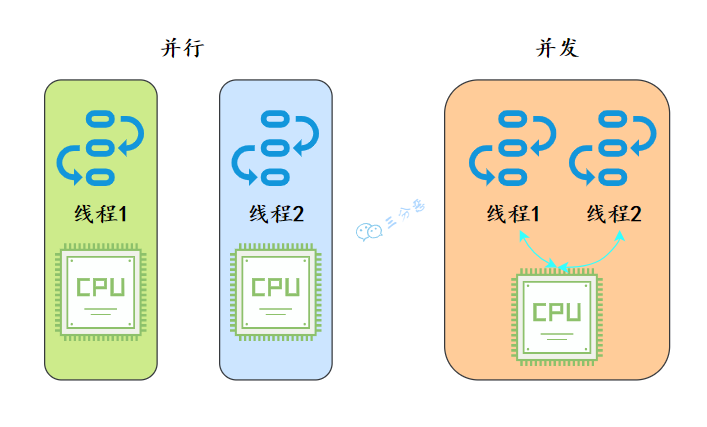

> 图文详解 60 道Java并发面试高频题，这次面试，一定吊打面试官，整理：火龙果
>
> 戳[转载链接open in new window](https://mp.weixin.qq.com/s/bImCIoYsH_JEzTkBx2lj4A)，作者：三分恶，戳[原文链接](https://mp.weixin.qq.com/s/1jhBZrAb7bnvkgN1TgAUpw)

## 基础

### 1.并行跟并发有什么区别？

从操作系统的角度来看，线程是CPU分配的最小单位。

- 并行就是同一时刻，两个线程都在执行。这就要求有两个CPU去分别执行两个线程。
- 并发就是同一时刻，只有一个执行，但是一个时间段内，两个线程都执行了。并发的实现依赖于CPU切换线程，因为切换的时间特别短，所以基本对于用户是无感知的。



### 2.说说什么是进程和线程？

要说线程，必须得先说说进程。

- 进程：进程是代码在数据集合上的一次运行活动，是**系统进行资源分配和调度的基本单位**。
- 线程：线程是进程的一个执行路径，一个进程中至少有一个线程，进程中的多个线程共享进程的资源。

操作系统在分配资源时是把资源分配给进程的， 但是 CPU 资源比较特殊，它是被分配到线程的，因为真正要占用CPU运行的是线程，所以也说**线程是 CPU分配的基本单位**。

比如在Java中，当我们启动 main 函数其实就启动了一个JVM进程，而 main 函数在的线程就是这个进程中的一个线程，也称主线程。


一个进程中有多个线程，多个线程共用进程的堆和方法区资源，但是每个线程有自己的程序计数器和栈。

### 3.说说线程有几种创建方式？

Java中[创建线程](https://so.csdn.net/so/search?q=创建线程&spm=1001.2101.3001.7020)主要有三种方式，分别为继承Thread类、实现Runnable接口、实现Callable接口。


## Java内存模型

###  18.说一下你对Java内存模型（JMM）的理解？

​	Java内存模型（Java Memory Model，JMM），是一种抽象的模型，被定义出来屏蔽各种硬件和操作系统的内存访问差异。

​	JMM定义了线程和主内存之间的抽象关系：线程之间的共享变量存储在`主内存`（Main Memory）中，每个线程都有一个私有的`本地内存`（Local Memory），本地内存中存储了该线程以读/写共享变量的副本。

​	Java内存模型的抽象图：


本地内存是JMM的 一个抽象概念，并不真实存在。它其实涵盖了缓存、写缓冲区、寄存器以及其他的硬件和编译器优化。


​	图里面的是一个双核 CPU 系统架构 ，每个核有自己的控制器和运算器，其中控制器包含一组寄存器和操作控制器，运算器执行算术逻辅运算。每个核都有自己的一级缓存，在有些架构里面还有一个所有 CPU 共享的二级缓存。 那么 Java 内存模型里面的工作内存，就对应这里的 Ll 缓存或者 L2 缓存或者 CPU 寄存器。

###  19.说说你对原子性、可见性、有序性的理解？

原子性、有序性、可见性是并发编程中非常重要的基础概念，JMM的很多技术都是围绕着这三大特性展开。

- **原子性**：原子性指的是一个操作是不可分割、不可中断的，要么全部执行并且执行的过程不会被任何因素打断，要么就全不执行。
- **可见性**：可见性指的是一个线程修改了某一个共享变量的值时，其它线程能够立即知道这个修改。
- **有序性**：有序性指的是对于一个线程的执行代码，从前往后依次执行，单线程下可以认为程序是有序的，但是并发时有可能会发生指令重排。

> 分析下面几行代码的原子性？

```java
int i = 2;
int j = i;
i++;
i = i + 1;
```

- 第1句是基本类型赋值，是原子性操作。
- 第2句先读i的值，再赋值到j，两步操作，不能保证原子性。
- 第3和第4句其实是等效的，先读取i的值，再+1，最后赋值到i，三步操作了，不能保证原子性。

> 原子性、可见性、有序性都应该怎么保证呢？

- 原子性：JMM只能保证基本的原子性，如果要保证一个代码块的原子性，需要使用`synchronized `。
- 可见性：Java是利用`volatile`关键字来保证可见性的，除此之外，`final`和`synchronized`也能保证可见性。
- 有序性：`synchronized`或者`volatile`都可以保证多线程之间操作的有序性。

(synchronized可以保证三个特性，原子性最难保证；可见性最好保证)

### 20.那说说什么是指令重排？


## 并发工具类

### 39.CountDownLatch（倒计数器）了解吗？

CountDownLatch，倒计数器，有两个常见的应用场景[18]：

**场景1：协调子线程结束动作：等待所有子线程运行结束**

CountDownLatch允许一个或多个线程等待其他线程完成操作。

例如，我们很多人喜欢玩的王者荣耀，开黑的时候，得等所有人都上线之后，才能开打。

![王者荣耀等待玩家确认-来源参考[18]](image/javathread-50.jpeg)


CountDownLatch模仿这个场景(参考[18])：

创建大乔、兰陵王、安其拉、哪吒和铠等五个玩家，主线程必须在他们都完成确认后，才可以继续运行。

在这段代码中，`new CountDownLatch(5)`用户创建初始的latch数量，各玩家通过`countDownLatch.countDown()`完成状态确认，主线程通过`countDownLatch.await()`等待。

```java
public static void main(String[] args) throws InterruptedException {
    CountDownLatch countDownLatch = new CountDownLatch(5);

    Thread 大乔 = new Thread(countDownLatch::countDown);
    Thread 兰陵王 = new Thread(countDownLatch::countDown);
    Thread 安其拉 = new Thread(countDownLatch::countDown);
    Thread 哪吒 = new Thread(countDownLatch::countDown);
    Thread 铠 = new Thread(() -> {
        try {
            // 稍等，上个卫生间，马上到...
            Thread.sleep(1500);
            countDownLatch.countDown();
        } catch (InterruptedException ignored) {}
    });

    大乔.start();
    兰陵王.start();
    安其拉.start();
    哪吒.start();
    铠.start();
    countDownLatch.await();
    System.out.println("所有玩家已经就位！");
}
```

